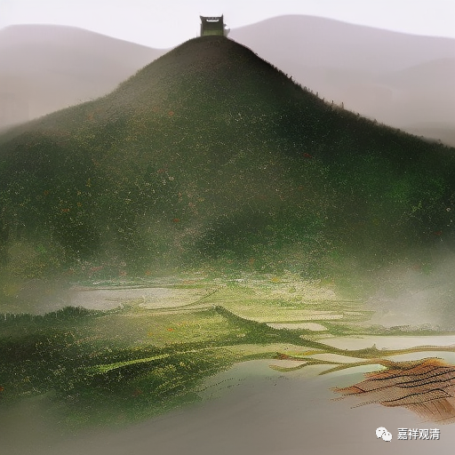

**《宗义略讲》001·031**

佛经常称弟子为“多闻圣弟子”，“多闻”肯定是有好处的，多学一点，学的多你的能够判别的东西就多，记的也多。比如说，你有了逻辑，也积累了大量的知识能够用于推理，那么你就容易对一个东西，对这些东西进行记忆。我举个例子，比如前两天我要找什么东西，我突然之间有历史上法师名字我想不起来了（我现在又想不起来了），但是我记起来他有一件事情，这件事情呢，又跟另外一个法师有关，然后我就想起这个法师叫虚云，然后我再记起这个法师的名叫太虚字……就是当我有了更多知识以后，我就有更多的通路去通向那个最后的那个答案。

今天有些人讲我们学校，小学，中学的东西我们学的太多了，我跟大家想法是不一样的，我是要批评这个说法的，我说实际上我们应该多学（我们只是对我们来说啊），绝不要想像学的东西不多不少正正好好，我们学知识应该是用“过饱和”这个词，我们应该“过饱和”地接纳知识，比如说今天我对新的知识能够很快的接受的原因是什么呢？因为你之前的知识是“过饱和”的，是比你只需要拥有的多，要多的很多，但在这个背景下，你再接上其他知识就比较容易。

对我们来说，我们的小学中学，高中，很多知识都是我们今天并不需要的，但是你一个学中文的人，可以很快的在职场上变身为一个程序员，这样一个编程员，原因是因为你的高中数学已经到了那个程度了，你那个时候的计算机编程的基本技术，已经到了那个程度了，相对你只要稍微努力一下，就可以“即插即用”了，因为你多了几个预设的插口，如果我这个电脑的设计只提供最少的插口，只提供最少的用的东西，那你这个电脑以后是废掉的，是最先被淘汰的……

那我们学习这个佛教知识呢，在现在没有办法背景下（我出生而佛大师已逝去）呢，也是一样，我们尽量能够多学，对我们来说知识“过饱和”的积累，是没有坏处的——当然你要聪明一点，别被炸死了，别把脑袋给撑坏了。我们年轻人应该多学一点，多学一点会有更多的路径去通向最终的解脱，通向最终帮你找到那个答案。

大乘的背景也就是这个样子，大乘他认为，有很多条路可以通向那个答案，都可以指向那个答案，如果你学的越多的话，你的智慧越大，就应该拥有更多的方法，大乘的“大”也在这里表现，有更多的方法帮你找到这条路。

在现在这个背景里也是，我们学习这个宗义呢，在某些方面来说，“知识的储备”也相当于“过饱和”的，但是在这个宗义知识“过饱和”吸收的背景下，可以帮助到自己学习中观。

我之前讲过很多次，有时候觉得某个部派的这个观点非常有趣，在他非常拧巴的解释的背后，世有时候只要你给他转移一个观念，就可以成立，而之前“拧巴”的解释就突然变精彩了，你如果把它这个观点方法，用在中观上，完全可以用，呵呵，类似宋诗里的“点铁成金”，换一两个字，突然就亮眼了……

