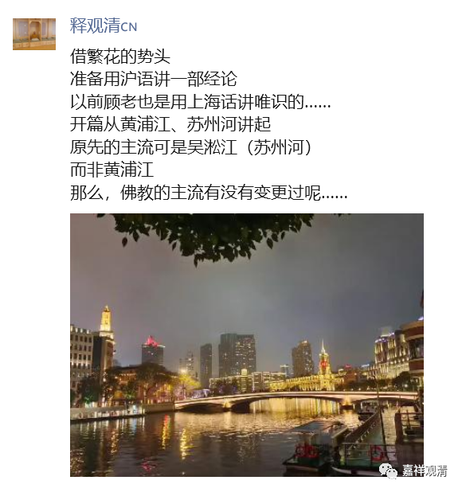
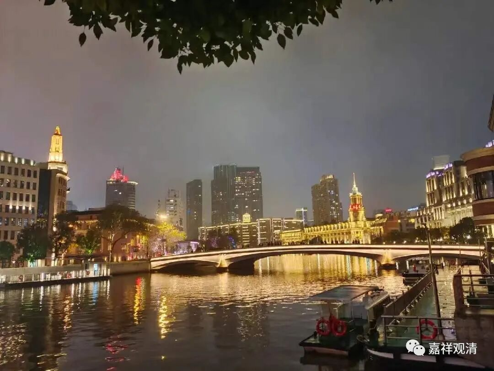

今天在朋友圈发了一段——

借《繁花》的势头

准备用沪语讲一部经论

以前顾老也是用上海话讲唯识的……

开篇从黄浦江、苏州河讲起

原先的主流可是吴淞江（苏州河）

而非黄浦江

那么，佛教的主流有没有变更过呢……

按：这张照片中景略右好象是上海的邮电大厦，解放前顾老就是在那里做职员的。

用沪语讲课其实是很久以来的一个“愿望”了，其实我自己学唯识的时候，顾老就是用上海话讲的，虽然应该也夹一点普通话，但主要还是用沪语表达，比如“唯识三十颂”，就读作“vi色se泽颂”，“瑜伽师地论”就读做“雨噶思地棱”……可以说，历史上绝大部分的经典教学都是以方言的方式传播的（在唐老那里也是听的四川话版本的唯识），现在用方言教经典反而特别了。不过呢，语音识别成文字可能是个问题哦——方言而专有名词，两重复杂了，当然受众面也会缩小。

开始要讲顺嘴、要找词（上海话发音）可能语速会慢一些，估计过一段时间就会顺一点了。我觉得也可以试试先聊聊近现代上海佛教的历史，这样上海人听起来更有画面感，比如盛宣怀和上海的几个寺院，近现代上海的几个高僧和他们建寺的故事，老寺院的旧址……之类。先练练嘴，大家练练听力（哇哈哈哈哈）。

哈哈。要不就从读这个开始？

