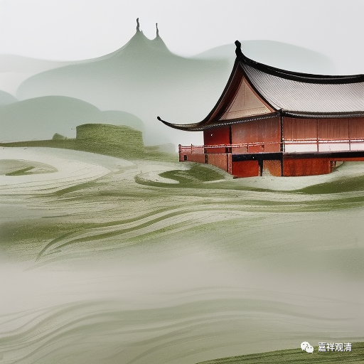
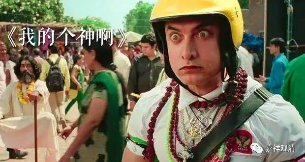

**《宗义略讲》001·032**

那么四个法印，或者三个法印，但是既然法印定下来了，那么在佛教里面，这些说宗义的大师们，就绝不敢去反对他。但是同样会出现问题，就是开始有了不同的解释，对吧，比如说“诸法无我”，他可以认为“诸法无我”的“诸”是在某个范围内，“某个范围内它是无我的，但是在某个范围内，人无我可以成立，法无我不成立”，或者有的宗派认为所说的“诸法”仅属于杂染法、轮回中的法；而中观派认为，这个“诸”指一切，“一切法无我”……这就出现了不同宗派的解释。

你看在佛教当中，只要出现任何一点，释迦佛没有把它讲到最后的“就是如此”，就会出现不同的解释，几乎都是这样（最后导致弥勒大士在《瑜伽师地论》里面创造了一个句式——除此更无若增若减！到此为止了！我就是最后的答案了！）如果一个宗教，一个哲学发展了两千年，这种情况就必然会出现……

那么再谈“诸行无常”。

“诸行无常”这个题目为什么要提出呢，为什么说是“法印”呢？我们今天的人去理解这个法印有点难，为什么呢，没有那个时代环境下的这种感觉。印度当时是思想界主流（婆罗门信仰）认为有常、一的东西的，有不变的东西，比如说，神，对神来说，他是认为没有时间的，其实西方基督教也是这样子认为的，对神来说，他是没有时间的，凡人是他所创造的，创世才有时间，才有最后的末日，对神来说是没有时间的，他是没有过去，没有现在，没有未来的，它是永恒的，是没有变化的。所以印度文化的主流思想是倾向“常、一”的。这些佛教以外的宗派，假如他也是求解脱、求彼岸，那基于他们认为终极的事物是常、一的，那我我们提出的“无常”就非常不一样了。

佛教弟子们就要随时说出佛教的核心观点是什么——诸法无我，诸行无常……世界是无常的，没有什么具体的东西是常、一的，既然它是造作的，既然上帝能够造作，那它就不是常的，既然他具体地在我们当中，那他也不是常的，我们在变化，他也在变化，所以佛教提出的的这个“诸行无常”，是基于那个而言的。

“涅槃寂静”也是一样，“涅槃”这个词不仅仅是佛教提出的，其他宗教也提出，今天我们总认为“涅槃”好像只有我们在讲——很多我们佛教徒，一厢情愿，没办法，因为他学的也不够多，没办法要求所有人都学得那么多。但实际上，你学了以后，你就会知道不是这样简单的。

比如说我前两天在微信上也讲到这个问题，什么呢？有些人就认为，“世尊，指的就是佛”，“大雄指的就是佛，大雄宝殿嘛”，你不能说它是错，你只能说它的知识面不够宽。在佛教内固然说佛是“大雄”，说佛是“世尊”，但是在印度我们看印度电影的话，里面都是这样的——去见看神，或者崇拜神，“薄伽梵，薄伽梵”，“世尊啊”，薄伽梵……

《外星人遇到地球神》《额滴神啊》，《我的神啊》，你们都看过了吗，这两个片子我都很喜欢，两个，一个是《我的神啊》，一个是《额滴神啊》，《额滴神啊》好像又叫《外星人大战印度神》，阿米尔汗颜的，还有一个就是《我的神啊》，就是讲一个印度的故事的，印度的一个关于宗教的故事的，非常好……

这些印度电影里面对“神”怎么称呼啊？就称呼为“薄伽梵”，“薄伽梵”翻译过来就是“世尊”啊。“大雄”呢，耆那教重要祖师也被他们称为“大雄”啊。虽然我们“大雄宝殿”的“大雄”是指释迦牟尼佛，但是它并不是历史上的“唯一”。“并不是唯一”的意思就是说，这个词在佛教里面我们可能是这么认为，其实它是一个尊称，在其他宗派里面也有。

那么，“涅槃”这个词也是一样，别人也在用。

