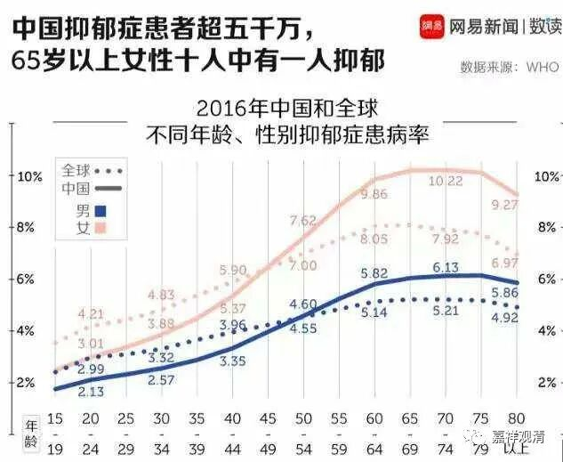

**若人静坐一须臾，胜造恒沙七宝塔**

很久没来深圳了，导致这次在深圳的行程很密集，遇到了很多老朋友、新朋友（还有阿宝），不过有一点令我有点震惊的，就是发现，学龄、青少年中的抑郁症比例高得不同寻常。

我们看一下上面的统计。

但实际我遇到的要高得多。当然不排除有小朋友的从众现象——看到同班同学可以借“抑郁”不上学，那“爸爸，我也要看心理医生”，一句“我感觉我爸爸不爱我”就可以轻松推卸责任，因为从小学到的就是“说一千道一万，错误不在我身上！”——其实很多父母就是这么表现的。

不过即使排除这些数据干扰，今天中国的抑郁症发病率仍旧是过高了。我们看，我国65到75岁女性的抑郁症发病率居然已经超过了百分之十！（刚刚收到消息，我的一个亲戚也因抑郁症原因突然过世。）

按我们中医的说法，抑郁症和阳气不足有关，“阳化气、阴成形”，户外活动过少导致今天癌症和抑郁症的发病率普遍上升。

而按照佛教的说法，今天人的福报消耗得太大、太快了，小小年纪就被父母安排得舒舒服服，福报迅速消耗……我们小时候可都没有顿顿有肉、餐餐美食啊，磕破点脑袋连创可贴都不需要，带着疤就上学了，现在稍微破点皮就去消耗儿科资源……

所以，作为中医大毕业的和尚，我给抑郁症开的“药方”就是：多做户外活动、多念经、少消耗福气，有机会可以学点禅修、打坐——学习静心、调心，让自己能够控制自己的心，所谓“制心一处，无事不办！”而且佛教还说过，“若人静坐一须臾，胜造恒沙七宝塔”。又能制心，又能培福，还不赶快把腿子盘起来！

今后我要多教一下打坐、禅修了！

