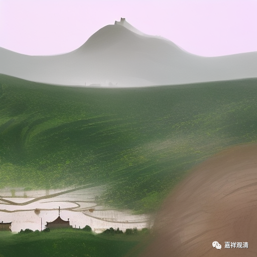

**《宗义略讲》001·033**

衡量是否佛教的标准（法印）里为什么要谈“涅槃寂静”呢？因为其他印度宗派也讲“涅槃”，他们认为初禅是涅槃，二禅是涅槃……乃至非想非非想地，或者非想非非想定是涅槃，那么针对这些，佛陀对他们说，“涅槃寂静”，说“涅槃”它里面是不存在烦恼的，“涅槃”就是所有的烦恼全部断完了，而你们所讲的那些，你们所以为的“涅槃”，他没有真正的“寂静”——我们给“烦恼”下的定义就是“令身心不寂静”。

释迦牟尼佛在证到初、二、三、四禅，他都并不认为自己证得涅槃。那时候他还是太子，刚刚出家不久，在证到这些禅的时候，他马上就醒觉，在他的老师跟他说“你已经证到的这个就是涅槃”的时候，释迦牟尼还有这种警觉心——这非常了不起的，我们有时候在前进的过程里会忘了自己根本目的是什么，释迦太子的根本目的是什么？他是为了解决“生死”的问题而逾城出家的。

他非常警觉，就知道我并没有解决我的生死问题，我并没有真正达到内心的寂静。我们定义什么是烦恼？烦恼就是令身心不寂静，是吧。当时释迦太子证得了禅定，但他警觉身心寂静的事情并没有真正的解决——所谓禅定的寂静，它是一种假的、暂时寂静，他不是真的寂静……

所以不管初禅也好，四禅也好，非想非非想定也好，都没有达到真正的寂静，释迦太子那个时候真的是一个非常了不起的宗教实践者，通常我们在走的过程当中，在行为过程当中，会忘记自己根本自己最初的问题，他没有忘记自己最初的问题，生死问题没有解决，他根本没有放下，他不停的。

我们通常会在“沿路的风景中迷失方向”，比如说我在打坐，假如我们这些人休息以后，然后突然哪一天，飞起来了，我可能会去炫耀，我忘了我打坐的原因是为了出离，或者梦里、禅定里面见到佛了会觉得非常了不起，你忘了见到佛了以后，你的烦恼断了还是没有断，没有断烦恼、没有生智慧，那见了一百个佛又有什么用呢？通常我们会被修行路上的风景所耽误……

但释迦太子是很了不起的一个宗教实践家，他完全没有被这些风景所耽误，他一直没有忘记，禅宗来说，他的话头，生死这个问题，他一直没有忘记，所以他不断离开它一个又一个更高明的老师，最后觉得这些都不是，自己来解决这些问题，别的都不对，自己来解决这些问题……

那么好，这里面就出现了，佛陀说的这个法印——涅槃寂静，这个“法印”的提出是针对那些的，针对这些以禅定为解脱的这些宗派来说的，而特别强调说“涅槃寂静”。

