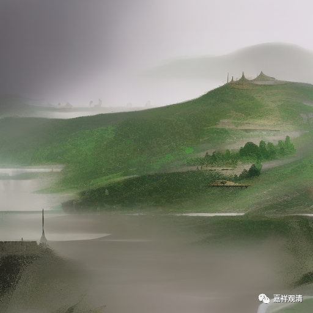

**《宗义略讲》001·034**

所以这“诸行无常、诸法无我、涅槃寂静”就是“三法印”，这个“无我”，也是针对当时其他宗教所谈到过的“我”或者“神”。其他宗教谈“我”“神”，现在说起来就是印度教，以前说的是婆罗门教，它是谈有梵我的，他们的“我”atman最终要归向梵，我是梵造的，我最终要回向梵，这就是“梵我一如”。而我们佛教讲，根本不存在这样一个造物主。

你看佛教对印度神话的重新再创造，假如我们再去看印度神话的话，我们会发现佛教对印度神话会有一种解构或者重新创造，佛教里的三界神仙和印度神话是不重合的……佛教在谈“无我”的时候，在这个背后他想说的是什么，他说的是根本没有一个至高无上的神，不见得说一定是后来所表述的一种神仙世界（佛教也给大家构建了一个类似印度神话的背景），但它打破了印度当时的神话背景。

印度的神话当中，梵天啊，大自在天啊，这个都是有女人的，他是有老婆的，但是在佛教当中，梵天、大自在天他们都是色界天主，没有老婆的——这个就完全不一样了，这个“神仙谱系”就完全是经过我们佛教解构后，然后又重新造出了一个佛教的“诸神体系”，实际上就是这样。

那我们从这里可以看到是什么呢——佛陀释迦牟尼，在他对印度大陆神话背景核心不做大的变动的情况下，借助世间世俗，来让大家认识什么是佛教想说的。释迦佛他更多说的是“不是”，而我们更多习惯是在什么不是以后去确定一个“是”！

最近我们在讲《金刚经》，我们在讲《金刚经》二十七个问题，你看得到吗，所有二十七个问题都是因为在佛讲了什么“不是”以后，我们马上起一个观念说“那应该是什么？”“那应该成立什么？”实际上佛都没有暗示过我们的那种思路……我们很多的时候，包括部派的开展，很多时候是误解了佛的说法，想要把佛所讲的补圆，结果“补”就是错，大家帮佛“补充说明”的那一部分就是错的！

像中观这种“大而化之”的做法他就不补，你看《入中论》里面怎么讲，“你们先吵，谁吵的有理了，我再跟谁讨论讨论。如果你觉得你是对的，你跟世间的人吵吵看，看看能不能够说服他，你们谁说对了，我跟谁继续……”所以中观在世俗上的建立没有拿出一个很完善的阿毗达磨来，可能和这个也有关。

有时候我看了《成实论》（受了中观影响的经部），你看到他收到中观师思路的影响，就是说，它有一种叫今天我们讲的“解构”一样，在他眼里好像这些都是可以被解构的，他根本不那么想去“建立”一个东西，一旦建立你又会以一种习惯性的理解，认为它是一种实有的东西，它不那么热衷于去建立一个东西，只不过是为了打破一个你的认识而已，他不是要通过这个新的观点，建立一个新的、实有的、终极的存在。

