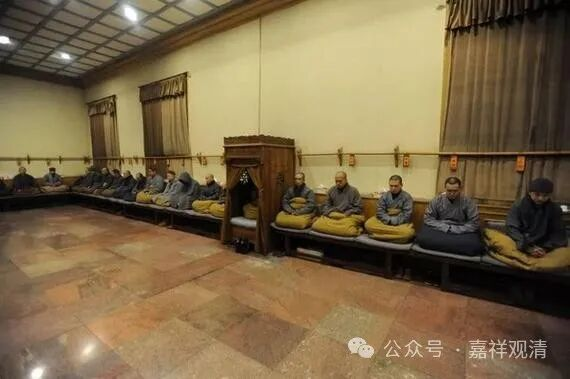

**“襯錢”与“衬钱”**

以前，供养僧人的财物叫“襯錢”（又叫“襯施錢”），简化后变成了“衬钱”。“襯”，原来是形声字加会意字，就是指贴身的衣服。后来“襯”简化为“衬”，就只有形声而没有会意的成分了。

《唐韻》《集韻》：“襯，初覲切，音櫬，近身衣也。”老的吴音里，“襯”“親”“寸”的音还都是很近甚至相同的。

《重雕補註禪苑清規》里就有：

“……** 首座施財**（〔喝〕云：財法二施，等無差別，檀波羅蜜，具足圓滿）。

** 庫頭或維那次第行襯**（輕手放僧前單上。意在恭敬。眾僧合掌受襯。不得眼覷。及不得將襯錢擲被位作聲。齋畢收之）。”

这是说，在僧众饭食时，若有布施。维那师（寺院执事）请首座大师施财。

首座此时说：“财法二种布施，等无差别，愿施主之布施波罗蜜多具足圆满。”

此时库头或者维那师按寺僧长幼次序“次第行襯”，一个接一个发钱。发钱的时候要恭敬，轻轻的用手放在僧人前面；僧人则合掌“受襯”，不要用眼睛偷窥，也不能把钱乱丢出声。用斋结束以后再收起来……

这里的“行襯”就是在发斋主布施的钱，“受襯”就是接受斋主布施的钱。布施的就叫“襯錢”“衬钱”。

这套东西搬到民间，在民间念唱宝卷、“讲经”（这里的“讲经”是指民间的说唱《宝卷》，接近于民俗的一种民间宗教活动，有的也类似说书）的“佛头”、“香头”（组织以上活动的民间艺人或民间宗教组织者）们拿的工资、收入也叫“襯錢”，民间不知道“襯”“衬”的正字，直接写作“亻亲”，叫（“亻亲”钱）。《宝卷笔记》P6～7：“……佛头大为感动，表示不收亻亲钱”。这应该算是“礼下诸野”吧。

