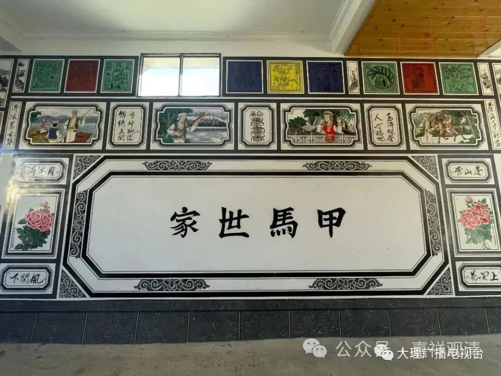
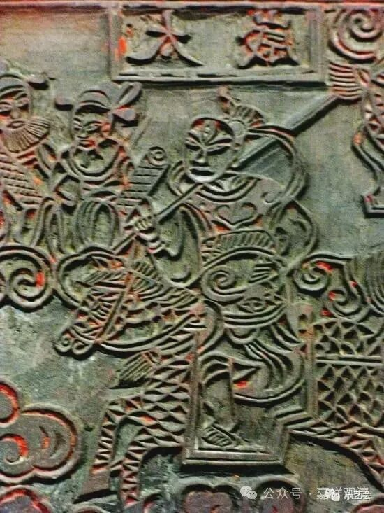
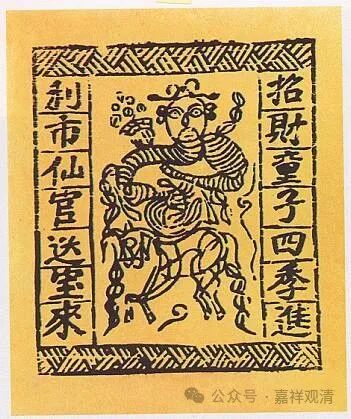
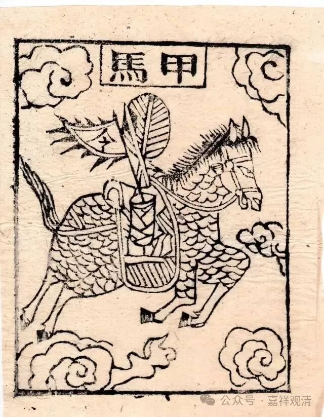
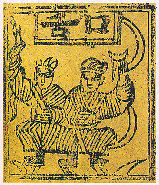
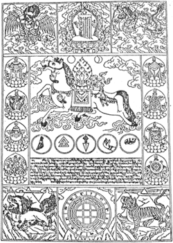
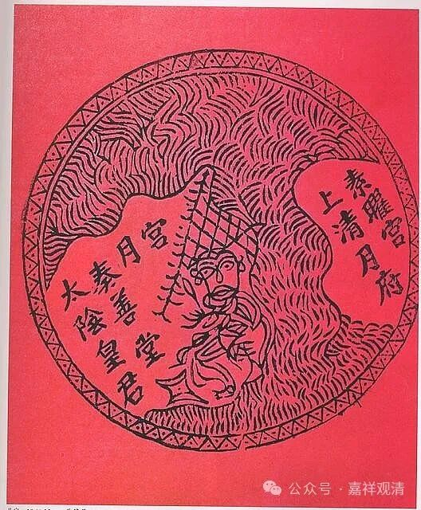

**甲马、风马、纸马、马纸和“出马”**

忽然之间发现，这几个东西之间应该有关系！

云南民间有一种相对粗糙原始的版画，叫“纸马”，前些年好像因为冯骥才等人发现、研究，火了起来，建了博物馆，也有人收藏。

“纸马”原先是一种单纯“（民间）宗教”“民俗”“祭祀”用途的，一般“纸马”上面雕刻的都是佛菩萨、神灵，不拘佛道，也有历史人物，甚至也有动物和太阳星辰……

纸马，也叫“甲马”，又叫“马纸”，《水浒传》里神行太保戴宗腿上绑的“甲马”其实也就是纸马。云南有“纸马”，江苏南通也有“纸马”，靖江则叫“马纸”，是一样的东西。藏地则叫“风马”，也还是同样的这个东西。

看来，这几个东西（风马、纸马、甲马、马纸）是同源的，而关键的元素似乎就是“马”。那什么是“马”呢？

我原先以为“马”就是乾卦，因为藏地“风马”（རླུང་རྟ，音“龙达”）的标准件上中间就是一匹马的形象。遇到山口或祈祷便撒“风马”，令我想到可能是《易经》里的乾卦，《说卦》：“乾为马”。

今天忽然想到，这个“马”和东北的“出马”的“马”会不会是一个意思呢？毕竟“纸马”上面主要的就是神灵和各种山川百灵，感觉就是最原始萨满信仰的承载。不知道东北、朝韩有没有类似的“纸马”。

