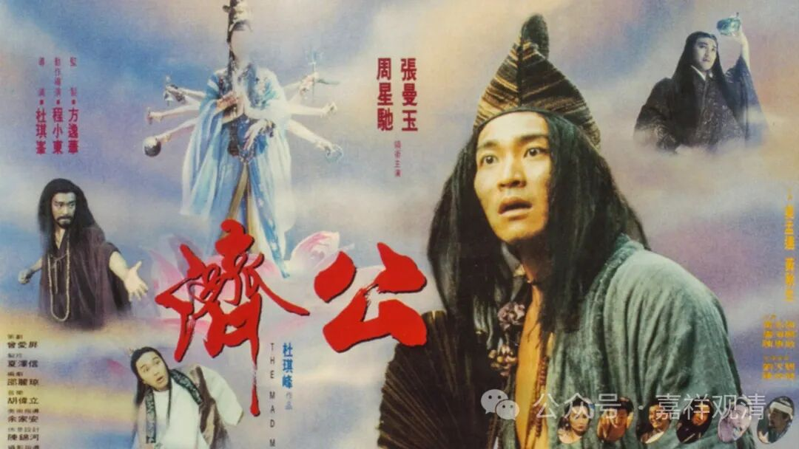

**中国人的人神关系**

中国人的“天人关系”（人神关系）也有两个“维度”，一是形而上的“天人合一”，一是形而下的“天人交接、两得相见”。道家虽然喊着“天人合一”，而道“教”乃至中国民间在实践中则更倾向于形而下的人神互动。

据慧皎《高僧传》：

** 昔竺法护出《正法华经》，《受决品》云：“天见人，人见天。”什译经至此乃言：“此语与西域义同，但在言过质。”叡曰：“将非‘人天交接，两得相见’”。什喜曰：“实然。”**

说鸠摩罗什法师在翻译《法华经》的时候，有一段之前的竺法护译作“天见人，人见天”，意思是对的，但文字不够雅训。一旁的僧睿法师说可以译成“人天交接，两得相见”，罗什大师觉得文字感觉很好，便采纳了。

僧睿法师脱口而出的这句“人天交接，两得相见”其实很可能暴露了中国人自带的一种“天人观”（人神关系）——人神互动。

这种“接地气”的内容我们可以找民间的宝卷读读。《月宫宝卷》开卷四句便说：

“** 仙是凡人塑，人是天赐成；**

** 人仰天赐福，天慕凡间人。**”

天（神）对于凡人，是既赐福，又羡慕，所以中国的神仙常常下凡，甚至常常迷失，迷失后要再升仙，则需要外来的“点化”。

所以，周星驰的《济公》实际就是中国民间神人观的一种现代表达，佛教不是它（周星驰的《济公》）的内核，是点缀——佛教的“因果报应”是中国文化心悦诚服愿意接受的东西，于是他被“嵌入”（不是“融入”）了中国文化。

