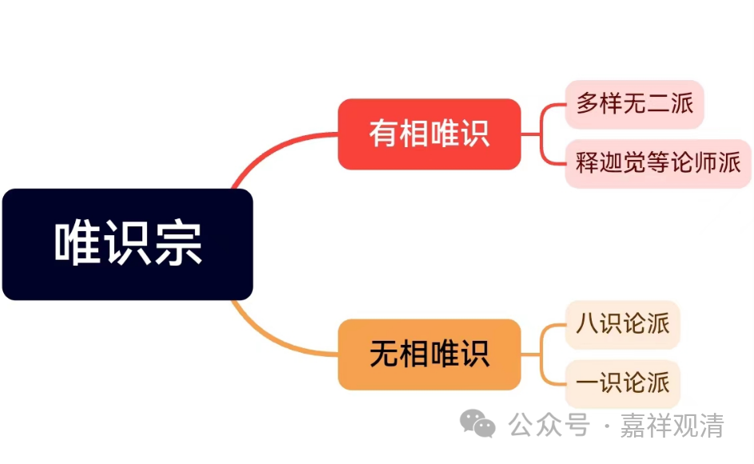
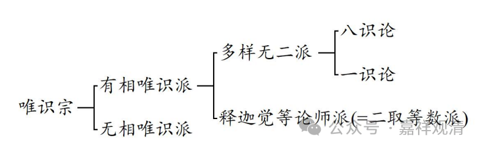

《<佛教与外道辨别论>的特点及价值研究》里说：

**恰巴的这部新出文献中对唯识宗有明确的分类。他先将唯识宗分为“有相唯识派”与“无相唯识派”，又将有相唯识派分为“释迦觉等论师”与“多样无二派”，最后将无相唯识派分为“八识论派”与“一识论派”。**

若按这里文字的说法，《佛教与外道辨别论》唯识宗部分的树形图应该如下：

 ┌有相唯识—┌多样无二派

唯识宗 │      └释迦觉等论师

 　│　　 　 　┌八识论派
  └无相唯识 —└一识论派

而《<佛教与外道辨别论>的特点及价值研究》原文所附的图则如下：

** 恰巴书中所见唯识宗分类如下：**

这个图显然和上文是不符合的。“八识论”和“一识论”的分别，前者系于“无相唯识”之下，而后者系于“多样无二派”之下。

而据《<佛教与外道辨别论>的特点及价值研究》原文之注解，则又有——

** 但是后期宗义文献即嘉木样协巴第一世·阿旺宗哲所著《宗义广论》将二取等数派分为八识论派与一识论派二派，多样无二派分为六识论派与一识论派两派。二者有出入。**

如此，则嘉木样协巴《大宗义》中之“有相唯识”分派当如下图——

则“八识论”与“一识论”的差别又系于“二取等数派”之下。“八识论”与“一识论”之所从来都换了三个派别了。

《<佛教与外道辨别论>的特点及价值研究》发现了妙音笑《大宗义》与法师子《佛教与外道辨别论》之不同，但自身文字和制表之间却似乎出现了差异。单纯从文字的感觉上来看，应当是文字部分出了问题，而文字后的表格可能是正确的。

我去找作者们问问看。等我回来给答案……

