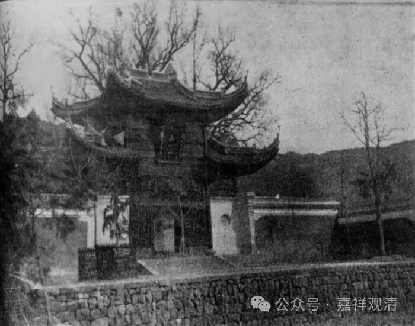

**民国时期奉化雪窦寺在上海的下院**

之前说过，民国前后，上海一下子建了很多寺院……比如普陀山诸寺院在上海有十五个下院，常州天宁寺在上海也有下院，甚至连今天玉佛寺的前身都要算普陀山法雨寺的下院。此时上海经济发达，商贾云集，所以周围大寺纷纷在上海设立接待处、下院，帮助化缘以贴补母寺。

宁波奉化雪窦寺曾是禅宗五山十刹之一，民国期间，奉化雪窦寺在上海也有一个下院，就在今天的东余杭路新建路口（解放以前是有恒路新纪浜路口）。

太虚法师和蒋介石来往甚密，蒋氏最初下野时太虚法师就曾去奉化相谈。1932年九月初九，应蒋氏之邀请，太虚法师赴奉化雪窦寺任方丈，时“二十一年九月九日，朗公率全体寺僧暨诸山长老，下山来迎，送入山者数百人。”此“朗公”，即朗清老和尚，他自1925年起任雪窦寺方丈，1932年让位于太虚大师。（上图即1930年代雪窦寺山门照片。）

朗清老和尚善医术，从雪窦寺退位以后，便来沪东虹口雪窦寺下院居住，期间老和尚在此雪窦寺下院开诊治病，赠医施药，深受病家信仰……

朗清老和尚离沪以后，无人接诊，于是中国佛学会上海分会出面继续聘人在此地设诊室，仅收诊金，药费全免。

据九六年上海佛协稿本

