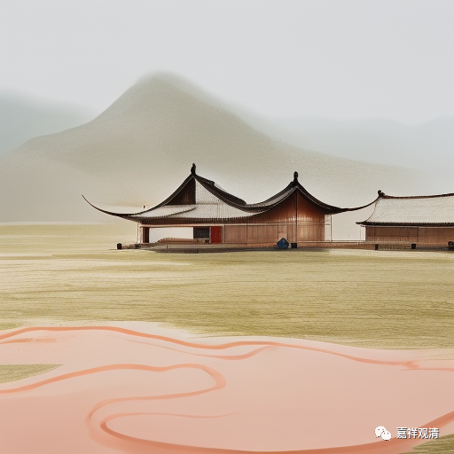

**《宗义略讲》001·042**

顺世派，古印度的那啥主义，主要就是不承认因果，不承认推理。他也是印度反婆罗门教的一支力量。顺世论我们不方便过多展开。

裸行派是什么呢，裸行派现在还在，就是耆那教。在佛教的典籍当中，经常出现的，叫尼乾子。现在在印度还有，有的穿着白衣服，有的不穿衣服，路上还能看得到，上次我们没看到，这次他们去印度，他们前两天照片就拍出来了，有这个裸行外道。裸行外道不都裸行，有一部分是裸行的有一部分穿白衣服的，有一部分是不穿衣服的，他们认为这些都是束缚，你看意思是一样的，衣服也是束缚，规矩是束缚，所以他们不要束缚，连外面束缚也不要了，你看，这很有趣啊，他都是把一些不是应该具体化的东西具体化了。“不要束缚”这句话，即使在修行当中讲也没错，但最后把它变成不穿衣服，这是把一个观念把它实有化了，再比如说……

……“多少罪恶是以善良的名义铸就”，就这样，一次一次又一次……今天是看回来了，今天西方人说，“（中东）那些没有文明的人”，但五六百年前，是反过来的，今天的西方才是“那些没有文明的人”，……西方文艺复兴以后呢，西方开放了，西方它变得是文明的代表了……（以上很多不适合整理出来）

我们也应开放一点，我一直讲，“佛教的中世纪”……在宗喀巴大师出现以后，佛教“走出中世纪”也完成了，但仅是一小部分精英完成的，它毕竟没有形成像今天西方那样的大学，他还是一个宗教学院，它还没有发展为今天那样并不以宗教为主的大学，它太宗教了，还是太宗教了，所以宗喀巴大师那个时候，“走出中世纪”了一段时间，又一段时间，我们又走回头路了。

总的来说今天的佛教，有没有“走出中世纪”呢？我觉得今天的佛教启蒙还没有完成，（有人问：现在启蒙是往好的方向走），能不能成功不知道，假如有更多的人出来慢慢的往前坐也许有希望……

今天的佛学院还是以宗教学院的方式，今天的佛学院，甚至连统一的教材都没有。假如我们的佛学院慢慢成为哪怕三四流的大学，也是一个大的进步了。我们还有“很大的上升空间”。

今天佛学院实际上是很矛盾的，为什么呢，因为今天佛学院的师资和生源两方面的水平都“参差不齐”，绝大部分师生都没有接触过合格的基础教育，在校期间，一方面给学生灌输一些应该有的基础知识，同时还得灌输给他们一些佛教的东西，同时想做两件事情，做不到。所以今天在办的佛学院，没有一个想出来怎么解决的方法，现在佛学院教学方法全都是错的……这是我认为，全都不对，他们根本没想好怎么做。

现在的佛教人才，除非他是带艺投师的，现在佛教人才面都是非常狭窄的，外面不知道……

（有人问：师父现在佛学院没有文化门槛了吗）

文字上说有文化门槛，但实际上水品很臭，文字上说要初中以上或者高中以上文化，但实际上初中以下，你要来也行，因为根本人就收不满……（下面全删了，今天删了有两千字了。）

