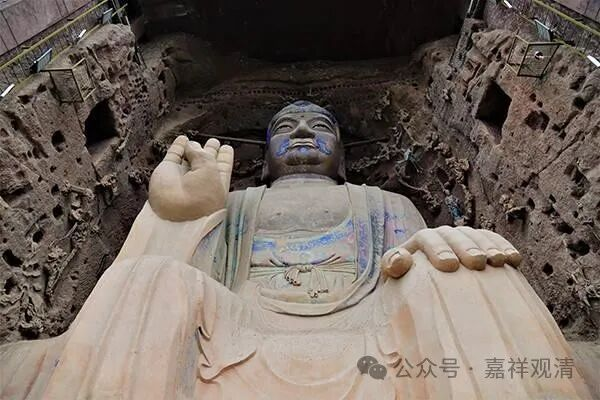
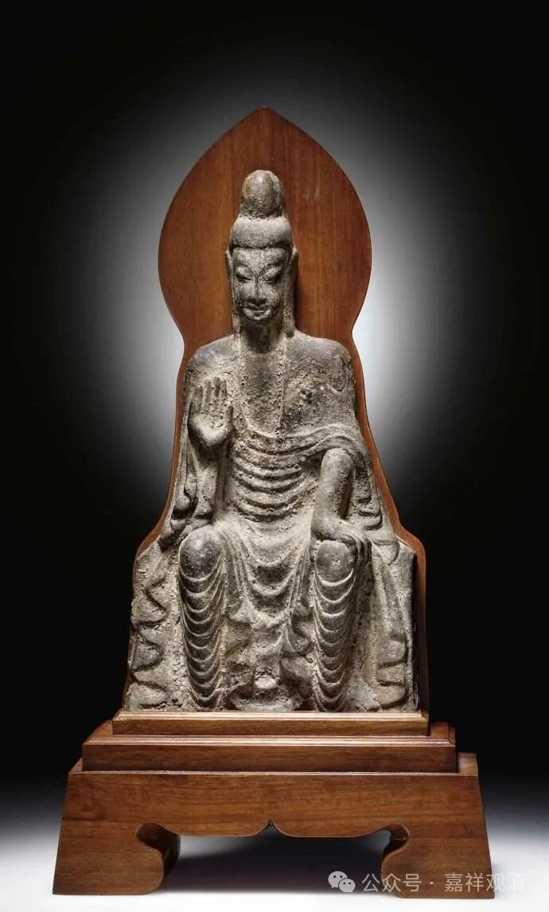
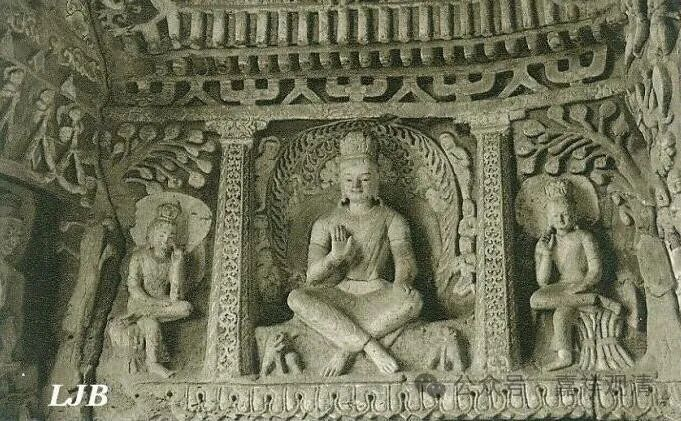

**弥勒造像之盛衰**

中国的石窟造像里，弥勒佛造像是最常见的题材，常见到在教内，弥勒佛的关注度一度要高于释迦佛，就如同今天阿弥陀佛的“热度”隐隐要高于释迦佛一样，甚至北周时还有人上书宣帝“就使弥勒初兴，不应顿弃释迦遗法”，就算弥勒来了，也要保护释迦，什么意思？释迦不如弥勒呗！

弥勒佛（天冠弥勒、准备成佛出世的弥勒）这一题材到了明以后则基本不见了（代之以契此和尚大肚子弥勒），因为马上带来太平世界的弥勒信仰实在太容易被改造拿来造反了。如隋大业六年——

“** 正月癸亥朔旦，有盗数十人，皆素冠练衣，焚香持花，自称弥勒佛。入自建国门，监门者皆稽首。既而夺卫士仗，将为乱。齐王暕遇而斩之。于是都下大索，与相连坐者千余家。**”

“** 旦，有盗数十人，皆素冠练衣，焚香持花，自称弥勒佛,，直入宫禁，将为乱叛……于是都下大索，与相连坐者千余家**”

说隋炀帝时，有人称弥勒佛下世，直入宫禁，夺杖为乱。隋齐王暕（lan）出而斩之。此隋齐王暕为炀帝成年之子，并与彼时佛教界关系匪浅，师事当时佛教界大师顶流巨匠智聚、保恭、吉藏、法常、僧坦，以隋齐王暕之政治与佛教的双重地位才能硬杠“弥勒下生”之“盗”贼，其余“监门”守卫皆匍匐“稽首”、不与争锋，不可谓不凶险啊！

但弥勒信仰之政治化，其实与皇家之推动亦不无关系，宋赞宁之“现在佛（太祖）不拜过去佛”，前述“……弥勒初兴，不应顿弃释迦……”都暗示了“当今圣上”为“弥勒应世”（还可以考虑到历代佛像多有以皇帝面相为之者），所以统治阶级对“弥勒应世”这件事情是纠结的——自己想用，又怕别人用！所以一直禁得不彻底。

后来弥勒信仰之大致退出历史舞台，其实是由于白莲教和西方净土抢占了大量底层宗教市场，而“让”出起市场份额，终于实力不济，渐渐淹没了……

