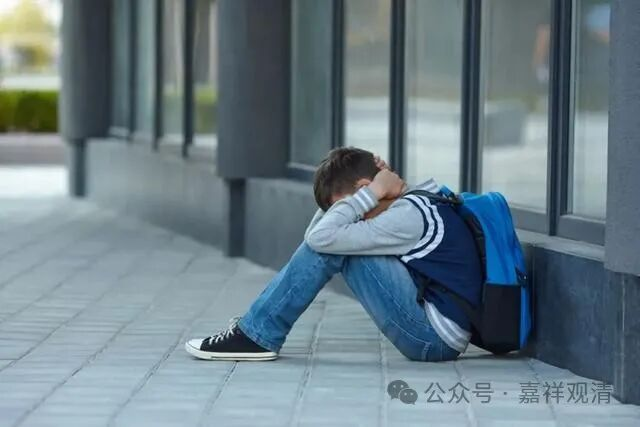

**轮回当中没有“一帆风顺”！**

佛教眼里，世间的本质就是“轮回的呈现”，没有什么一帆风顺。

最近频繁“被”触及抑郁症话题，如繁花的城市某重点高中——

“××的女儿，@@中学高二开始抑郁了，今年高考也参加不了了。他们学校四分之一的孩子抑郁。老师明说的，让吃药继续上学。××舍不得。这就是某市天花板的中学高中现状

那边教务老师说，他们学校就是个战场，撑不下去就淘汰。

没人有空关心倒下去的，后面补位的很多等着呢……”

不管怎么样，高二“四分之一”抑郁的比例还是太高了。上个月在深圳也遇到，某重点高三学生也报有抑郁，告诉我说“只能考211了”（为什么211叫只能？他同校同级某生高一抑郁至今还没上过学）。孩子们的压力这么大了吗？都卷到高中了吗？

我们那个年代，几乎都没有这种现象啊。

作为出家人的感觉是，家长们给孩子们从小营造的“不要让孩子吃苦”“让孩子们一帆风顺”的“养娃理念”是错误的，现实的本质是“轮回的呈现”，轮回的本质是苦，根本就不存在一帆风顺的人生。孩子们这辈子该吃的苦逃不掉的，一直给他们营造“无灾无难”“一帆风顺”的环境其实就是在人为伪造一个自闭、虚伪的世界，等他们消耗完了有限的福报，神经受体对外界刺激不再“合理”分泌五羟色胺、多巴胺，那就无法再合理获得“快乐”，或者用更刺激、激进的手段来获得“快乐”……

家长们要学会对孩子“合理保护”的界限，家长们的过分“呵护”其实也是“后天性自闭症”和青少儿抑郁症的一个来源——至少作为一个学过医、对心理学、自闭症多少有点认识的和尚的看法是如此。

轮回的呈现，是不以家长意志为转移的，佛也不行！

