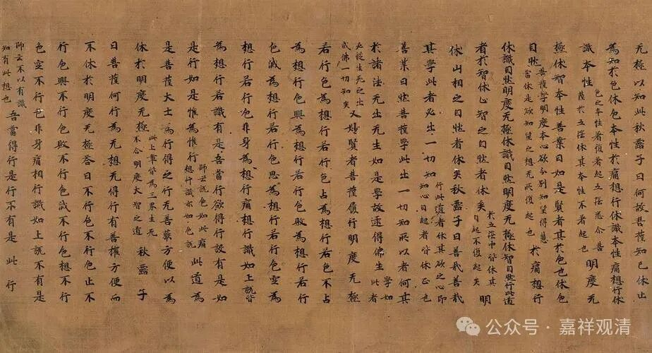

**“六双十二辈”是什么？**

读书……

康僧会《安般守意经序》有一句给我看懵了——

** “大士上人，六双十二辈，靡不执行”**

“四双八辈”我懂，这“六双十二辈”是啥？（“四双八辈”，就是“四果四向”，四果：预流果、一来果、不还果、阿罗汉果；四向：四果：预流向、一来向、不还向、阿罗汉向。）从没见过啊！

百度也没找到其他的解释。

检索一下，《阴持入经注》（“阴”就是“蕴”，“持”就是“界”，“入”就是“处”，“阴、持、入”是古译，新译就是“蕴、界、处”）中说：

** “自佛下至沟港，六双十二辈”**

也是一头雾水……

继续检索。

据《一切经音义》《明度无极经》（“明”就是“般若”，“度无极”就是“波罗蜜多”，“明度无极”就是“般若波罗蜜多”，“明度无极”也是古译）下“沟港”，释为：

** “古项反，字略云港，水分流也。今梵言须陁洹是也。此言至流，或言入流，经中或作道迹，或言分布，今云沟港。……”。**

这就明白了，“沟港”就是“入流”的古译，就是预流果。

康僧会译《六度集经》有：

** “进行或得沟港、频来、不还、应真、缘觉、有发无上正真道”**

这里，古译的“沟港、频来、不还、应真、缘觉、无上正真”，对应新译，就是，预流、一来、不还、阿罗汉、缘觉（独觉）、佛。再对照“四双八辈”和《阴持入经注》，则“六双十二辈”就是：

六果：预流果、一来果、不还果、阿罗汉果、缘觉果、佛果；

六向：预流向、一来向、不还向、阿罗汉向、缘觉向、佛向（菩萨）。

“六双十二辈”，这是很少见的一个说法。

（题图是敦煌写经《大明度无极经》）

