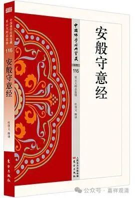

**《安般守意经序》句读一则**

前说康僧会《安般守意经序》“六双十二辈”，再聊几句这一段里面的句读问题。

康僧会《安般守意经序》除了被放在《安般守意经》前面，同时也被收录于《出三藏记集》，也可以互相对照着看。

** “于是世尊化为两身一曰何等一尊主演于斯义出矣大士上人六双十二辈靡不执行……”**

这一段文，查了一些原文和解释，各家句读、校勘，差别很大。这里就不征引各家版本了，直接说我在这里给的句读。

这一段应作：

** “于是世尊化为两身，一曰‘何等’，一尊主演于斯义。出矣，大士上人，六双十二辈，靡不执行……”**

这是说，

世尊化为两个形象，（于是世尊化为两身）

一个提问，（一曰“何等？”——普宁藏、嘉兴藏“曰”做“白”。意思一样，都说得通。）

一个讲经，（一尊主演于斯义——《出三藏记集》思溪藏、普宁藏、嘉兴藏版“一尊”做“一曰尊”，不当。“于”，普宁藏、嘉兴藏做“千”，非是。）

内容说完以后，（出矣——考虑到上下文结构，这两字单独拿出来，比“于斯义出矣”这么读要好。）

大家都照着做……（大士上人，六双十二辈，靡不执行……）

个人觉得，这样句读比较理想。

