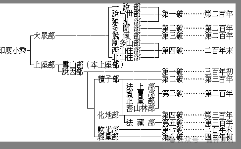
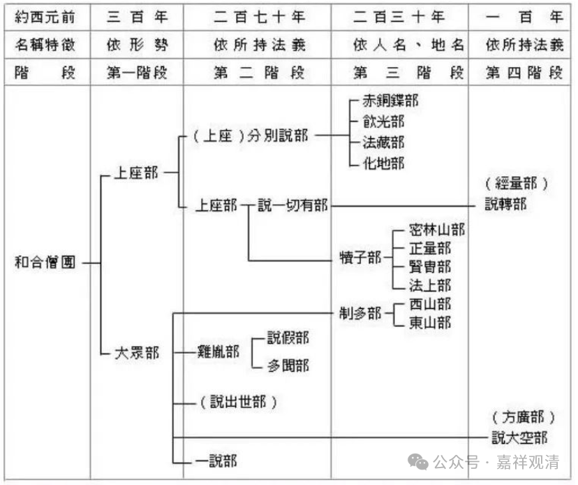

**《宗义略讲》002·004**

我们讲佛教的宗义，有些东西大家还不了解的，需要把后面补充的东西讲一讲，比如说这些部派的分化、或者说分派（说“分裂”不太好）。

这些部派的分派我们现在看这些表格，我今天刚刚发的这个表格——

这个是部派分化的汉地的主要说法，依据《异部宗论论》。而这个说法主要是根本说一切有部系统当中保留的说法。《异部宗论论》作者是世友论师，是说一切有部背景的著名论师，传记里经常把他和马鸣的事迹混淆。

这个表格也不错，是另一种说法。

佛教部派分化的说法很多，不同的传承保存了不同的说法，真正搞佛教史研究的可以专门研究讨论，这里大家只要知道个大概就行了。我也专门讲过《异部宗论论》，那里会介绍比较详细，有兴趣大家可以听听。

那么在介绍部派佛教的时候，我们要讲，所谓的“部派佛教”是我们今天的人给那个时候的总结，生活在那个时代的人他绝不会认为“我是‘部派佛教’当中一员”“我的时代如何如何”，他们没有明显的“我在部派佛教时代”的感觉，这个是没有的，这种想法是不会有的，但是印度人会有很明显的宗派意识。

就像有些人喜欢问我们什么派？就是很多人一学佛教，一碰到我们就问，“你是什么派？”“我们是什么派？”好像自己没有一个“派”就浑身没着没落的，好像出去要跟人家说一说是什么派才觉得自己有着落，其实实际来说，以目前绝大多数学佛的人来说，绝对还谈不上什么“派”，一般人还谈不到“宗见”，最多算师父是什么派。

其实长期以来，绝大部分中国人的宗派意识并不强——在绝大部分是文盲的背景下，哪里谈得上什么派，能不滑向民间宗教就“阿弥陀佛”了。自觉的宗派意识，印度、日本都比中国强得多。

