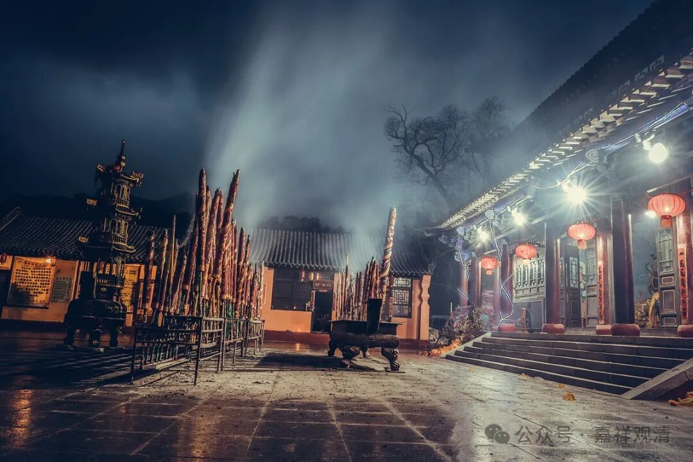

**几类“善知识”的“德相”**

佛教里说“善知识的德相”——就是好的师父应该具备的条件。《大乘经庄严论》说八种，《道次第》里一般说十种，即：

1、戒律、2、禅定、3、智慧——这是说通达佛教的“基本三学”；

4、功德至少得超过徒弟；

5、勤于善法；

6、知识渊博；

7、通达空理；

8、善于表达；

9、慈悲心；

10、利生无倦。

如果没有十个条件都满足的人，那作为师父应具备的底线条件，至少应该具备两条——

1、戒律；

2、慈悲心。

很明显这作为“底线”的两条都属于品德方面的。

民间对“这一行”则有着自己的认同标准：

1、首先得“盘靓条顺”，长得帅！

2、嗓子好，声音好！

3、记性好！

4、人品好！

这倒是传播所必需的“先决条件”。

香花和尚、瑜伽僧（民间佛教）则另有四个标准：

1、能说、能唱、会科仪；

2、能扎纸马、糊纸人、叠锡箔……；

3、能写：能上疏、写表，会“公文”书写；

4、能剪，心灵手巧会纸活儿，剪剪贴贴的细节得会。

呵呵，现在实际的“市场需求”是什么呢？我不说，你们自己对号入座……

