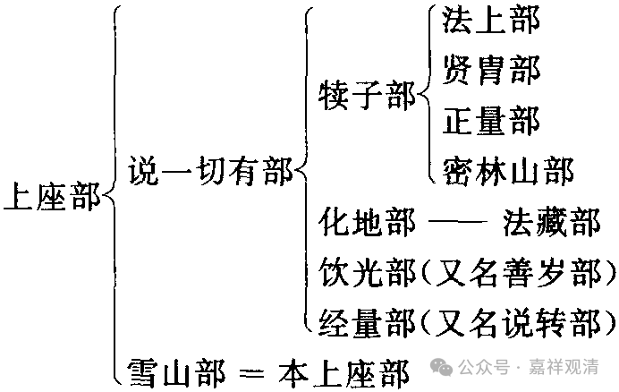

**《宗义略讲》002·007**

那么我们看从“上座部”最早分出了“雪山部”和“说一切有部”（还是按照《异部宗轮论》来说）。“说一切有部”（在表格第一个分裂当中，）他就说，“其实‘雪山部’和我是不一样的，我才是正宗的‘上座部’，所以，‘他们’就不能再用“上座部”的名字了，他们是‘雪山部’”有部说“我才是真正的上座部”，所以呢，原来的上座部就变成雪山部了。

接下来呢，分出了犊子部。而有部依然认为犊子部也是从他分出来的，但是呢好像有其他的记载说他们是“叔伯兄弟的关系”，就是他们虽然都属于上座部系统，但实际上并不是能生、所生的“父子关系”，而是先后从上座部系统当中独立出来的部派。待会我们再说，有可能犊子部跟有部有一些关系，因为如果你站在有部的立场上来看，所有的部派都是从他独立出去的，当然换一个部派的论典也会说同样的话——他们是从我们分出去的。

那么犊子部说他最特别的一个观点就是提出了“不可说我”……

一切的佛教宗派都要提到“无我”（大乘的说法是“人无我”、“法无我”），那么犊子部突然提出个“不可说我”，大家直觉地觉得，“你这个不对！”然后“犊子部”还比较犟，“我就是对的”，然后自己独立发展。

在佛教内部宗派频繁且合力打压之下，犊子部居然一直是佛教界的顶流，可以想象他的实力！玄奘法师和义净法师在印度的时候，犊子——正量部一直是佛教界的四大山头之一：上座部、大众部、说一切有部、正量部！（这里的“上座部”略近于今天说的“南传上座部”，实际我们认为今天的“南传上座部”更接近与历史上的“分别说部”的大系统，当然叫“上座部”也完全可以。）

其实我觉得犊子部说得挺有道理的……

（有人问：有说他接近外道……）

历史上、文献上都有这个说法，但说他“接近外道”是外人对他的抹黑或者更严肃一点说是诽谤……其实这种抹黑在佛教史里很常见，包括对人、对部派的抹黑，甚至也有对外道的抹黑，大家要习惯。这种“抹黑”，包括但不限于误读、八卦、栽赃……比如叫犊子部、鸡胤部，就被解释为人家先人是牛娃、山鸡……

我对“犊子”略有些心得。我挺喜欢犊子部的（也许是因为我好打抱不平），但是对他后期极端的主张我不接受啊。其实我们在谈到犊子部特殊观点的时候，你要知道所谓他的“特殊观点”，到底是“我不试图去理解”，还是“我不能理解”呢？假如我来替犊子部下一“转语”：

这个“‘不可说蕴’的‘我’”，就叫“不可说我”，而这个“不可说蕴”相当于你们说的“心不相应行法”。此“心不相应行法”里的“我”，与五蕴，非即非离，所以说它“非即蕴非离蕴”……

——这么一说，我看批评他的人们都要先闭嘴几分钟酝酿酝酿、思考思考了。有部的“心不相应行”都是独立实有的，大乘的“心不相应行”则全部是分位差别的假法了！那犊子的“不可说我”错在哪里？！

