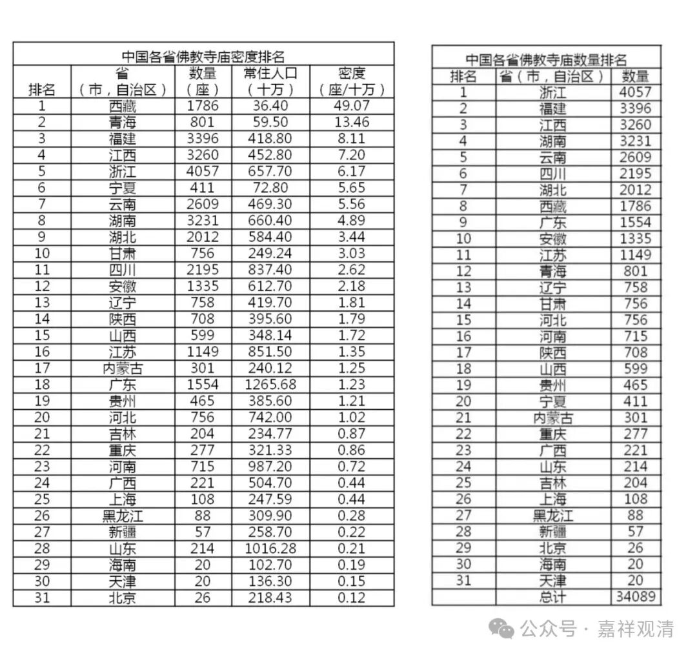
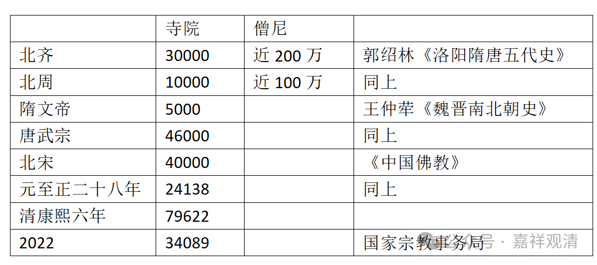

**数数上海和全国寺院

最近在用沪语讲上海佛教史，所以翻了翻上海的地方志。

先说今天的。按2022年年底国家宗教局的官方数据，上海共有寺院108（好数字），每10万人口拥有寺院0.44座（第一名西藏，每10万人口49座，第三十一名北京，每10万人口0.12座），排名第25。全国有寺院34089座。

按，随便翻几本上海地方志看看——

据光绪《重修奉贤县志》，则奉贤县有寺80余座；据乾隆《上海县志》，则上海县有寺103所；光绪《嘉定县志》录得寺院35……如此，则到清末，在今天的上海境内，大约有寺在5000～10000。（得空我准备全部数一遍。）

据清代康熙六年记载，则大清当时全国有寺79622所。若就今天上海的这些地方志看来，恐怕康熙年间的数字还是低了（也可能是后来经济繁荣了，乾隆以后，那啥也放开了）。

再查……据郭绍林《洛阳隋唐五代史》记载，北周有寺10000余，僧尼近100万；北齐有寺30000余，僧尼近200万……，据王仲荦《魏晋南北朝史》，则隋文帝时全国有寺约5000所；唐武宗时有寺约46000所，据《中国佛教》，北宋有寺40000余，元至正二十八年，全国有寺24138所……

做一个不完全统计表，大家看着玩玩吧（以后有机会找资料继续做……）

寺院

僧尼

参考资料
北齐

30000

近200万

郭绍林《洛阳隋唐五代史》

北周

10000

近100万

同上

隋文帝

5000

王仲荦《魏晋南北朝史》

唐武宗

46000

同上

北宋

40000

《中国佛教》

元至正二十八年

24138

同上

清康熙六年

79622

中国2022

34089

国家宗教事务局

        修改于