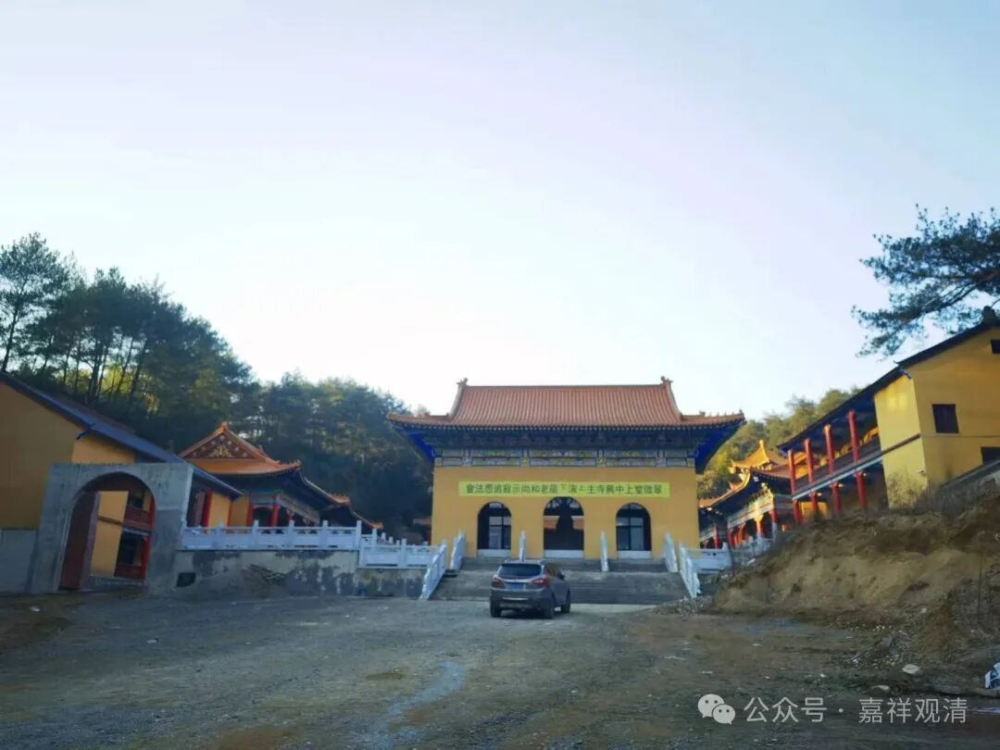
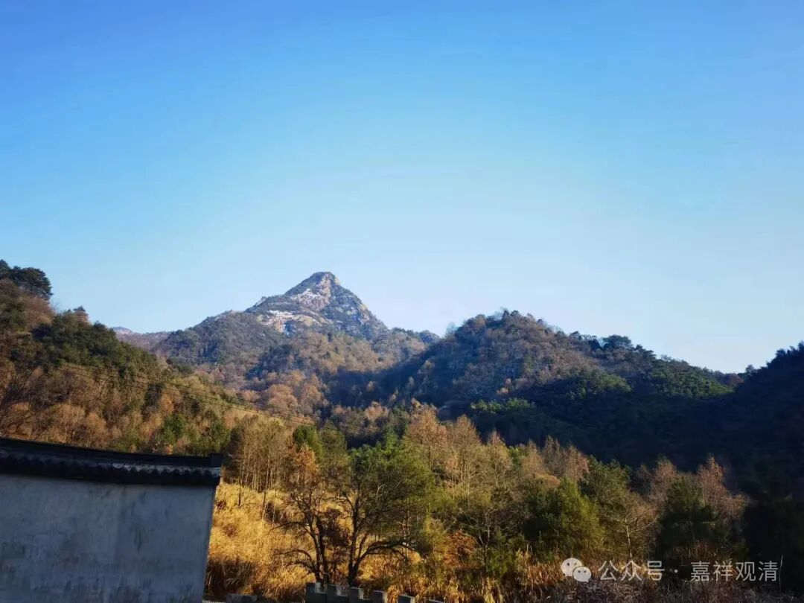
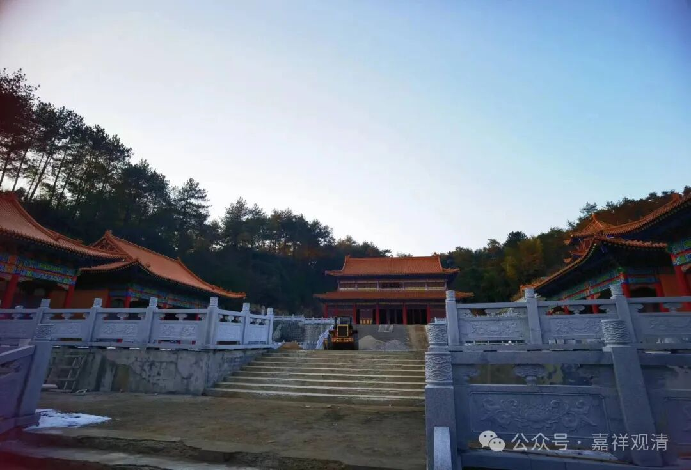

回到黄山翠微寺。

黄山翠微寺在黄山西海，以前有徽州古道经过寺院门口，所以历史上也曾经很有名，上海图书馆还有本可能是孤本的《黄山翠微寺志》，师父还曾经影印了一版，送了我一本（不过我那本留在天津了）。

今天，古道早已荒弃，现在寺院本身没有直接的山路和黄山景区相通，所以也不用费心逃门票了。

差不多那年非典的时候，我们有出家师父从寺院出发沿着古路往前山走过，后来只是走到了大峡谷的边上，上不去。以前据师父说他走过，大概应该有老路可以去前山，但现在早已无法辨识。荒弃的山路走起来很麻烦，蛇虫很多，有危险。前面说过那个独自翻山去前山的，就被蛇咬了。有几次师父、师兄们进山也踩到蛇了，好在互相都没有伤害。我老实得很，不敢走没路的“路”。

寺院面对的就是弥勒峰，或者我们叫它“弥勒峰”，远处看起来像大肚子弥勒，而且是整体都像。“弥勒”肚子这里有一个山洞，以前师父和一个师叔都曾经在里面住山、闭关。我上山的时候，那个师叔已经下山走了——他没完成三年的闭关，两年多，身体问题，吐血下山了。如果我早点到他应该就没事了。另外，他不太懂一些闭关的“注意事项”。

寺院已经十几年没回来了，看起来变了点模样，又没变多少模样。感觉跟翠微寺相比，白云寺的发展算很快了。

师父圆寂，师兄弟和第三代们都慢慢聚回来，送师父最后一程……

