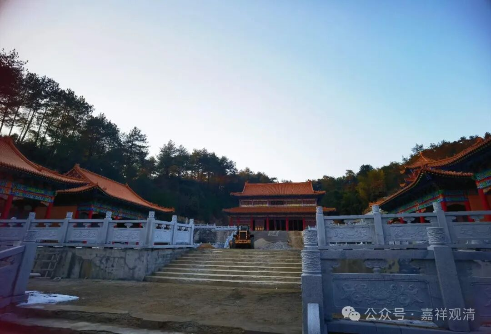
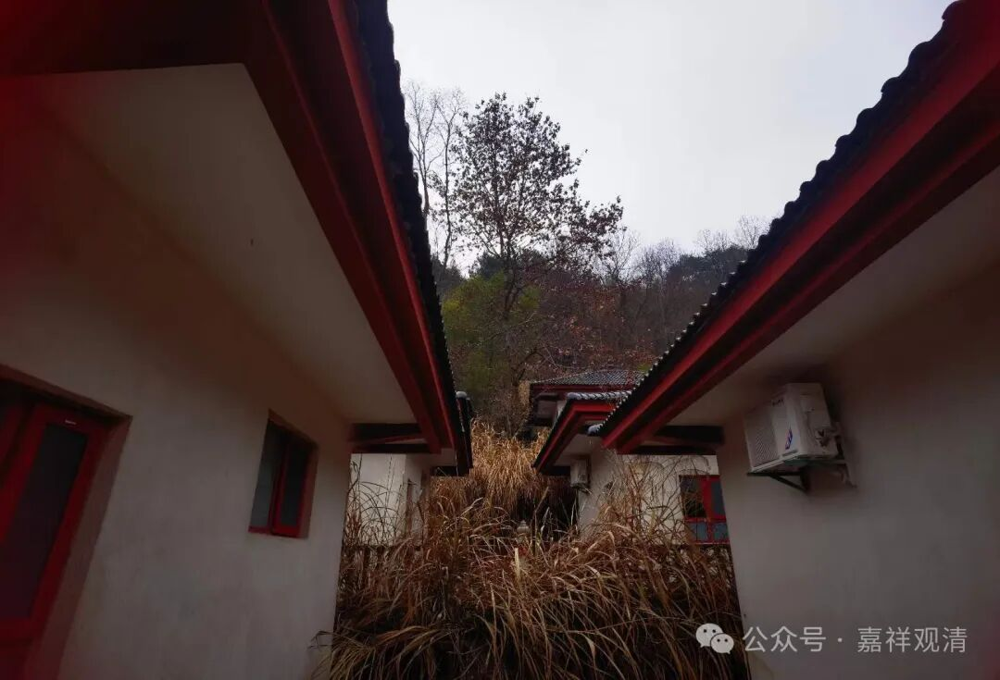
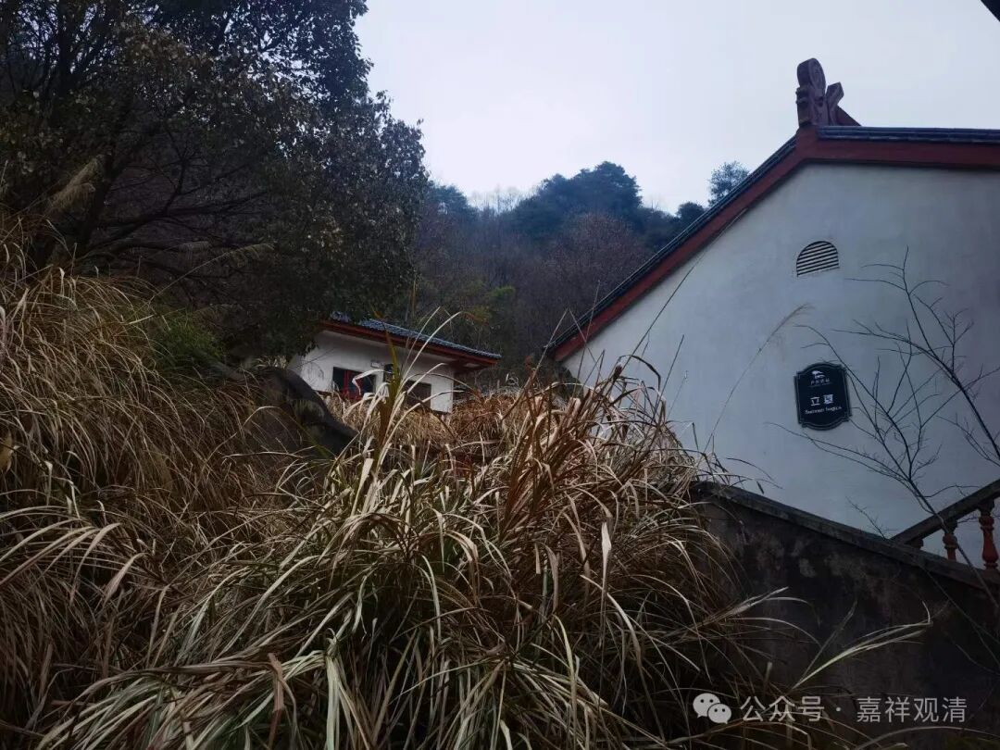
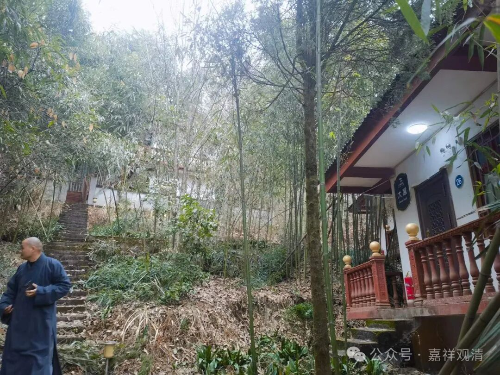
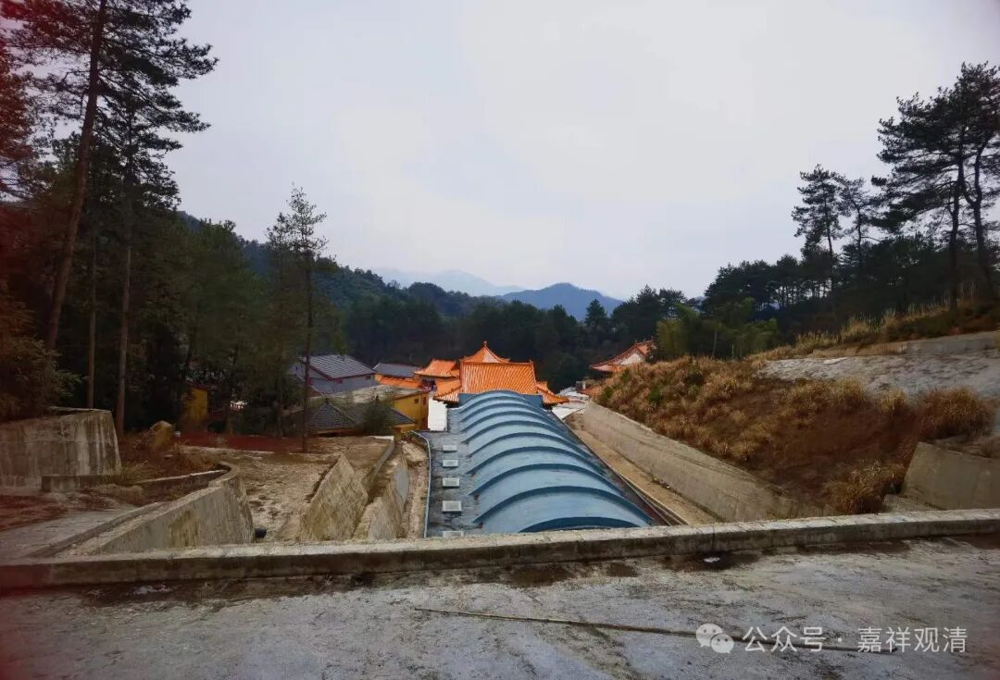
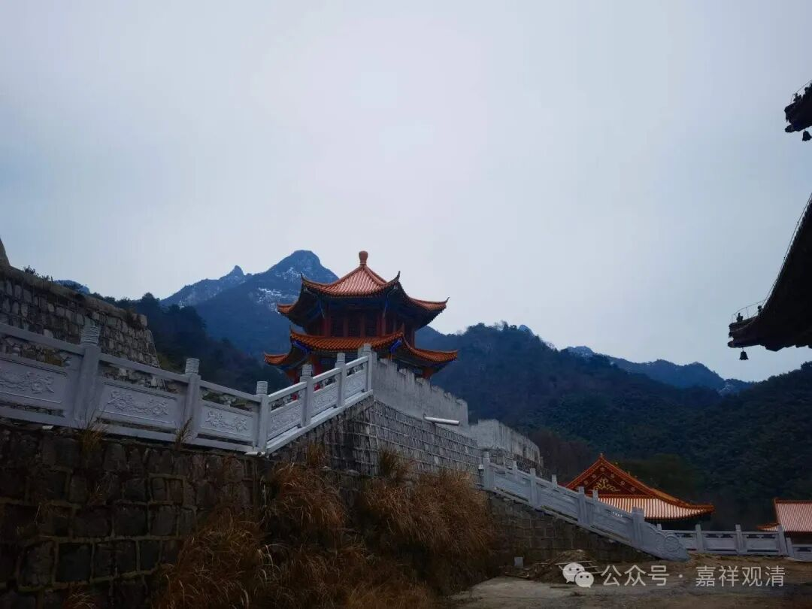
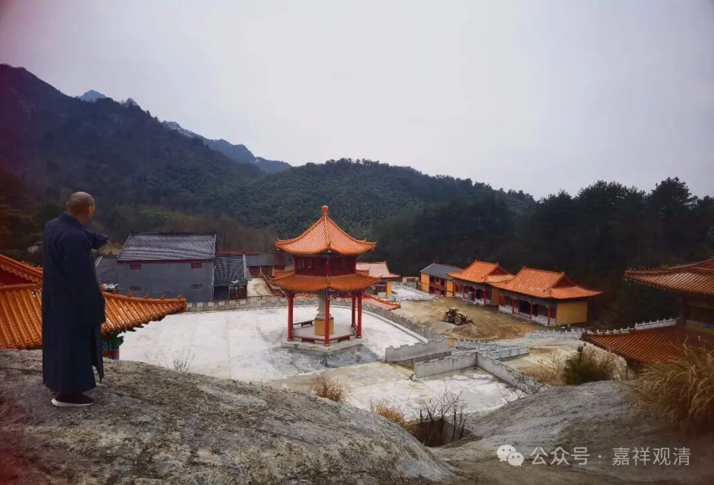

**重游翠微——深山藏古寺**

下午和师兄弟几个逛了逛十几年没再来过的翠微寺（我好像七八年前回来过一次）……

其实前两天我是觉得这若干年庙里建设不多，今天看来，那是误判了。

今天观法师赶回来了，当年我们是一起在庙里的，同时还有一个观净师，还有观道师。那年冬天，观净师晚上把碳炉拿到房间里……第二天差点早上没起来，估计再晚两个小时就得交代了——煤气中毒。还好年轻。

昨天我说庙里没路去黄山风景区……观法师说他们走过，不过还是得先下山，然后从山下绕过检查站……他们那天三点钟就下山了，十一点钟到达什么峰顶，估计是九龙峰，他说后山风景比前山好。

我们故地重游，忽然发现边上多了很多“茅棚”——

师父以前发愿造四十二个茅棚，对应华严四十二个字母，现在一看，有一个茅棚贴着“39”的标识，那意思应该都已经造完了？！只是这几年没人打理，这一片都荒了。

我说：我们可以一人认领一个，以后闭关用！不过闭关房（茅棚）有点小，有一室一厅一卫就好了。以后我得按这个标准来建。

想把42个茅棚数清楚，我们就继续往山后爬，“望路之远近，豁然开朗”

原来后面还藏着一片建筑，护坡都做得整整齐齐，比我们庙里建得像样多了。

和几个师兄弟说：这说明庙里工程没停过啊！

不过转念一想，接手的师兄还得落一身债务——庙还没建完，肯定落下一堆工程款。呃，一想起来就浑身脑袋疼！

