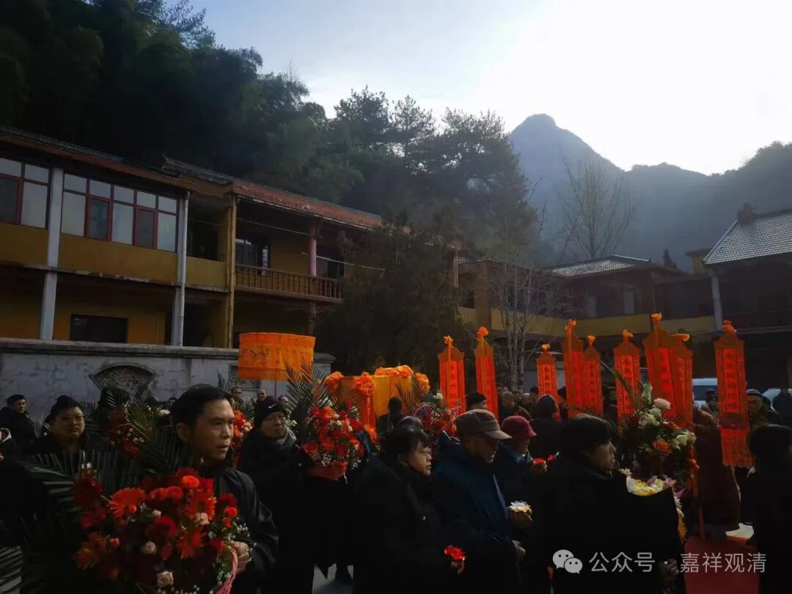
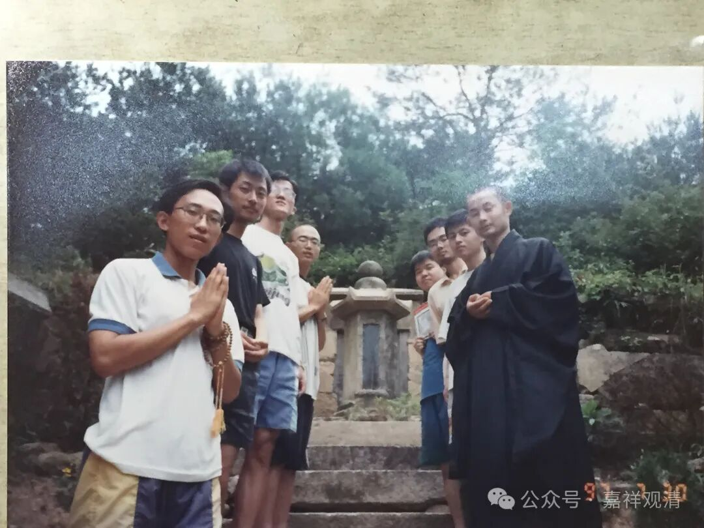
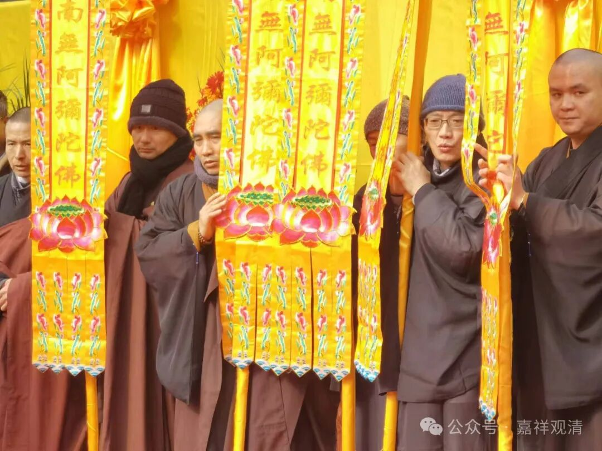
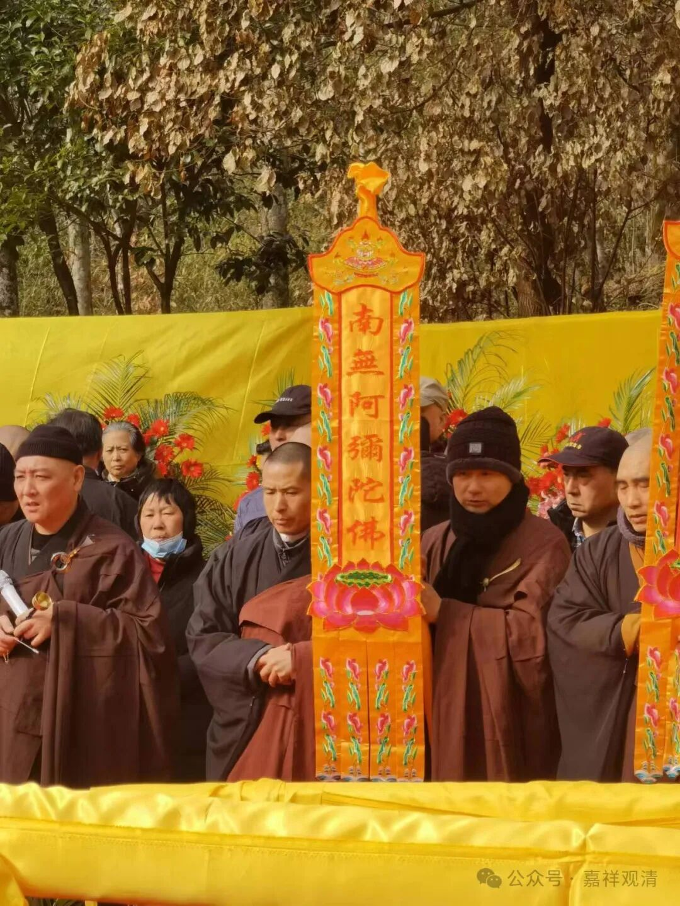

**霹雳一声全体现，者回掣断旧生涯！**

今天黄山翠微寺师父追思会，以后直接起龛落葬，并不荼毗火葬，直接起全身塔，直截了当。

二十多年前，师父重建翠微寺时，有一天夜里出门，睹对面山头放光，便说“要现宝”！第二天便带着弟子们上山“寻宝”。当时山上并没有后来这些路，大家四处散开，终于在一片荒芜中找到雨峰纲禅师的全身舍利塔……现在那一片已经被开了石板路，就在寺院对面的小山包上。我这还有当年一起礼塔的照片。

几个兄弟都在，我就不一一点名了。那时候我们还是大学生……

照片里的这个年轻出家人是无暇师，唐山人。我们经常说他就是九华山的祖师，他说“此无暇非彼无瑕”（九华山百岁宫有无瑕祖师的肉身）……后来无暇师在高旻寺做了堂主，又后来去了深圳弘法寺……现在叫印能法师，佛教界算个网红吧。他的华严字母唱腔就是师父教的，那是我就在边上蹲着……这次他也来送师父最后一程。

这次我回庙里，有人说“车里都在放你的牒子”，我想我虽然嗓子好，但也没出过唱片啊……原来他们把我当无暇师了。无暇师录了不少佛教牒片。

无暇师见面说我胖走样了，我回来看了一下照片，“不至于啊！”倒是他前些年那真是胖走形了，这次看到，那绝对是瘦回来了。可能他在跟我显摆减肥成功吧……

看谁认出来

前面说到山上有全身舍利起塔的雨峰纲禅师，即“新安黄山慈光雨峰纲禅师”，《五灯会元》有传。他有颂曰：

“** 面皮抝转验当家，起倒随人未足夸。**

** 霹雳一声全体现，者回掣断旧生涯。**”

“者回”，就是“这回”。

