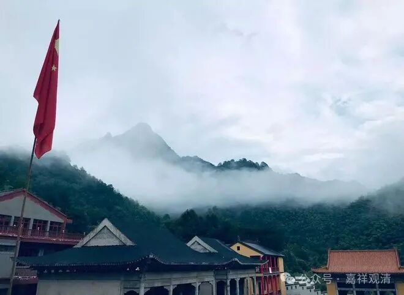
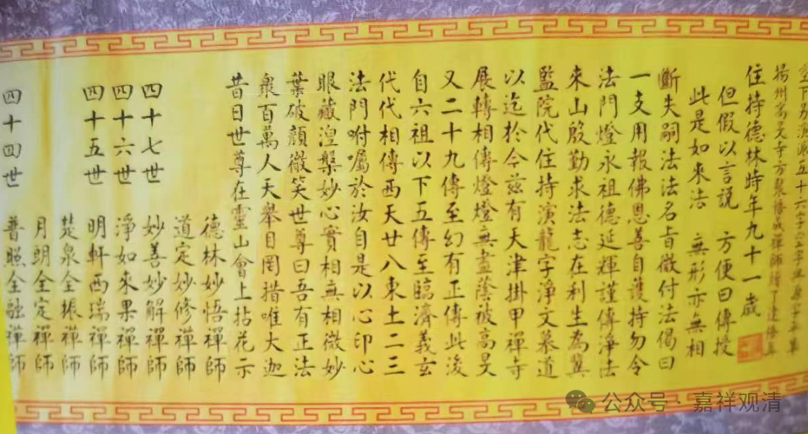

**马蹄催趁月明归**

今天回寺院了。

翠微寺还有留下的师兄弟在处理留下的事。首先自然是法不能中断，所以马上就安排“法华七”，念《法华经》了。

我们以前在庙里，大经是常年轮着念的：《华严经》《大般涅槃经》《法华经》……黄山翠微寺组织“华严七”是形成传统了，最初是20天念《八十华严》，后来就在《入法界品》接《四十华严》和《普贤行愿品》……我可能都念过有十遍《华严经》了吧。我最初上翠微寺就是参加念《华严经》的。昨天那张照片也是那时候拍的。

翠微寺数经兴废，但历史上好像留有的线索指向它都是标准的禅宗寺院。前一次废弃，是在太平天国时期，此地（太平，今改名黄山区）是左宗棠部和太平军李世贤部大战的战场……文革时期寺院全废，演龙师傅过来的时候只有一个牛棚，于是它就是旧大殿了，我们也是在那里上早晚课，我那时候讲道次第就是在二楼。

师父也是禅宗的，在高旻寺历任知客、堂主、首座，2005年5月初接德林老和尚传法法卷，为临济宗下第四十八世。老和尚传法卷那天我也在现场，当时高旻寺刚放戒不久。

这就是当时付法法卷部分。有德林老和尚传法偈曰：

“此是如来法，无形亦无相；

但以假言说，方便曰传授。”

        修改于