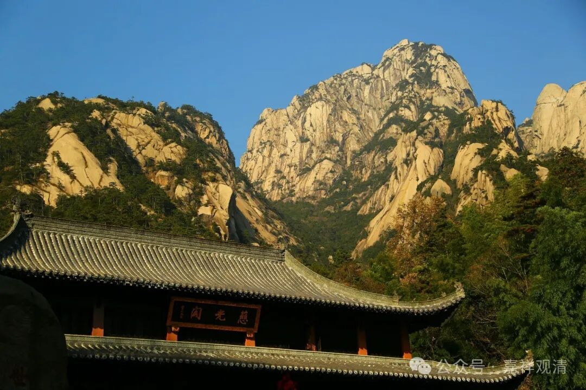
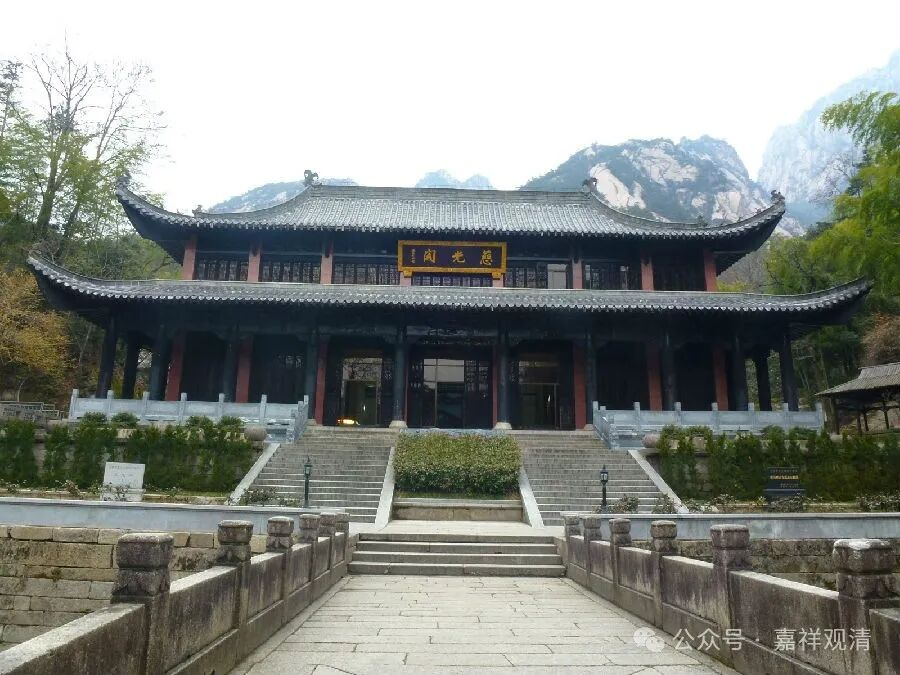

**雨峰超纲禅师与《黄山翠微寺志》**

《黄山翠微寺志》在《中国佛寺史志汇刊》里也被收录了，就是雨峰超纲（也可以叫“雨峰纲”）禅师编纂、辑录的（或者说是他牵头主编的，因为里面还有他的小传）。

《翠微寺志》“雨峰禅师”的小传里说：

“** 清雨峯襌師，名超綱，嘉禾氏，嗣東塔晦岩熹和尚，係龍池萬翁之孫，戒秉福嚴費老人。**”

说他嗣法于东塔（寺）晦岩熹禅师，是龙池（山）万如通微禅师的法孙，同时他得戒于费隐通容禅师。费隐通容禅师和万如通微禅师都是临济宗第三十世密云圆悟禅师的法嗣（法子）。那么雨峰超纲禅师的临济宗法脉传承如下：

……正传幻有禅师——密云圆悟禅师（临济第三十代）——万如通微禅师——廣福晦巖熹禪師——雨峰超纲禅师（临济三十三世）……

又，密云圆悟禅师住持宜兴龙池山澄光寺（又名禹门禅院）在正传幻有禅师之后，是正传幻有禅师法子，则，正传幻有、密云圆悟、万如通微三代皆住持龙池山澄光寺，而雨峰超纲禅师又被称为“龙池雨公”，则他应也住持过龙池山澄光寺。

《五灯全书》里，雨峰超纲禅师被称为“新安黃山慈光雨峰纲禅师”，“慈光”，即黄山慈光寺（今已不存，仅存慈光阁，见上图）。《黄山翠微寺志》说，雨峰超纲禅师先在黄山慈光寺任方丈，退位后被迎至翠微寺住持并扩建。

如此，则雨峰超纲禅师当先后住持过宜兴龙池山澄光寺、黄山慈光寺、黄山翠微寺，最后在翠微寺圆寂、起塔。

