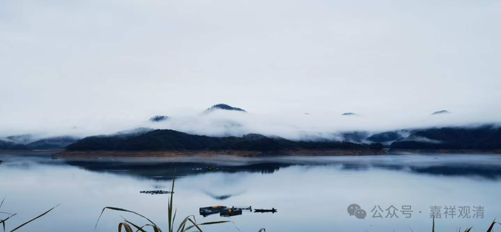
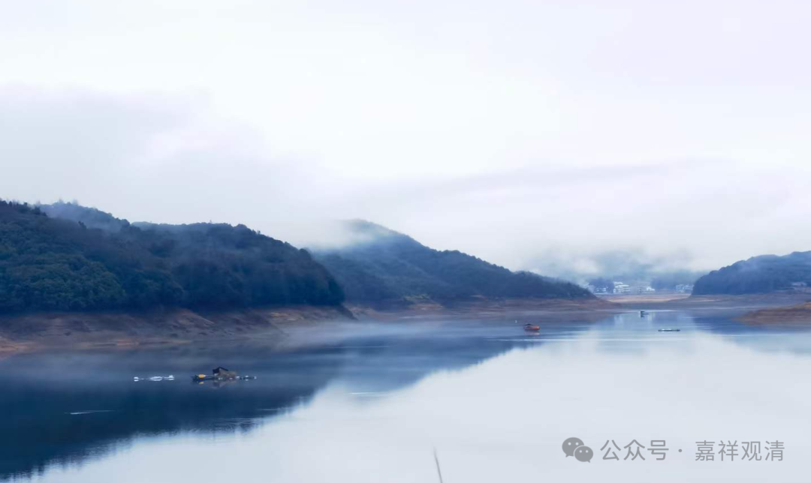
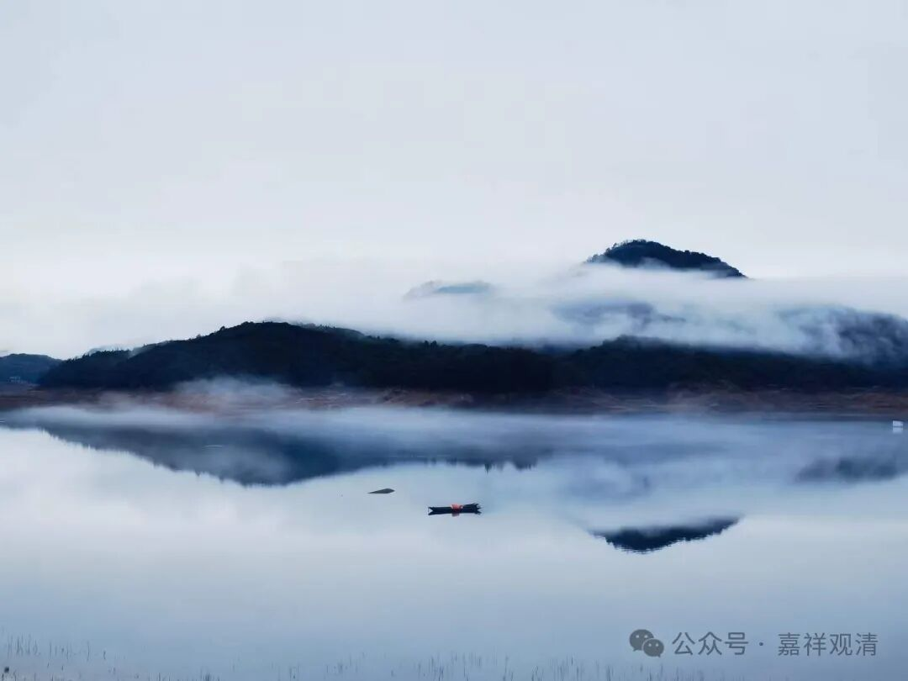
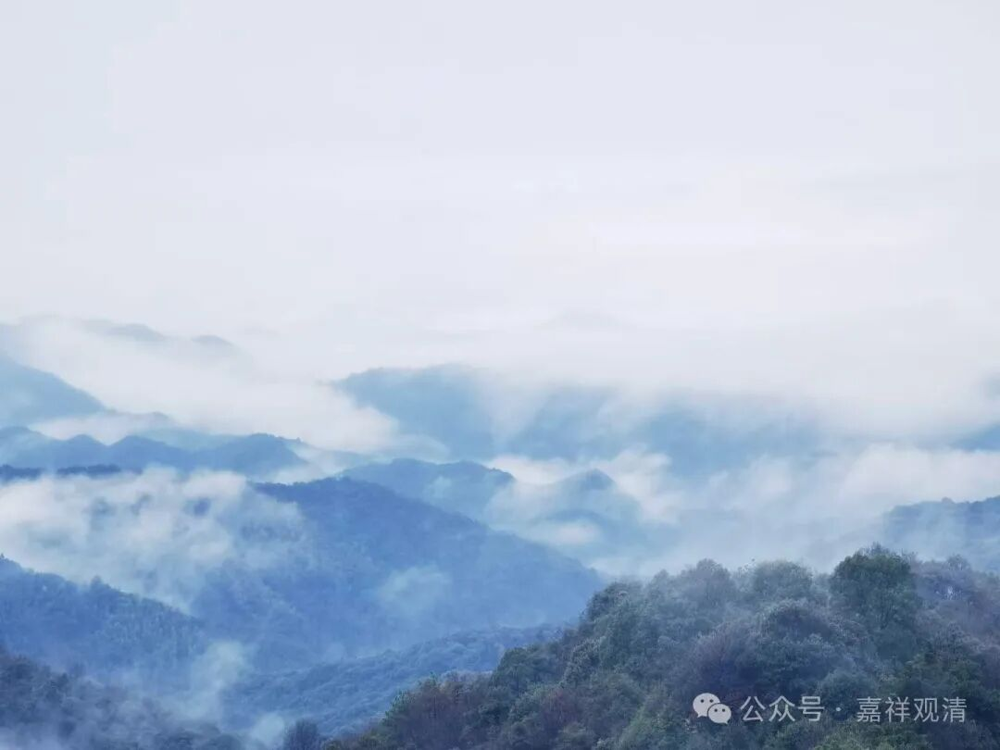
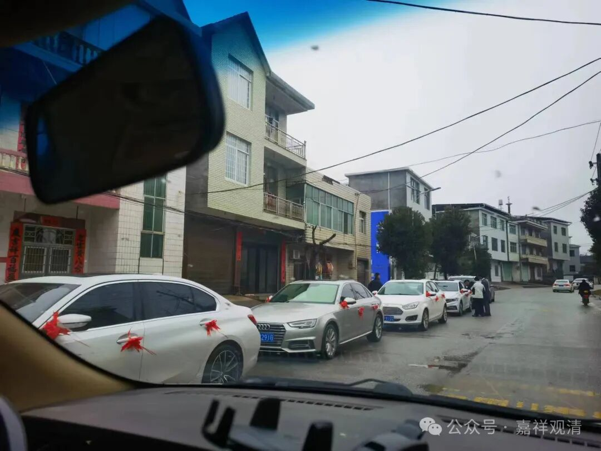

**传说·风景·娶亲**

今天下山。

李七斤和我一起下山。车开过一片山谷地，七斤说，那里几块石头，叫“石头压麻雀”……

“古时候，有个仙人路过这里。他看见一个小孩，就问他讨水喝。小孩儿说：大人让我看着麻雀（不让麻雀偷吃）。仙人说：我替你看麻雀。小孩儿就回屋里取水去了。小孩走了，果然有麻雀飞来……仙人就用石头把它压着……小麻雀还在扑腾……仙人又压了一块石头，麻雀就飞不动了。仙人喝了水就走了，麻雀后来也变成了石头……这里就留下一个‘石头压麻雀’的风景。就在对面。

所以我们这里没有麻雀，仙人压住了。”

想想好像确实是这样，在这里这么多年似乎真没见过麻雀哦。不过稍微想想，可能还是因为山里竹林多，蛇也多的缘故，蛇把麻雀都吃了的缘故吧。

一路下山，风景极佳，不停地下车拍照。

看看，是不是有点像青花瓷的图案？所以景德镇出这个是有道理的。（景德镇直线距离距这里不到五十公里。）

今天是个好日子，沿路遇到好几家娶亲的，镇上和村里都堵车。

路上也遇到老长的迎亲车队，一路打着双闪。

村里水泉家也办酒席，今天他们家有女儿（孙女？）出嫁。

