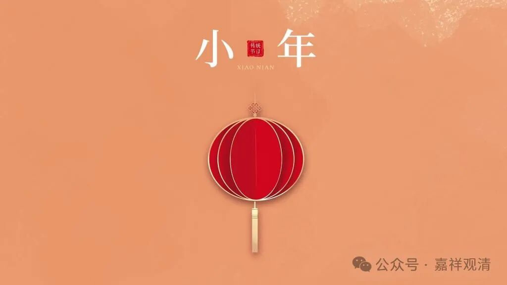
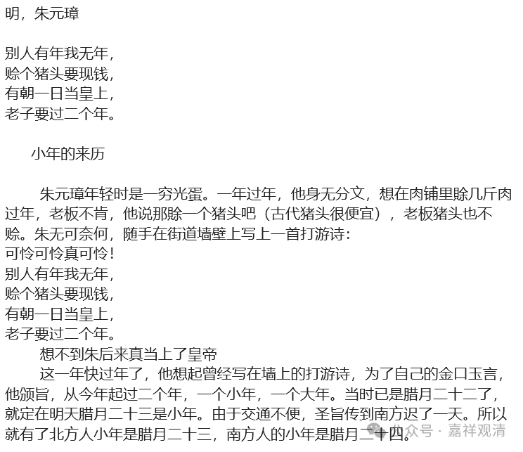

**咱山里的村子，“小年”的日子各不相同**

今天日历上标注——“小年”，呵呵，这个日历标得有点任性啊。

其实“小年”放在这个日子至少不是最普遍的，我作为南方人就不会确定腊月二十三是小年的民俗，连南方的民间故事里都说了：

说：朱元璋穷的时候没年可过，当了皇帝要过“两个年”，而圣旨传达有先后，于是北方“小年”在腊月二十三，南方的“小年”在腊月二十四。

这个故事不消说只是故事，因为朱元璋的朝廷一直在南方的南京（定都北京那是明成祖朱棣时候的事了），但也表明了，南方的小年和北方不同。

我记得小时候的小年夜，指的是腊月二十九（没有腊月三十的时候就是腊月二十八）。鄱阳这边山里面，“小年”则又有不同——

这里每个村子的小年日子都不一样，比如：张村李村小年是二十五，王村赵村就是二十六，周村吴村则二十七过小年……周围的村子“过小年”都错开，大概是方便大家走亲戚的缘故。

在这个大的习俗上面还有小不同，比如说，某村两个大姓，又会出现冯姓二十六过小年，郑姓二十七过小年的情况……木生他们村子就是这么个套路。还有的村子、大姓，因为要照顾有的年份没有腊月三十，则会往前推一天过小年（比如孙姓原来是腊月二十九过小年的，则在没有腊月三十的年份，孙姓改为腊月二十八过小年）。

所以，“小年”的习俗各地很不统一，也不是很清楚为什么日历上就这么把它标准化了。

