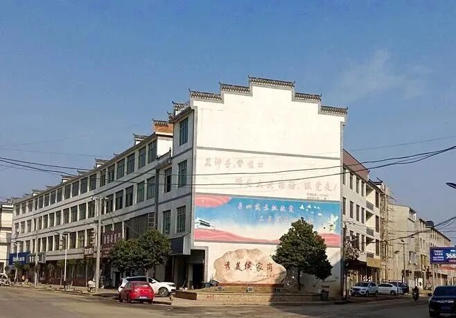
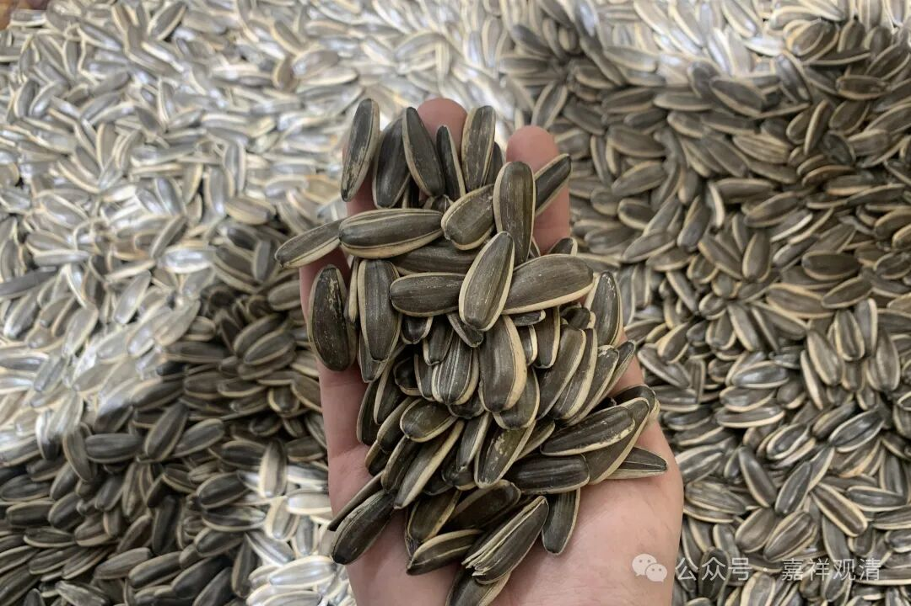
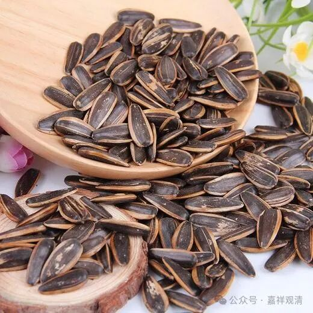

老胡下山去镇上修车，我们顺便下山买点年货。

老胡一直舍不得修车，结果现在车子的四个轮胎都快被磨平了，终于害怕了，小心翼翼地开下山去修，一路上都不敢加速。修车师傅笑他胆子大……哈哈哈哈，他不是胆子大，是胆子小，只是要为我们庙里省钱。我说以后没必要这样，出个事儿不值得。早点换轮胎就好。其实23年是准备换个车的，但是我们大管家过世了，这事儿就这么拖了下来。我们的车是宝马他哥——宝骏。哈哈。

镇上有个批发部，去买了三箱坚果，还买了箱小蛋糕和饮料，再买些蜡烛、纸巾、洗衣粉……山上有东北人，特意多买了一箱瓜子。

我们以前龙胜师也是东北人，那吃瓜子是一绝啊，我的自信心都要被打掉了。说起吃瓜子他是一脸骄傲，属于“当仁（儿）不让于师”。他说以前冬天净磕瓜子了，门牙都磕出槽来了……呃，这个我们真的做不到啊。

问另一位东北法师，他也承认东北人爱磕瓜子，只是不盯着一只牙磕，可以换牙磕瓜子。

他们磕瓜子喜欢原味的，我买的是一箱核桃味的、一箱焦糖味的。前几年在景德镇买年货的时候我也买过一次焦糖味的，最后……忘了拿上车了。

车子修了一半，还得换刹车片，刹车片也快磨光了……过两天换几个人下山，换他们买年货。

不买荤菜，素菜我们又能靠庙里的地自给自足一部分，所以年货真的没啥可以买的。

