**豆腐·小年·焰慧地**

今天是山下村里的“小年”（他们村的“小年”是腊月二十五，“大年”是腊月二十九。呵呵，不同的地方存在民俗差异），我一个人下山，到村里居士家里走走。

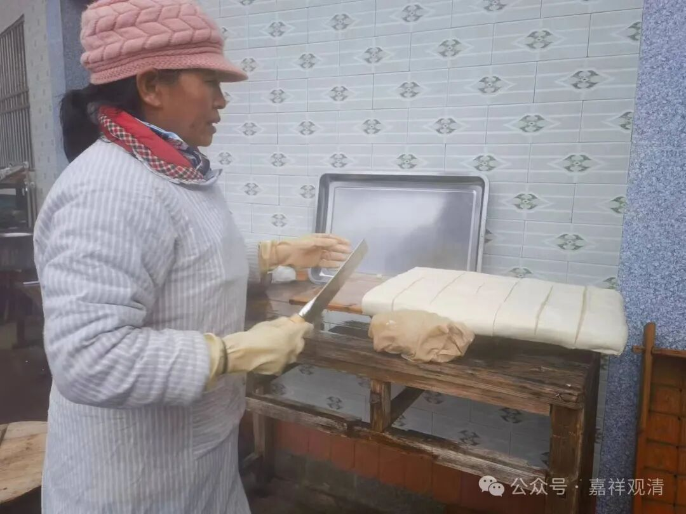

胡居士家是村里做豆腐的，我们“业务往来”甚密，哈哈。最近过年了，他这里全家上阵，一天做21板豆腐……我问平时做多少？呵呵，平时也就一板。

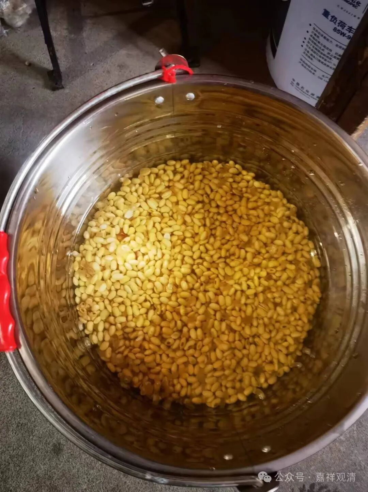

浸泡黄豆

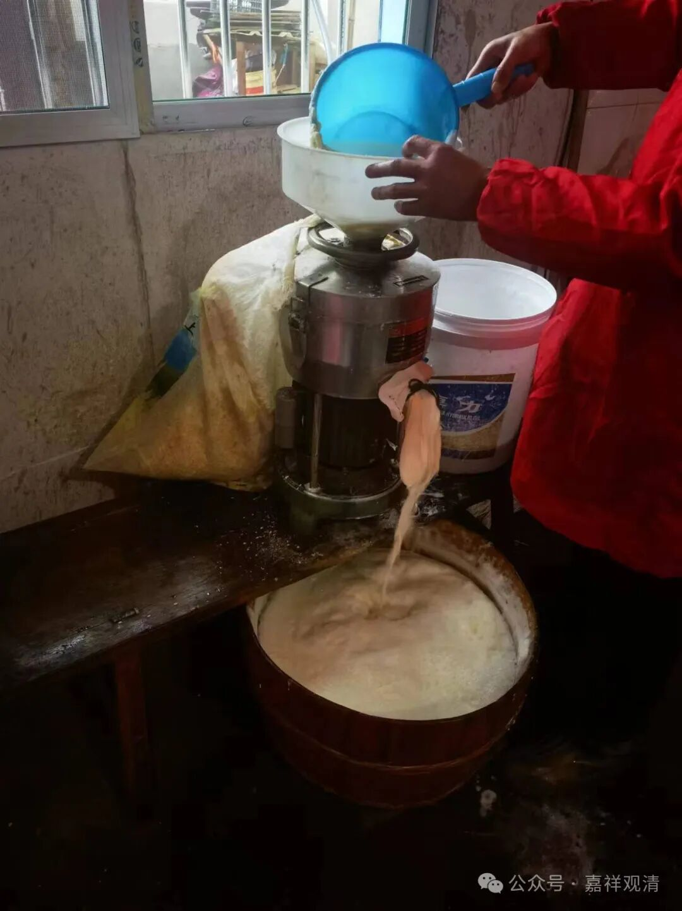

机器磨豆浆，自动干湿分离

豆浆先煮沸，然后静置

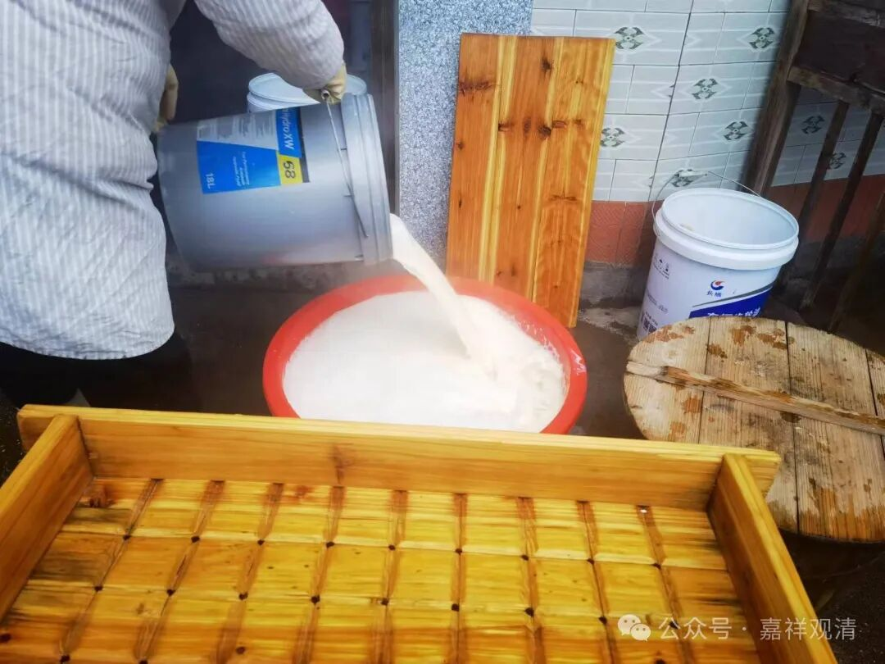

点卤了

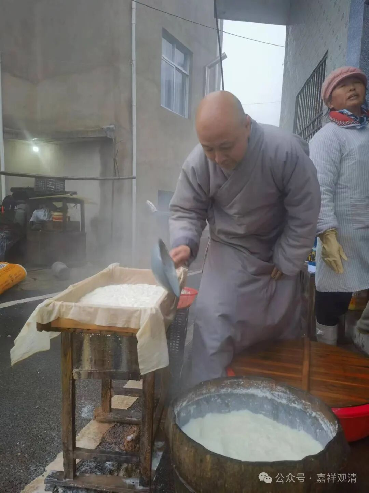

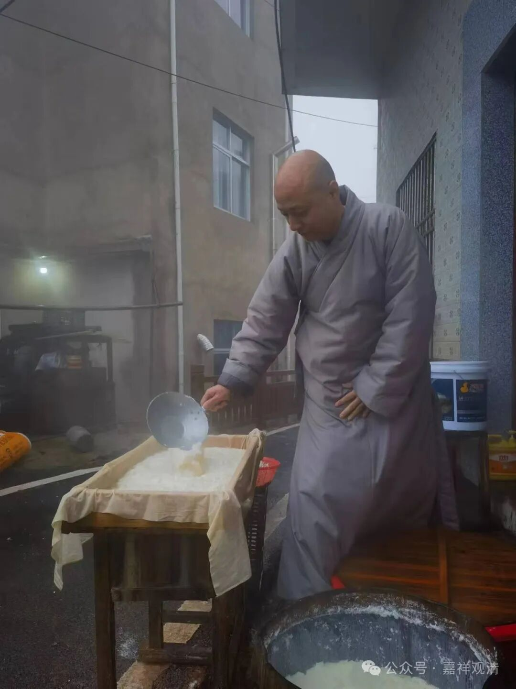

点卤静置后，把豆花舀到木格子里

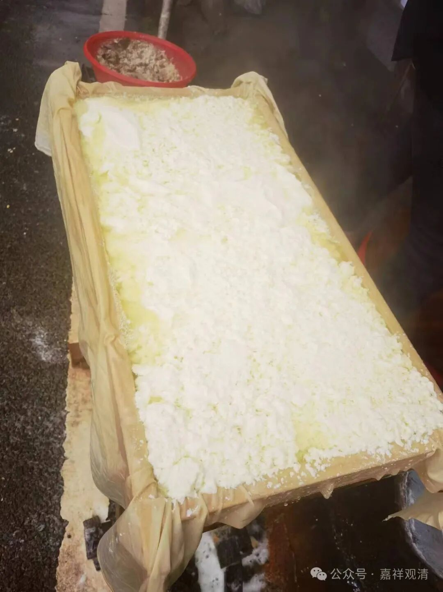

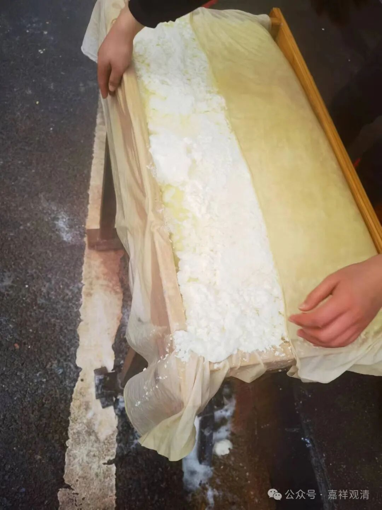

布盖好

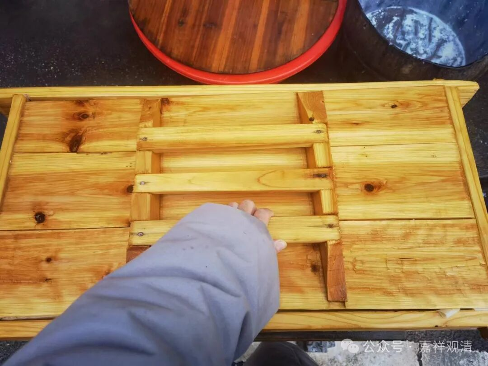

合上盖子

加压

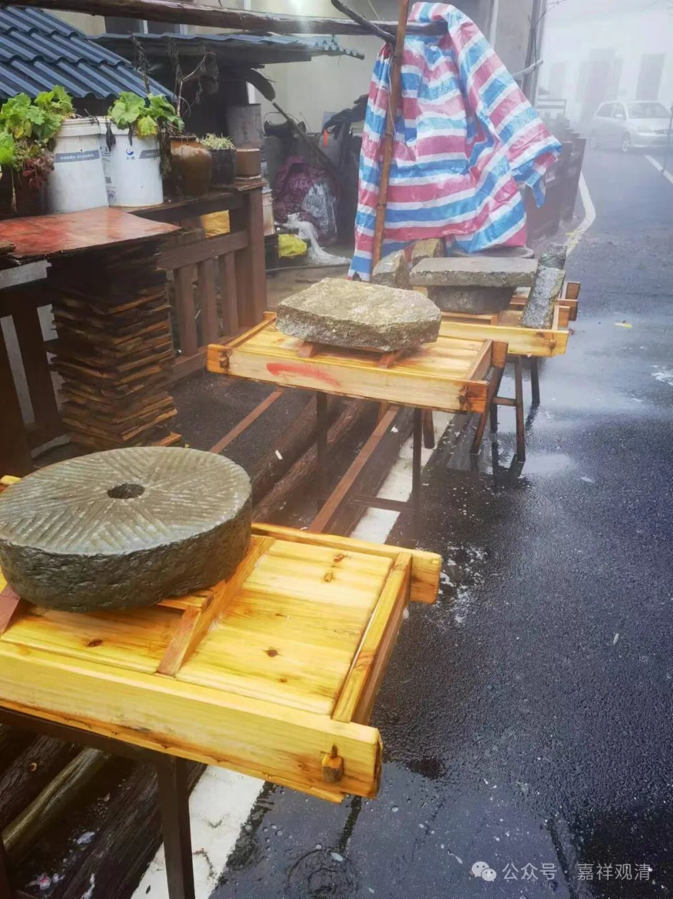

静置

成品豆腐

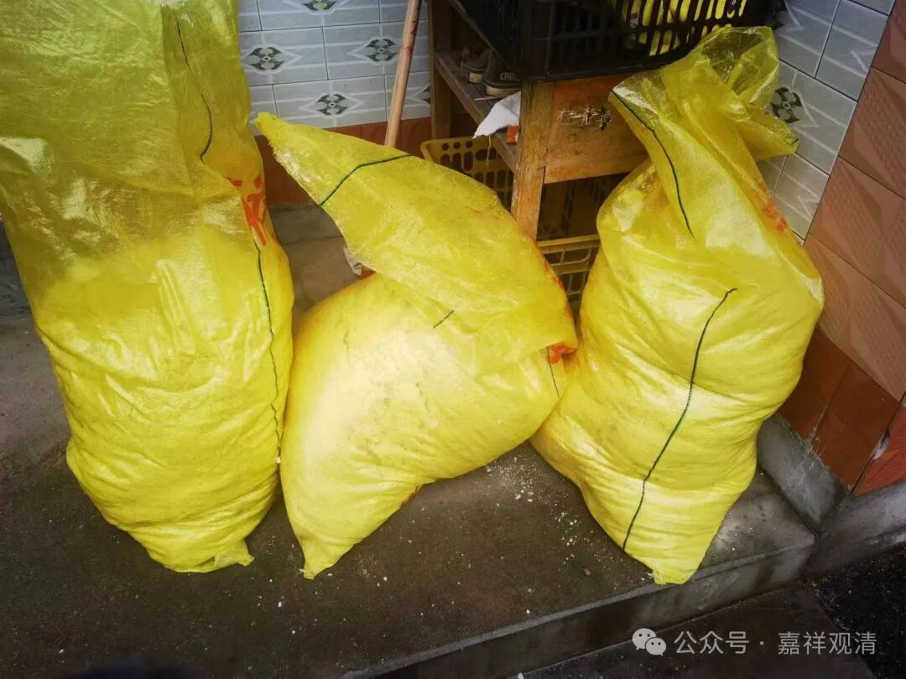

豆渣。过年，猪都被那啥了……现在豆渣倒在地里当肥料。平时养猪场拿去，一年一共给五百……

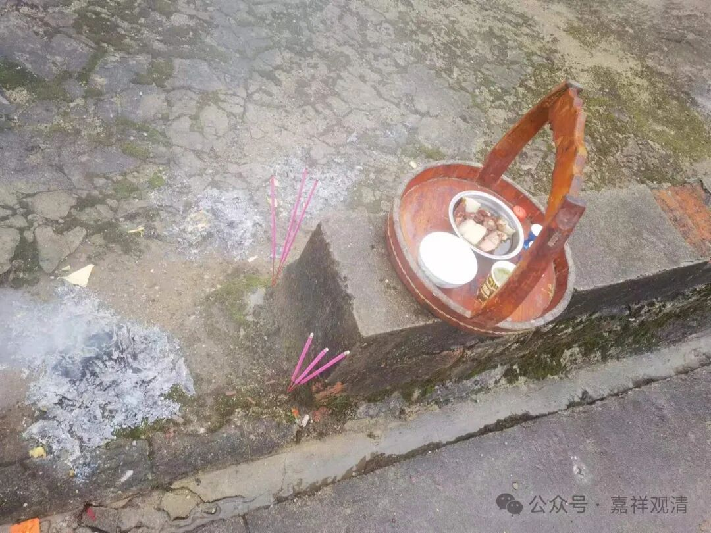

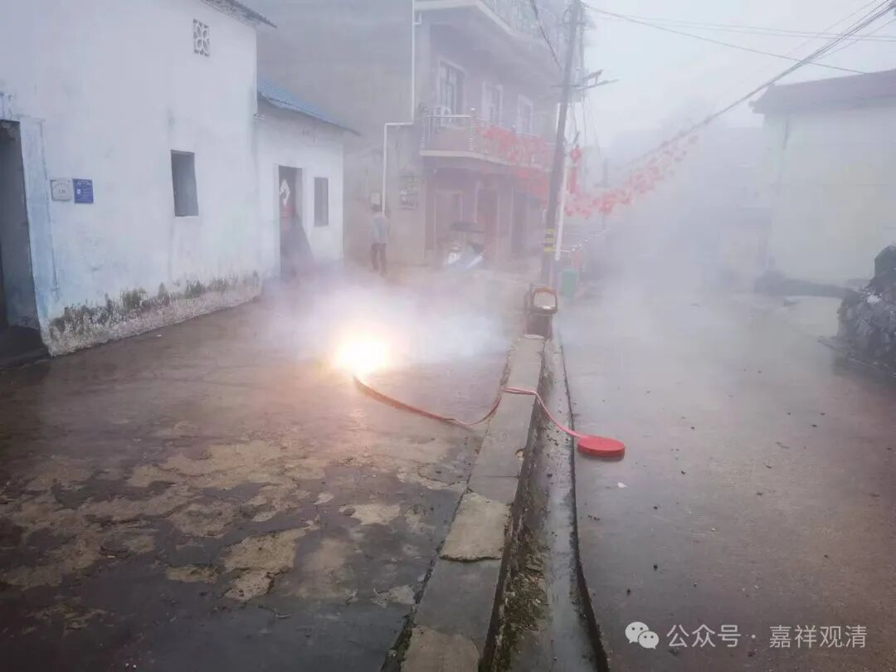

今天是村里过小年，这是在门口烧纸、点香、上供、点炮（放炮仗），意思是让老祖宗回家吃年饭了！江西人啥事儿都爱放炮仗，原先放鞭炮是炸了动静大，让“年兽”别来，现在演变为热热闹闹地“欢迎祖宗回来团圆”……

一家放了鞭炮，各家也都开始了，鞭炮声此起彼伏、不绝于耳……一会儿就看不见路了，能见度“三米以内”。

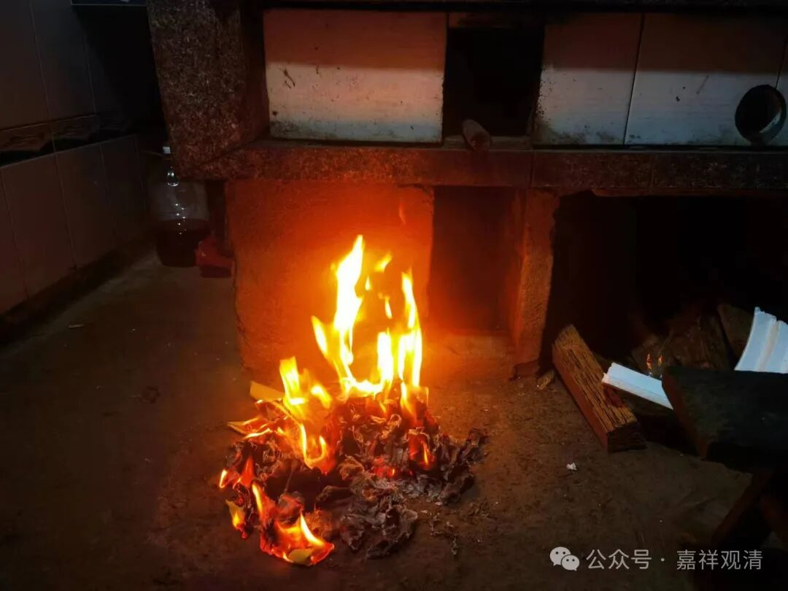

门口烧纸、上供、点炮这一顿搞完还没结束，还要到屋里的灶口烧一堆纸钱，算是祭灶，老居士说是烧给“灶王菩萨”“监斋菩萨”的。

我们再来看看——

在民间的佛教就是这么“朴素”，因为“灶”带火，还是“火”字旁，所以“灶神”就被“封”了“火部威神”，并一下升到了四地——焰慧地。这种由文盲来封菩萨果位的做法，很“民间”，好听的说法叫很接地气——文盲就是“地气”！

