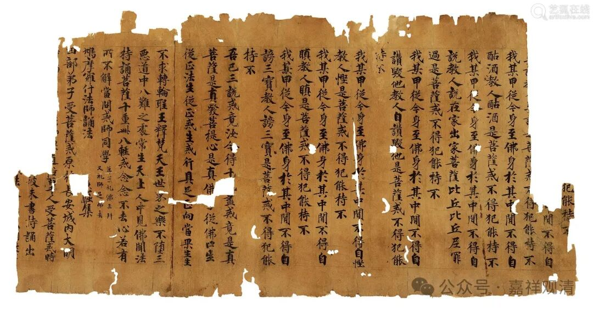

……先介绍一下《入中论颂》和《现观庄严论颂》。

这两部论都是经由法尊法师译为汉文的，《入中论颂》的作者是月称，《现观庄严论》的作者是慈氏（弥勒）。

《入中论》是月称的名著，月称还有《入中论自释》，法尊法师也已经翻译完成，法尊法师还翻译了宗大师的《入中论善显密义疏》，也是名著。

江湖上曾经出现过某法师《入中论释》的节本，就很奇怪——以《入中论释》的篇幅实在没必要做一个“节本”，也许被“节”掉的那部分是这位法师死也看不懂的东西吧。唉，有钱人动静就是大，就是没文化也想让大家都知道，所以要把自己的“节本”印出来晒给大家看。

《现观庄严论》，传说历史上义净法师翻译过，但是失传了；稍晚于法尊法师，能海上师也译过一个版本，作《现证庄严论》，能海上师翻译完本颂以后还译出了狮子贤的《心要释》，并多次以此为蓝本在上海、五台山等地做了讲解，今天被收入不同版本的《能海上师全集》中。

现在《现观庄严论》的《释》已经翻译了不少出来，包括一些经典的教材，不过有些本子翻译得比较拗口，汉文文字用藏文语法连成句、缀成文，实在是让不懂的人别想看懂，呃，好辛苦……我是说我很辛苦。

《现观》一般分八品，向来称“八品七十义”，有的版本分出了“序品”，也没有问题，但又有好事者把最后两颂和尊法师译成敬礼的一颂单独拿出来作为“摄品”，不知道算什么操作？甚至原来第八品中的那两颂还照原样放着……好事者的这种文盲套路实在让人看不懂！没文化的，少插点手行不？！

