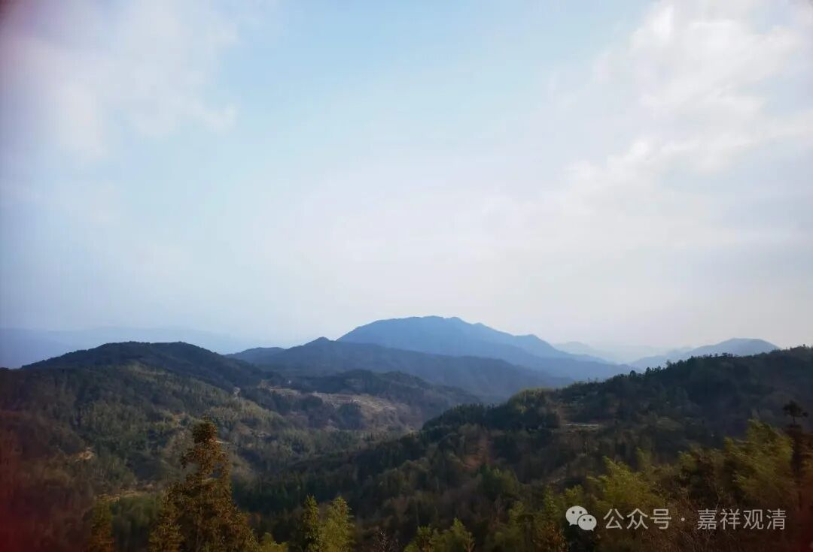

**老先生给的两个忠告

今天讲课的时候，说起刚出家的时候两位老先生给我的建议、忠告。

两位老先生都是能海上师、法尊法师的高足，有一位当过清凉桥监院也去过拉寺学习还管理过哪里的观音殿……

低我两届的小学弟带我去拜访两位老先生，还一起吃了饭。老先生给了我两个忠告、建议：1、要有自己的寺院；2、要收别人的弟子。

其实这两句话我一开始都没听进去，现在才知道那是过来人的话，是经验之谈。

1、要有自己的寺院。老先生说；你看，法尊法师学问极好，但是没有寺院，只有学生没有弟子，他身故以后，就没有人（有两位居士，但没有出家人）接他的班。能海上师则到处收寺院，能够把弟子固定下来，你看现在都是举他旗子的……

我当时以为，只要自己有能力，江湖上会有人请我去讲课、教学的，所以完全没想过要建寺院，而且建寺院也完全不是我的强项。后来在江湖上，也有请我去做教务长的，也有很近的关系“诚邀”我去讲课的……最后去了却完全做不了事——1、被“供”起来吃好喝好却没有任何教学任务，方丈自己突然“福至心灵”地开讲大论了；2、每天讲经的我被提醒“不要讲太多，一个礼拜一次就够了……”后知后觉的我这才知道，在大多数方丈眼里，能讲经的法师是“对手”，因为讲经这件事情（特别是讲得好）会转移寺院的信仰核心……

无数次碰壁+寒心以后，才明白老先生的第一条建议……于是就有了现在的莲花山白云寺，算是应了老先生们的第一条建议。

2、收别人的弟子。老先生说：你看太虚法师就是收别人的弟子，历史上绝大多数传承交接都不是剃度弟子……

这句话我也没听进去。“收别人徒弟，不好吧”……我是直到今天才反应过来。其实之前我对来求剃度的弟子也有过这样的话——“你们不知道我的好，你们是‘撞’到我这里来的……”来求剃度的不是来求法的，来求法的就是来求法的。

老先生把我当自己人说了肺腑之言，我到今天才误打误撞地、懵懂地、假装明白了……

二十年了……

