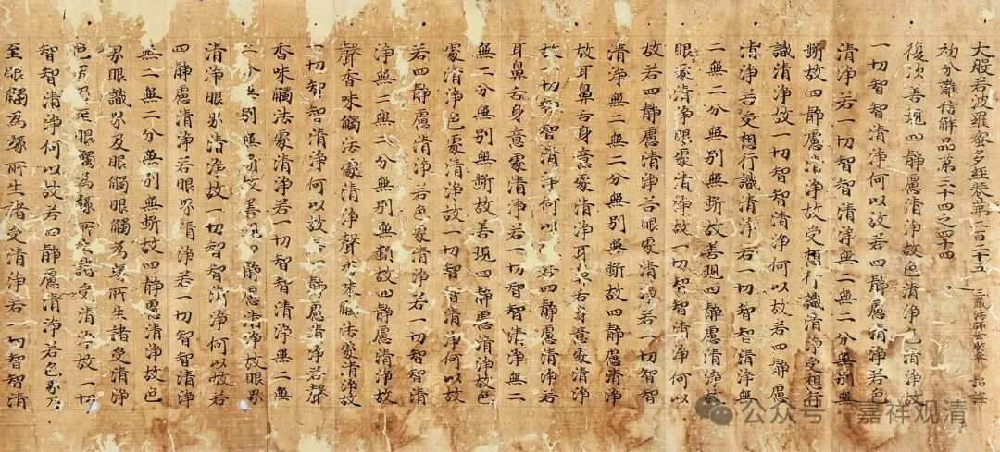

**增智慧、功德大、能除魔**

** ——推荐大家念《般若经》**

年初二，今天传讲《心经》。

《般若波罗蜜多心经》简称《心经》，是《般若经》系统里最短的一部，翻译成今天的白话就是“智慧到彼岸的诀窍”。这里的“心”是心要的意思，很多人理解为“静心”“修心”，都不是这里“心”的本意。《心经》在社会上流通比较广，除了短以外，很多人认为是“可以静心”……呃，反正有效果就好，我不反对。

很多人问我“我该念什么经？”，我一般都会推荐“念《金刚经》《心经》吧”。因为：1、本身都是般若智慧系的经典，或近或远都有点开智慧的效用；2、《金刚经》和般若系的经典都不断地说“福德不可思量”“乃至算数比喻亦不可及”，说明“书读诵说”《般若经》的福报很大；3、“书读诵说”《般若经》有消除魔碍的作用。

比如《摩诃般若波罗蜜经》中说：“善男子、善女人，能受持读诵般若波罗蜜，如所说行，魔若魔天，人若非人，不得其便……”而且实践上也确实如此，常见的有《心经》除障回遮法，有的讲经法会之前都会配合念诵它以消除讲法的障碍……

所以，一般情况下，我都会推荐大家念诵《般若经》，短一点的可以《心经》，长一点的《金刚经》，每年可以念一次《摩诃般若波罗蜜经》，一辈子可以念一次六百卷的《大般若经》（一天一卷的话，两年就念完了）。

玄奘法师辛辛苦苦翻译这些经（六百卷《大般若经》是玄奘大师翻译的，《摩诃般若波罗蜜经》是罗什大师翻译的）肯定不是为了让我们单纯磕头用的，单纯磕头、礼拜、供养的经典不需要翻译，梵文本往那一放就可以了！大师们辛辛苦苦翻译过来，我们怎么也得给点面子至少一辈子念一遍吧，不然真的觉得对不起大师们啊～～

不过现实是我们真的对不起大师们……

