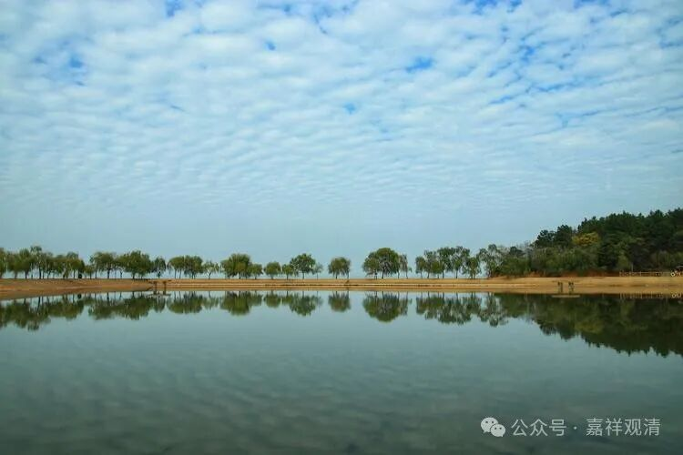

减一百斤真的不容易！

看了《麻辣滚烫》的故事梗概，看着贾玲瘦了一百斤的形象，确实励志！

之前我还有点看不起贾玲，因为她的电影票房突破以后，并没有看到承诺的“瘦成闪电”，反而胖得脱型了，成了“球形闪电”，沈腾调侃她说“疫情期间（吃得太多）累死了个厨子”，觉得她没有毅力……现在才知道，那时候是为了拍电影增肥呢。错怪她了。

有一批人看不看电影的都在她身上投送负面情绪，这很没必要，很low。像我这样跑过步的人都知道，通过运动减一百斤真是很不容易的，何况还要增肌（一般，减脂和增肌都不能同时）。比如我的经验，减个十斤还是可以做到的，二十斤以上就很难了，而且还要考虑自身身体健康的问题——减脂太过的话，抵抗力、免疫力会下降，还要考虑预防运动损伤（我的腰一直不太好，所以就不做力量训练）。

有人问我有没有减肥的咒语，还真有——

《杂阿含经》里说，波斯匿王因为太胖了，平时就喘得厉害，释迦佛告诉他：

“人当自系念，每食知节量，

是则诸受薄，安消而保寿。”

后来波斯匿王就找了个人每天在他吃东西的时候念这句话……终于减肥成功——当然不是因为“咒语”而减肥成功，是听佛的话，因为节食而减肥成功。

节食、锻炼，戒“汤糖躺烫”，可以减肥！

        修改于