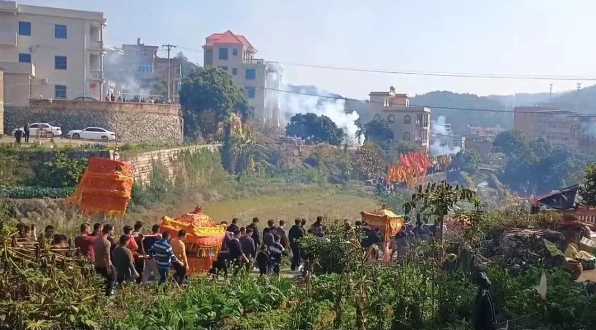

**泉州的“观音巡境祈福”与“行像”的古风俗**

今天正月初四，泉州某寺院举行一年一度的民俗活动——观音菩萨巡境祈福。虽然叫“观音菩萨巡境祈福”，但其民俗符号远大于宗教符号。春节期间同样的活动在全国很多地方都有，比如潮州正月里的“游神赛会”“老爷巡城”，夏河县正月十五的弥勒佛巡寺……等等，或更接近民俗，或更接近宗教，总之，此类活动是流走在民俗与宗教之间的。

其实这类活动甚至可以看到周边文化的背景。玄奘法师在《大唐西域记》卷一中就记载：“屈支国……伽蓝百余所，僧徒五千余人，习学小乘教说一切有部。经教律仪，取则印度……每岁秋分数十日间，举国僧徒皆来会集……诸僧伽蓝庄严佛像，莹以珍宝，饰之锦绮，载诸辇舆，谓之行像，动以千数，云集会所。”

说屈支国（即龟兹国，今新疆库车）学小乘说一切有部，秋分前后，寺院装饰佛像，用轿、车装载（出巡），叫“行像”，动则千人以上参加。

此类“行像”盛事，在西域颇常见，《高僧法显传》中也有记载：

“于阗，其国丰乐人民殷盛，尽皆奉法，以法乐相娱。众僧乃数万人，多大乘学……从四月一日，城里便扫洒道路，庄严巷陌，其城门上张大帏幕，事事严饰……离城二四里，作四轮像车，高三丈余，状如行殿，七宝庄校，悬缯幡盖。像立车中，二菩萨侍，作诸天侍从，皆以金银彫莹，悬于虚空。像去门百步，王脱天冠易着新衣，徒跣持花香翼从出城迎像。头面礼足，散花烧香。像入城时，门楼上夫人、婇女遥散众花，纷纷而下。如是庄严供具，车车各异。一僧伽蓝则一日行像。自月一日为始，至十四日，行像乃讫。”

说于阗国（在今新疆和田地区）信奉大乘佛教，也有“行像”，为了看这个热闹，法显大师专门留停了仨月。四月初一到十四（十五是佛诞纪念日），四轮豪车上装饰华丽，佛像菩萨像立于其中，随从诸车装饰各异……巡城之时，国王脱帽赤脚出城迎接，入城则王后采女带头香花供养……

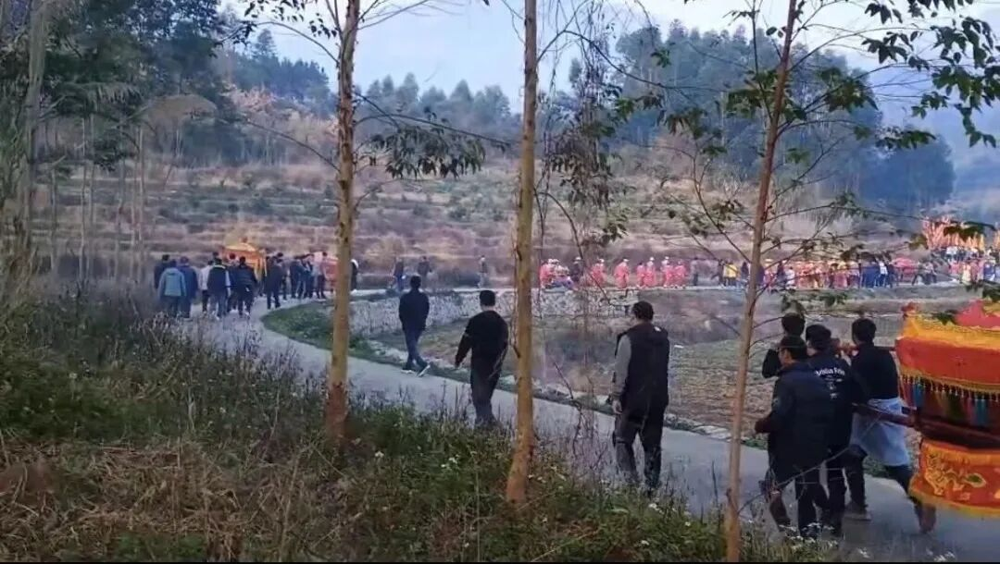

泉州这里的观音巡境祈福，先是关公来请菩萨（关公庙里把关公像“请”到轿子里抬过来，下同），然后善财童子也来接……观音菩萨出寺院后上轿，和村里的诸多神明聚在福安堂（供善财童子的庙）前面，出发去巡境。各路锣鼓队、腰鼓队、旗队前后翼从……

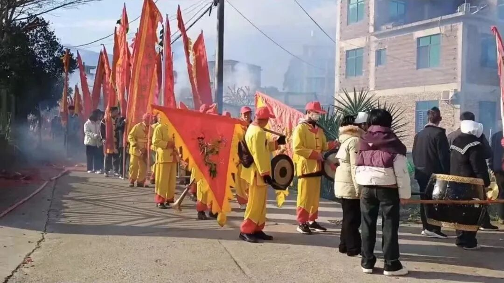

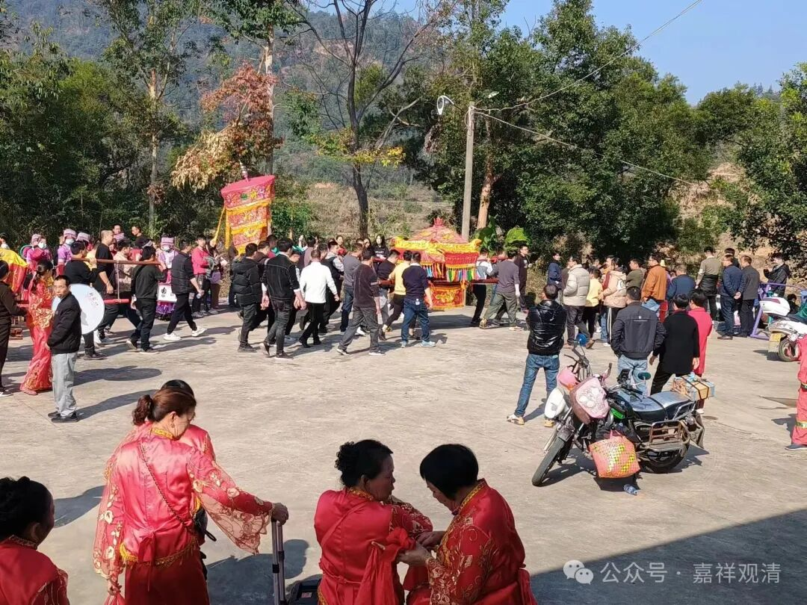

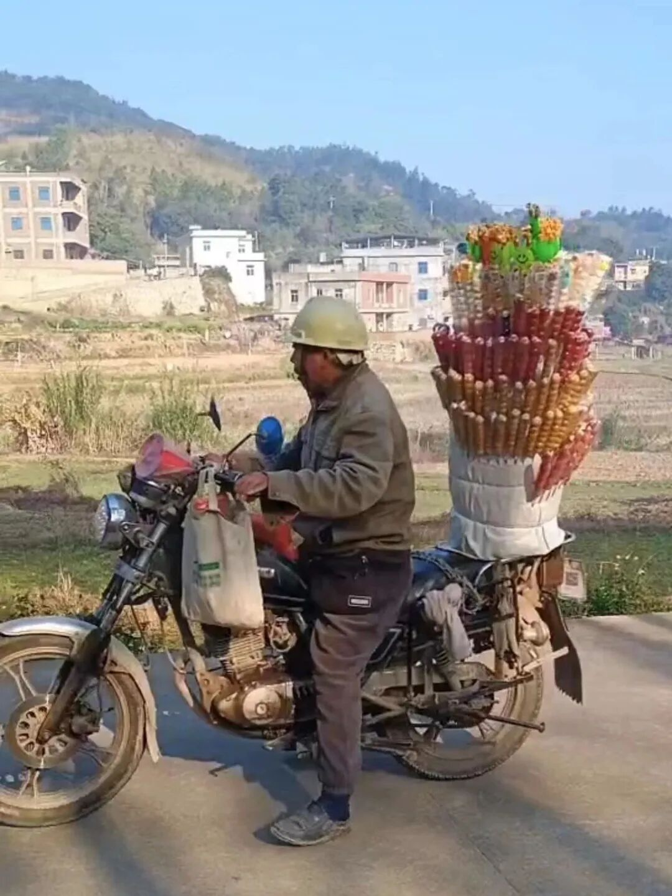

卖糖葫芦的一路跟着

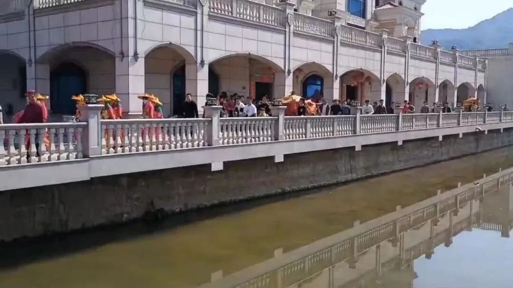

在这家门口绕了一大圈

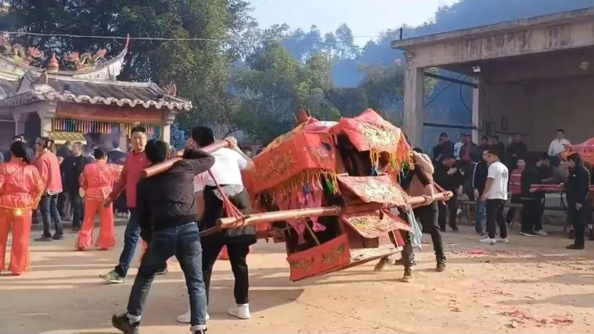

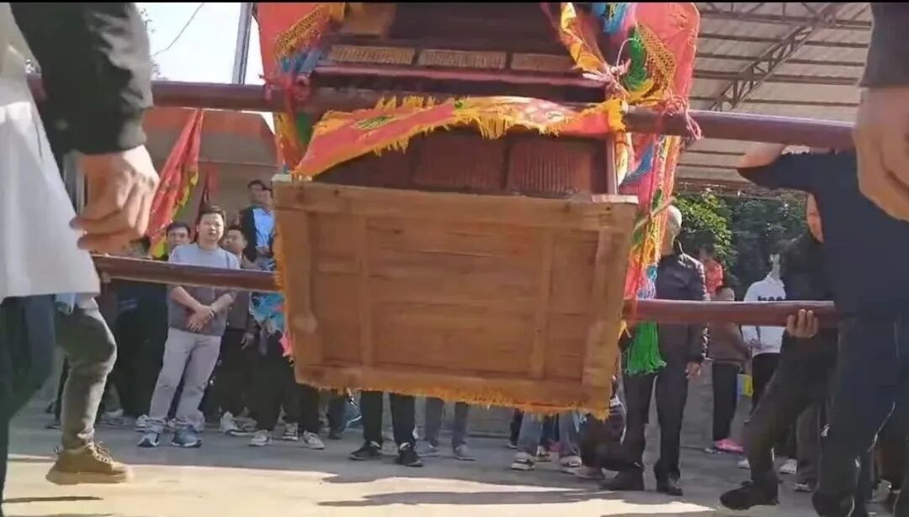

摇轿子

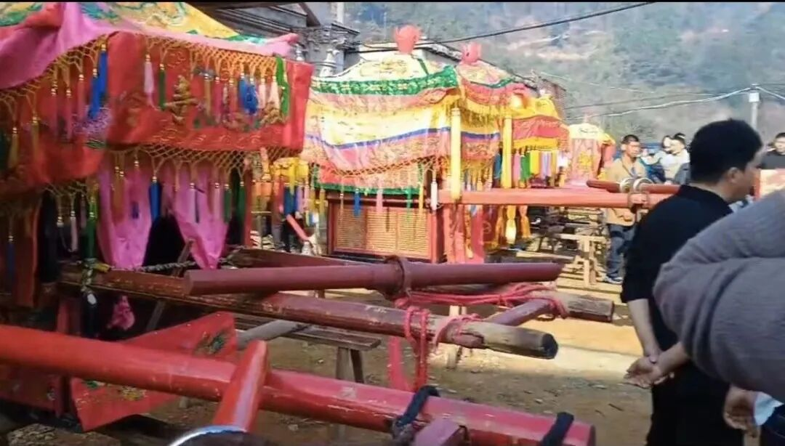

停轿子

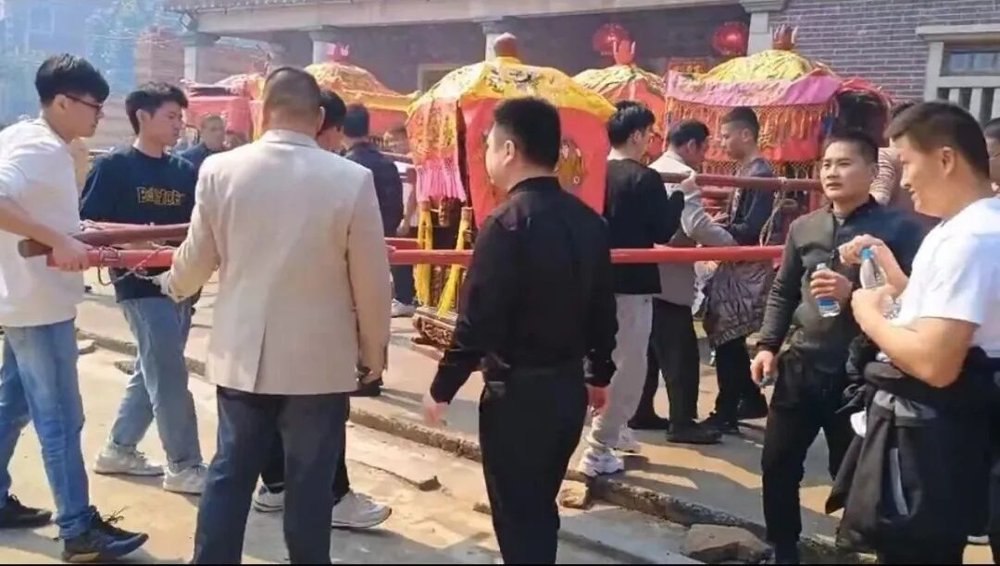

到大户门口还要摇轿子，意思应该是保佑（也有化缘的意思吧），也有停下来的。停下来的轿子不能落地（但有几次摇过分了轿子有掉地上的，哈哈），放在事先架好的桌子板凳之上，桌子板凳上要垫“金纸”。轿子摇的幅度很大，经常超过九十度。新手“轿夫”肩膀上不垫毛巾，皮都搞破了。（一路都会换抬轿子的人。）

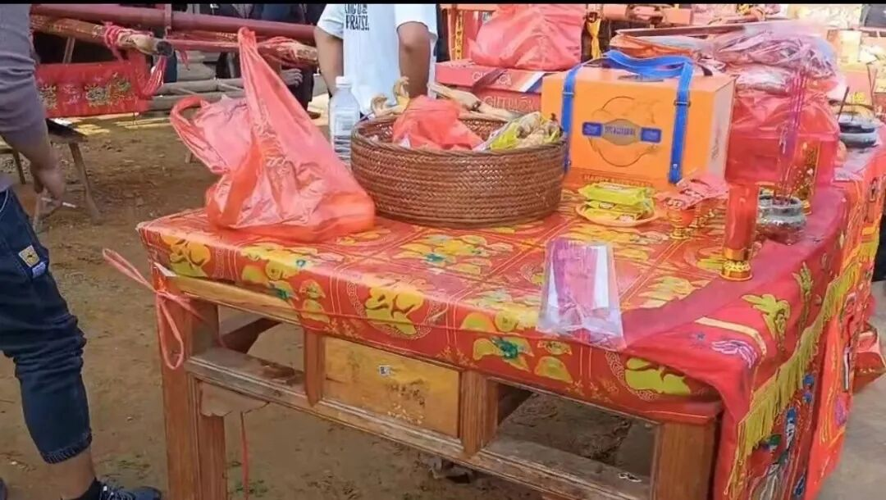

各家各户门前都摆着香案、供品，也有烧黄纸的……捐款多的自然多停会儿，甚至绕着半圈的。

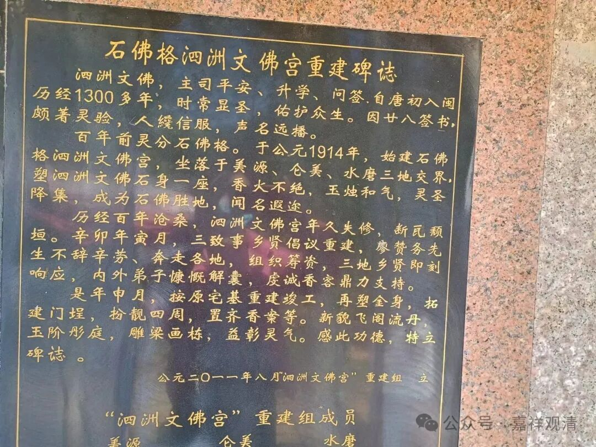

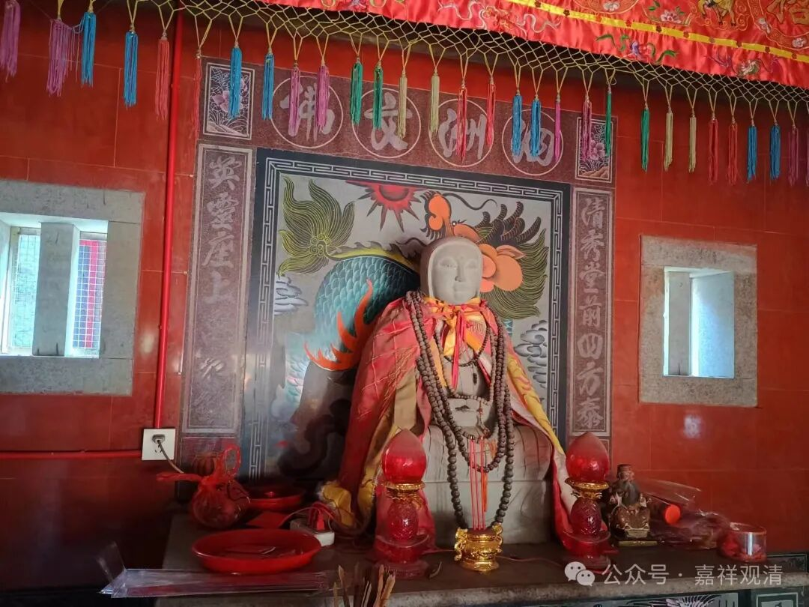

路过寺院，神明、菩萨们停下来拜佛。这是“石佛格”，估计正名应该是“石佛阁”，供的“泗州文佛”，估计是“泗州大圣”和“释迦文佛”的民间组合版吧。

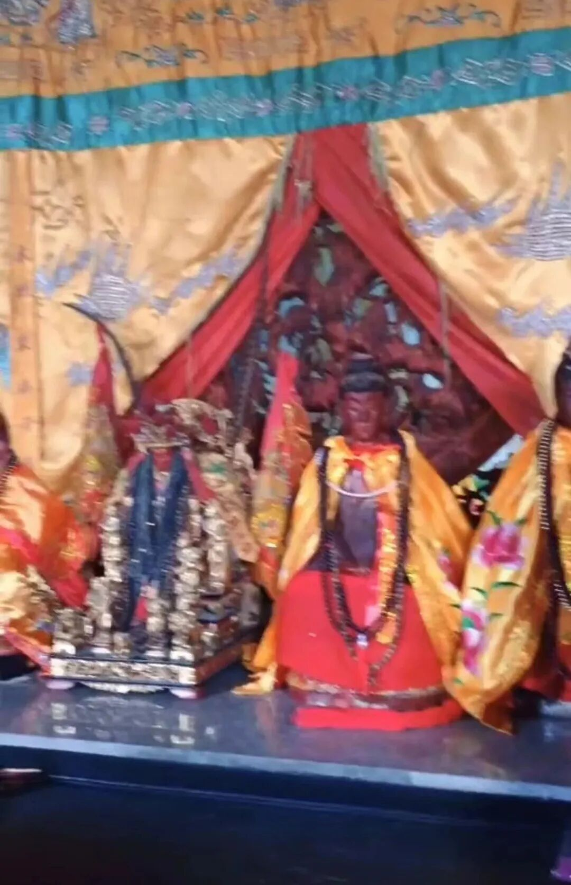

……最后观音菩萨回自己庙里……

一场民间游神会宣告结束……

