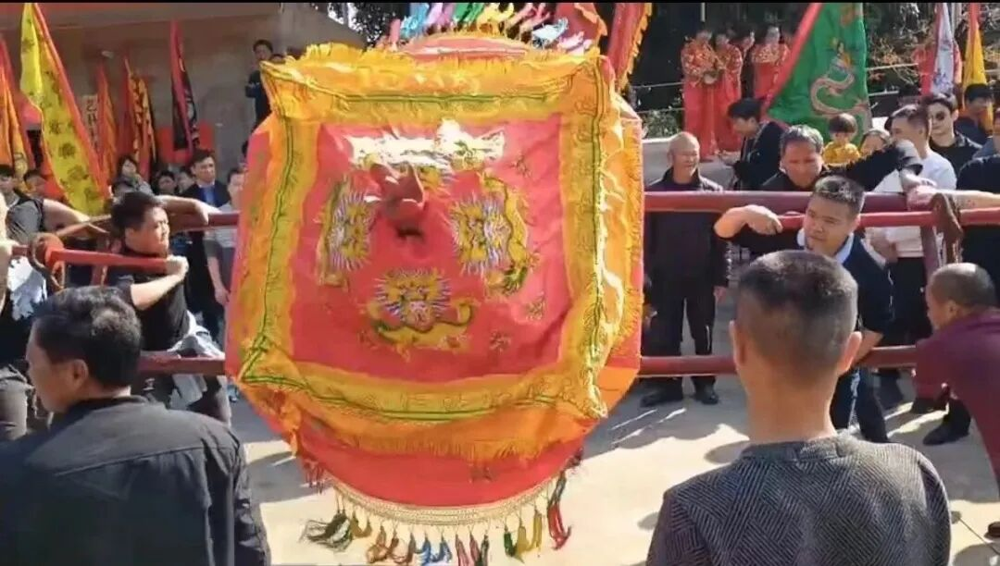

**听专业人士谈“神明巡境之摇轿子”**

昨天讲泉州“观音巡境”摇轿子，有业内资深不可公布名字的隐形大佬（你们懂的）纠正+补充，说：

“这不是‘摇轿子’。这个‘神轿’是神明坐的，抬轿子的人也是神明选的……‘神明巡境’相当于一种形式的降神……路过某个地方神轿会自己晃，那就表示这里有事，要停下来，神明要处理一下。

台湾那边，抬这个轿子都是要训练过才能抬的，而且是神明亲自“抓”人，类似先有个仪式在村里挑选可以抬轿子的男丁。

甚至神轿还会倒退，还会转圈，走错了路它自己知道的。”

泉州这边也来反馈了，说：

“本来应该如（神秘主义专家）说的那样才对，可是昨天的现场，明显是抬轿子人主动地摇轿子，不是被动的。

而且昨天都没有看到有人被降神……

老一辈说，过去村里妈祖出来‘巡境’，有人会被降神。有一次一个出嫁的女儿来看热闹，结果突然就被降神了。这个人平时很斯文的（应该是大概这种类型的人，就是平时不可能搞那种神神叨叨的事），突然现场被降神后，举止大变，还各家派供，那家有啥东西，主人有时都想不起来什么东西在哪里，她都知道让拿出来供！

年前我去我们村看‘妈祖巡境’，还能看到一个人打嗝，这次一个都没有。”

注解：打嗝是被附体、降神的表现之一。那啥也有打嗝现象。不过为什么被附体、降神会打嗝，有人会解释吗？

清案：

从某种角度来说，这表明现在确实是民间宗教的东西被民俗化了，不知道是算进步还是退步……

