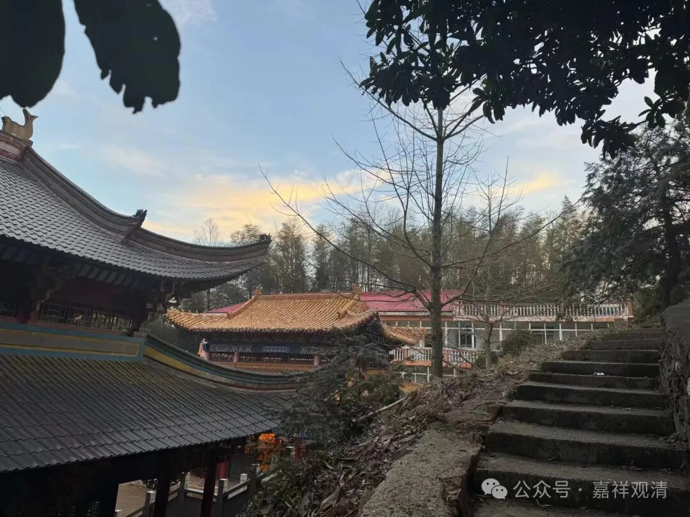

**风俗的变化……**

今天是年初六。

按这里的传统，正月里的初三、初六、初九、十三、十五是进香的日子，正月初一是春节，正月十五是元宵节，其他，就按照“三六九”的意思来，也不知道“三六九进香”的来源是啥。（沪谚中有“三六九，拉现钞”，也是“三六九”合说的。）

一般，和上述日子错开的，年初二、四、五、七、八……等等，我们这山里的小庙都是很冷清的，如果再加上雨、雪、上冻的天气，那就更加空旷了。

但最近，外面的年俗通过回乡的年轻人也带进了山里——以前的年初五是没什么人上山的，今年就很多，而且是年轻人居多，也可能是拜财神正好遇到情人节，所以年轻人居多。昨天我还说“年轻人现在拜佛的多了”，今天才反应过来，那可能是情人节的原因。（如果明年还是这样，那就明确“初五烧香敬财神”的风俗算是移植、嫁接成功了。）

今天初六，我们和义工们都严阵以待……结果来上香的人并不多，传统的“初五冷清初六旺”的情况，现在已经倒置了，我说，这就是人口流动带来的风俗的变化——大环境影响小环境。而且，可能因为今天又下雨，原先约好的村里居士们也“都”没来帮忙——原先还要准备中午多做一桌饭菜的。

还有些年俗，则因为政策环境的原因改变了，比如现在严禁打猎（一经发现就抓），以前过年送礼的野兔、野鸡、野猪、腊肉也就消失了。（这两天晚上两条小狗对着山上叫，我估计是野猪……）

风俗是有为法，也是变化中的，现在人口流动基数、速度都大，风俗的变化远比以前快得多……

