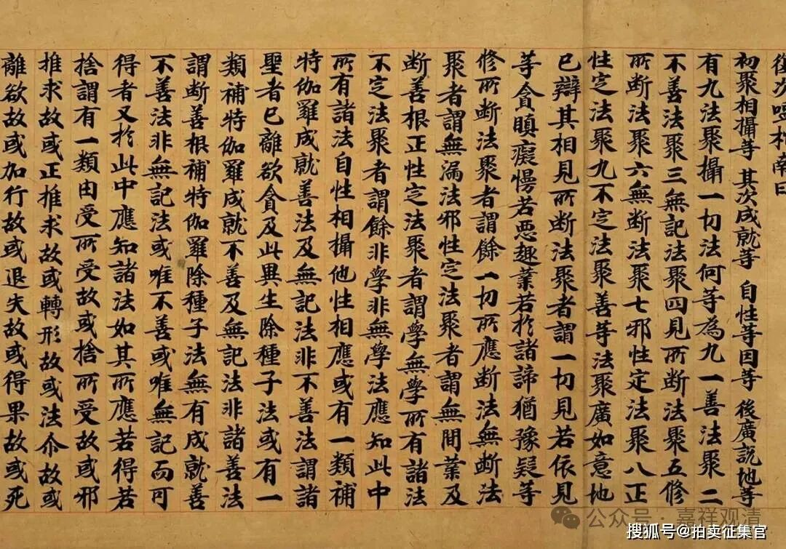

**别境心所之考察（一）**

唯识系统中，通常把“欲、胜解、念、定、慧”称为“别境心所”。

在有部成熟的系统中，此“五别境”和“触、作意、受、想、思”（“五遍行”）合称“十大地法”，认为是遍于一切心的。其他宗派则不然……

经部师认为“心所即心”，而一心不能同时有二境，所以根本不承认“十大地法”等心所同时生起的理论——经部师说心所“不可多体俱生，定次第生”（《顺正理论》引经部说）“必次第生”（《成实论》说）。

在《瑜伽师地论》（弥勒著）里尚无“别境”之名，在《瑜伽师地论》后五十卷里出现了五“遍行”的名称，同时把“欲、胜解、念、定、慧”单独称作“五不遍行”，在《显扬圣教论》（无著所作）里则最初出现了“五别境”的名词。此后的《大乘百法明门论》（世亲作）则基本照搬了《显扬圣教论》的心所分类，也照搬“五别境”的说法……

玄奘法师译《唯识三十颂》，谓“別境謂欲、勝解、念、定、慧，所緣事不同”，今梵文本《唯识三十颂》中无“所缘事不同”一句，应是玄奘法师对“别境”的解释——“别”就是不同、差别、别别（也有译为殊胜的）；“境”，就是“所缘事”。霍韬晦在其《安慧<唯识三十颂释>原典译注》里把这里玄奘法师加上的“所緣事不同”一句理解为是对后文“善心所”的注释，这个注释不当。《成唯识论》和《成唯识论述记》都未对“所缘事不同”一句做释，所以基本可以确定此句也非玄奘手中梵文本里固有的，只是为了行文合适而加字凑成一颂（否则至少《成唯识论述记》里应该有释）。

