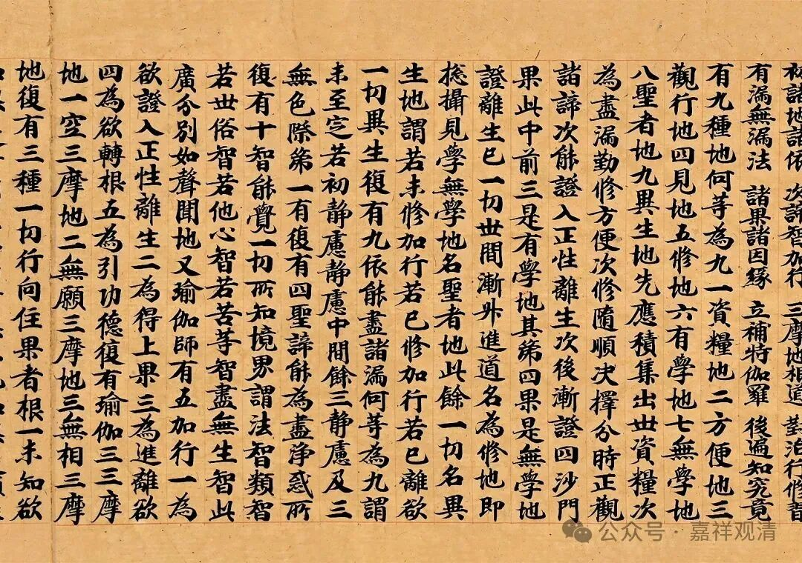

**别境心所之考察（二）**

《唯识三十颂》（玄奘译）“别境谓欲、胜解、念、定、慧，”颂文里的“别境”，梵文本用的是niyatāh，与一般用的viniyata 不同。niyatāh 是决定义。颂文以niyatāh以代替viniyata，应是考虑到颂文音节上的限制。

安慧在《唯识三十颂释》中说：“于别别（之境），决定为性，故名别境viniyata。以其境别别，故非一切。此五法（欲、胜解、念、定、慧）互离而现，若起胜解，余（胜解、念、定、慧）定不生。于余（胜解、念、定、慧）亦应如是而说。”

安慧说“此五法互离而现，若起胜解，余定不生，于余亦应如是而说”，这是说五别境决不能同时生起，理由其实也很充分——“所缘境不同”！既然五别境心所是不同的对境，可爱事、决定事、串习事、所观事（三摩地、慧的所缘境都是“所观事”），那么，能缘的心也必然不能同时生起——比如在可爱事上能生起欲心所，而由于“所缘事”的“不同”，“余”心所“定不生”起！这是说得通的。

但是，同样是署名安慧的《广五蕴论》（玄奘译）中，安慧论师又这样说——

“** 五是別境。

此五一一于差别境，展转决定性不相离，是中有一必有一切。”

意思是，这五个“展转决定性不相离，是中有一必有一切。”从来都在一起，起一个必起其余。

从《三十论释》到《广五蕴论》，安慧对别境的解释上给了完全不同（甚至相违）的两种说法，这很有趣。

然勘梵本安慧《五蕴论释》，《五蕴论》原文“五是别境”之后，并无“此五一一于差别境，展转决定性不相离，是中有一必有一切”之句。

《成唯识论》把五别境同时生起“是中有一必有一切”说成是安慧的说法，可能就是采信玄奘译的《广五蕴论》，但据今本《（安慧）五蕴论释》，很可能安慧并没有这一说法，而今本的《安慧唯识三十论释》的观点是“于中有一，必不起余”。（这在调伏天《唯识三十论释疏》中也能找到证据，调伏天解释“别境”时是顺着安慧的“于中有一，必不起余”的说法展开的。）

不过，虽然可能“是中有一必有一切”不一定是安慧的观点，但安慧以外，也可以找到持这一观点者——功德光。

……

