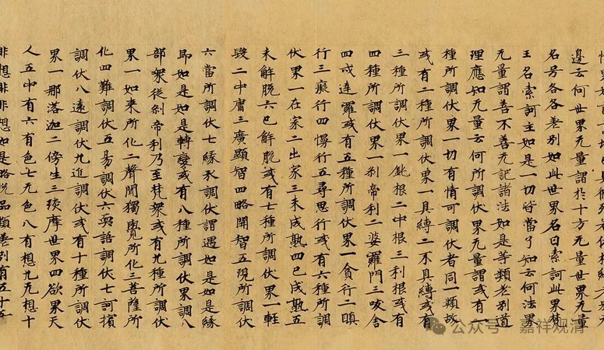

**别境心所之考察（三）**

据《成唯识论》卷五：

** “有义：此五定互相资，随一起时必有余四。”**

说五别境若生起随一，则必具起余四，《论》文并未实指持论者谁。但《述记》明指此说为安慧义——

《成唯识论述记》云：

** “此安慧义，西方共责”。**（这里的“西方”指的是印度）

然安慧《三十颂释》持“若起随一，必不生余”，非如《述记》所说。虽《广五蕴论》有说“此五（别境）……展转决定性不相离，是中有一必有一切”，但勘梵文本无此句。

然《成唯识论》“有义：此五定互相资，随一起时必有余四”之说并无差错，只是持此说者并非如《述记》说为安慧，而是德光。

德光，即功德光律师，律学巨擎，著名的“二胜六庄严”之一，约与安慧、陈那同时，有说为世亲亲识弟子。德光论师的唯识著作有《菩萨地释》与《五蕴论释》。

德光《五蕴论释》（穆昱臻、云丹法师译注）：

** “五别境者，谓欲、胜解、念、三摩地、慧。何处生胜解，彼处亦无疑当生欲、念、三摩地、慧，若此等互无则不生，故谓‘别境’。”**

这是说，五别境中随生一法，余四无疑当生。德光说“若此等互无则不生”，“互无”，亦即“互离”，“互离则不生”，意指必同时生。所以德光即《成唯识论》所说的持五别境同时生的人。（德光论师《五蕴论释》行走在《俱舍论》和《集论》之间，德光此持持“五别境同时生起”，确实更接近《俱舍》而非《集论》。）

德光此说在地亲《五蕴论释》中也被提及，地亲引德光之说道：“有说：随于何境，五者其一若生，五者于此无疑皆生，故谓别境。”（此处地亲仅引述而已，并不支持德光之说。）

德光非《三十颂》的注释十家（亲胜、火辨、德慧、安慧、难陀、净月、护法、胜友、最胜子、智月）之一，而其说出自《五蕴论释》，同时安慧也有《五蕴论释》，或者因此基大师混淆了德光与安慧二师的观点。

（本文多处引文为云丹法师所译，随喜并感谢）

