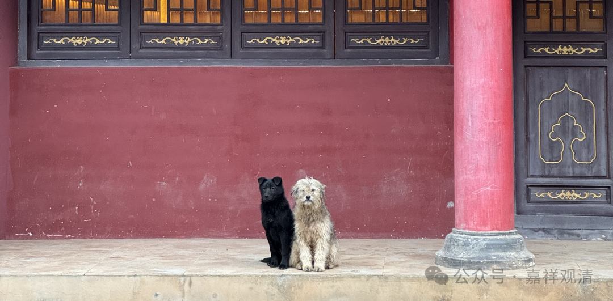
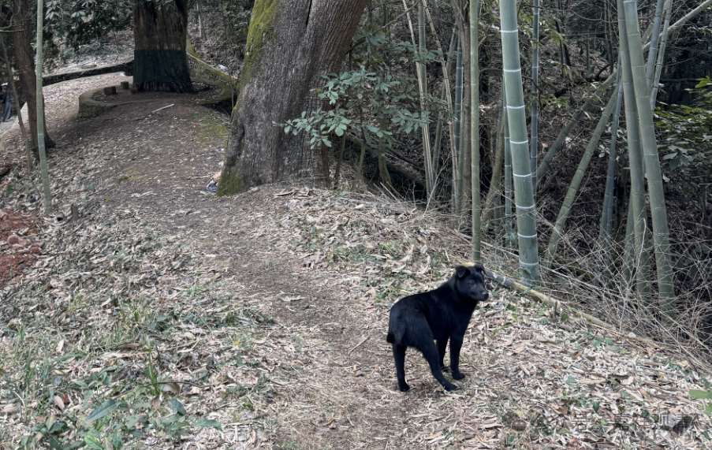
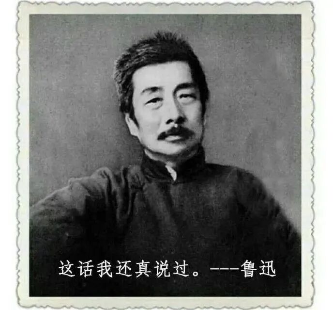
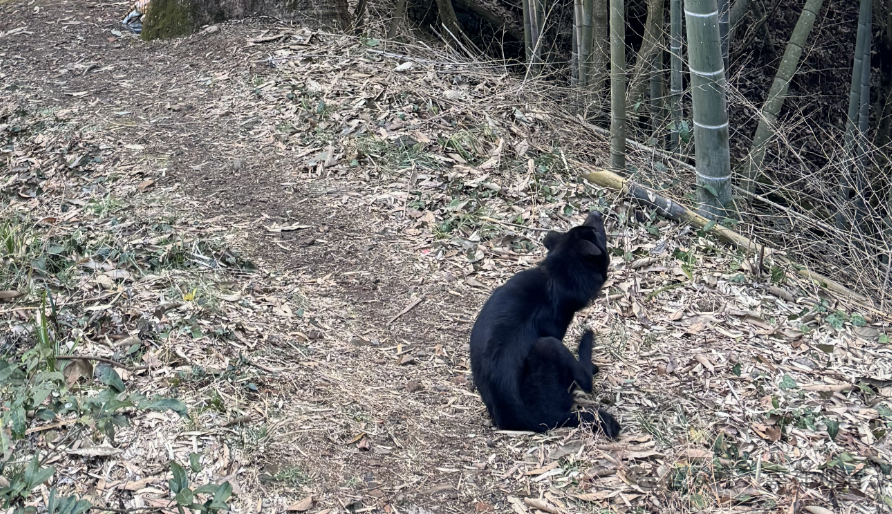

**小黑被偷**

从昨天下午起，小黑（乔丹）就不见了。

今天一天，小灰就不吃饭，它的玩伴没了，虽然它的脑袋上还有小黑咬的伤口，但是小黑的缺席，让它茶饭不思。

小黑大概率是被人偷走了……

最底层的人群，经常有一种“上帝视角”——我看到的就是我的！我们庙里供大悲水的杯子、地里的蔬菜、树上的茶叶……甚至散在的电线，都被人（不是专业的小偷）“收集”回家了。甚至有一个老乡在我地里刨姜刨了半个小时……我实在看不下去去阻止，他居然说“你们是外来人，这都是我们的！”我说你问问边上站的护林员，我是不是这里的法人。

有个弟子说前两天她面试了一个保姆，告辞的时候保姆手上套了一堆头绳，准雇主说“那是我女儿的头绳”，准保姆说“我在地上捡到的（就是我的）”。这个“理由”居然是“通说”，不是个别案例。

我们被教材催眠，以为勤劳淳朴是基层人民的共性，但沉下去你会看到来自底层满满的恶意。来烧香的本地人看到外来的义工，会愤愤地说“你们外地人怎么把我们的庙给占了？！大学生了不起啊！上海人了不起啊！”若是看到村里的老居士们在帮忙则又叫“这庙就是你们村里占着的财产！我们是一分钱都不会捐的！”（他甚至连给菩萨上的香都是“顺”去的）。以前翠微寺建庙的时候也是，庙还没建，村里的校舍先逼我们捐建了。还有的地方，村里的“老人会”也去寺院逼捐……

鲁迅先生说：“我向来是不惮以最坏的恶意，来推测中国人的……”在陌生的底层，若是要自保，必须首先要深刻领会这句话。

一天半了，没有小黑的汪汪声，庙里安静了许多……

小黑才刚满三个月……

