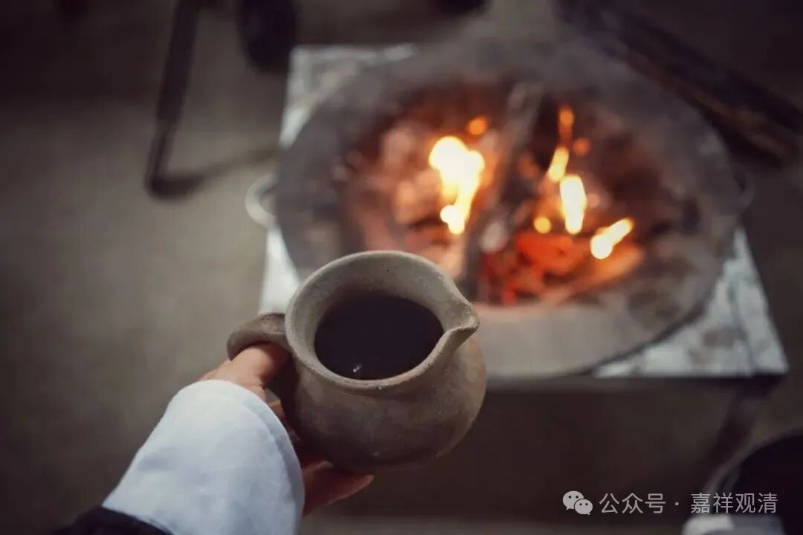

**围炉夜话之“不信也有”**

正月十二，老周提了几十斤年货过来拜年……

晚上一个桌子上聊天，还是聊到小黑被偷，聊到寺院建设。

我说：当地人说，我们白云寺在文黄时候被拆，后来所有拆寺院的都没活过40。我问木生，木生说是。

木生说，上次我去开光的清溪那边山上，以前有个小庙，庙不大，拜的“枫树娘娘”。后来文黄那时候，有个人就把小庙给拆了，当年大年三十晚上被雷劈死了，连个年都没让他过去。（这个庙前些年有个当地老板重建了，有条小土路上山，我还没去过。下次有空去看看。）

龙肃说：菩萨慈悲，护法神可厉害了！

老周就说他的事儿了。他们在南方维修一个寺院，寺院前面有个池子，他们就把水抽干了。里面有很多硬币……有个小工就“提”了一桶回家。然后就病了，去医院也没办法。小工的妈妈问他做了什么事，最后问出来“一桶硬币”……后来老妈妈还了两桶硬币去庙里，第二周病就好了。

老周说“不可不信”，“信则有，不信则无”。我说：这提了一桶钱的就是不信的，不信也有啊！拆庙的都是不信的，不信也有啊！

