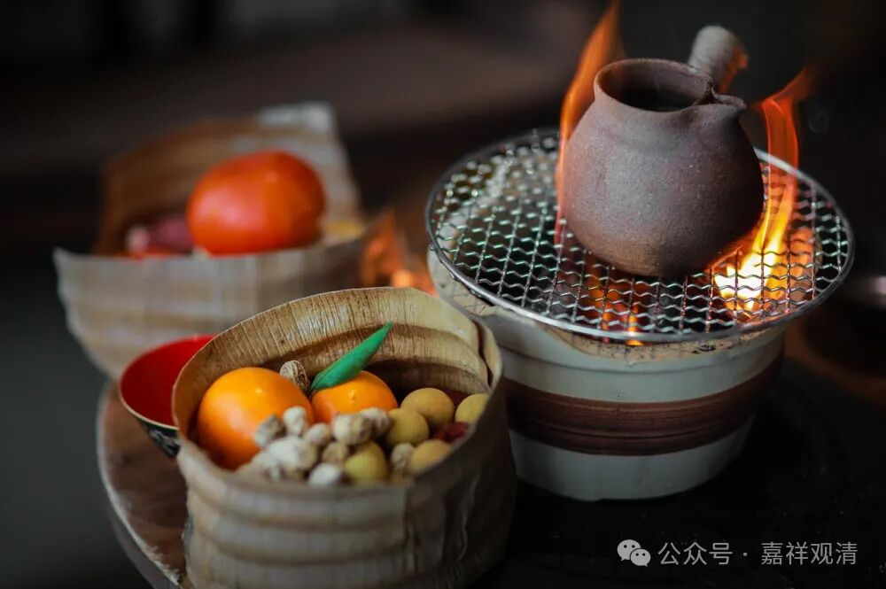

**围炉夜话之寺院有护法**

今天冷，继续围炉夜话……

** 一**

很多年前，有人专程来寺院还钱，主动说……

曾和同伙盗功德箱……所有同伙都出了意外，他实在被吓到了，所以回来……

** 二**

某师的一位前辈的师爷，嘉绒人。

普通的僧人，未多习经教，终身习密咒为主。逝于50年代，依习俗土葬。

丙午年，墓葬被三村民毁之。

三人之报：

甲：上山伐柴，落崖而亡；

乙：驾拖拉车，车翻压亡：

丙：山路逢疯牛，角戳肠流。

** 三**

某寺，文黄时被拆……寺主怒，责问护法：这事儿不管的吗？！

拆寺院的人们回程突遇疯牛，被挑死数人……

（后续是，这一怒，寺主也不免报应……后来还俗了）

** 四**

再说说翠微寺的事儿。

那时候师父刚刚恢复翠微寺……

有一天正出大雄宝殿门，面前掉下一片瓦片，师父说：明天有人献宝！

第二天，有村民送东西上来。原来是翠微寺祖师舍利……

此人说，文黄时候上山掘宝，得一罐，内似宝石，遂藏于家。

此后数数发梦，天神告知“非汝之物，当交还寺院”。甚惧。但此时全县、全市都没有寺院了，遂暂收藏。

等到知道翠微寺有人恢复，赶紧送过来……

（师父说完，就去房间拿来给我们看……）

