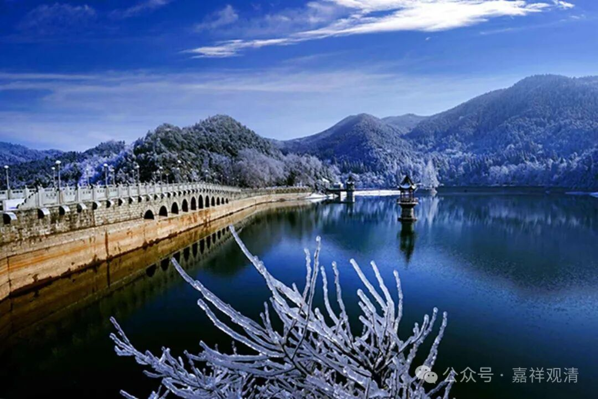

**《宗义略讲》002·038**

克什米尔的说一切有部，得到了国王迦腻色迦的大力的支持，就出现了非常兴盛的这种情况，有部在克什米尔是非常兴盛的，因为实力强大成为有部的主流。说一切有部在印度及其周边其他地方也有。

有部分为；

1、迦湿弥罗有部师，这个是有部最正统的……克什米尔的有部师是有部的核心，人多，庙多，钱多等等，都是他们的，作品也非常多。

2、西方师，又称为日下师，这个是相对于中印度的“西方”，有说是相对于迦湿弥罗的“西方”。有部的西方师其实原先也挺重要的，西方师当中出现过几个很有名的论师，好像法救啊，觉天啊等等，都是这里面的，包括《阿毗昙心论》《杂阿毗昙心论》，都是他们写的，都是他们这个系统的，叫西方师。这个西方为什么叫日下师呢太阳底下，就是太阳下去的地方的意思，就是西方。

“日落”借为“西方”，汉文里也有这个意思。而在英语里，也见到有“日落”借为“西方”、“日出”借为“东方”的意思。如：

Occidental，日落之处的，西方的；

Oriental，东方的，日生之处的；

Hesperian,西方的；西方国家的，日落之国的。

两个单词在谈到西方的背景下，也是日下的一个背景，日落的一个背景，西方这个意思本来就有日落的背景，从希腊来看小亚细亚，它是西方，所以《西方宗教史》这个西方，是日落的那个地方。印度也是这个词语。

3、还有一个就是中原师，在这里写的是摩揭陀的毗婆沙师，又称为叫中原师，中原师或者称为中国师可能更好，因为在佛教里面讲，“生在中国”，这个生在“中国”指的是生在摩揭陀国，这个不是我们今天的“中国”，当然后来佛经里“生在中国”的“中国”含义被扩大了，说“有四众弟子游行的地方，我们叫中国”，当年呢？还是指的摩羯陀国。

西方师，克什米尔师，还有就是中原师（就是指的摩揭陀国的毗婆沙师），就是说一切有部师的几个大宗。

有部师被称为“毗婆沙师”的原因就是因为它的最核心的论典本来是《发智论》，但对《发智论》进行了大量的解释，玄奘法师翻译的两百卷的篇幅，《大毗婆沙论》，这个对迦湿弥罗的说一切有部师来说太核心了，所以他们又被叫“毗婆沙师”

《大毗婆沙论》就是《发智论》里面任何一句话，它都拿出来，几十条解释，甚至继续发散出租……我挺喜欢看的。但是有时候要知道很多东西，比如你讲经没有听众、无人喝彩就很没劲——有一段时间，我在整理《毗婆沙论》，整理了大概二十卷左右，发到网上去，没人喝彩，一点回应都没有，然后我就再也做不下去了，没有劲……你看这个也是需要听众，需要其他的条件给你回应。我最刚开始网络讲课的情况也类似，对着电脑，但是对面一点回应也没有，没有回馈……这种课特别难讲。

