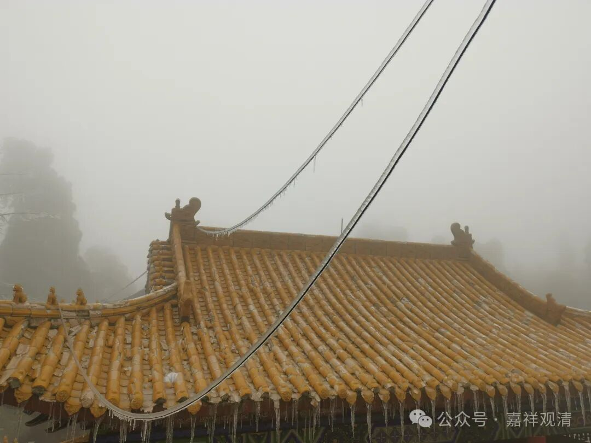
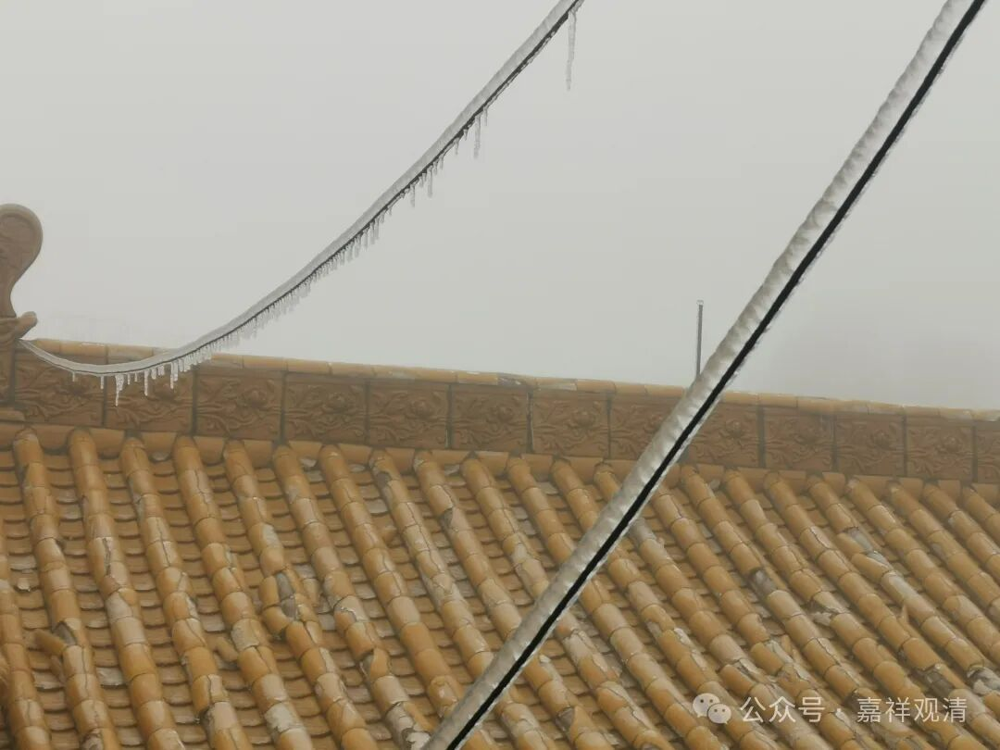

**冰封的元宵节**

今天是正月十五，元宵节。

一早起来，又又断电了。煤气罐也快空了……老胡还是煮了元宵应景。我们已经准备捡柴火生炉灶了。

不过今天比较惨，直到晚上天黑了电路才修通。村长打电话给老胡，老胡在楼下大声喊“来！电！啦！”……我一按开关，来电了！那感觉，绝对比过节还高兴得多。

今天上来上香的人说，路上到处都是倒下的树，压坏了电线，到处都在抢修。我们只能等。

原以为路上冻成这样子，今天应该是没人上来的，结果还是有些人冲上来拜佛、上香的。真的是第一次怕人来寺院，因为一路都是冰，台阶上也是冰，滑得很，不得不一边一一关照“小心再小心”，一边我们所有人都拿起铲子出去铲冰，然后就听见到处都是叮叮当当的声音。

香客说，下面村里还好，就是我们山顶冻得厉害些，路上车子打滑开不上来，都停在下面停车场，他们是自己走上来的。看到我们山顶的情况比山下惨些……四周的山感觉被削平了。

今天的冰比昨天还厚些，这是我们的电线，很为它担心……

走到山头，安静一会儿，就可以听到四周不停地传来树被压断的声音。寮房后面山头倒了很多树和竹子下来，根本来不及收拾。老胡拿了锯子出去，我说，这时候，锯子不如柴刀合适，不过我们对柴刀运用不那么熟练。

没电就没水，连上厕所都麻烦。

山头都被冰封了一样，旁观者看着很晶莹，我们看着愁啊！

总算好，天刚黑就来电了，满血复活！

一看屋里的温度计——7摄氏度。

