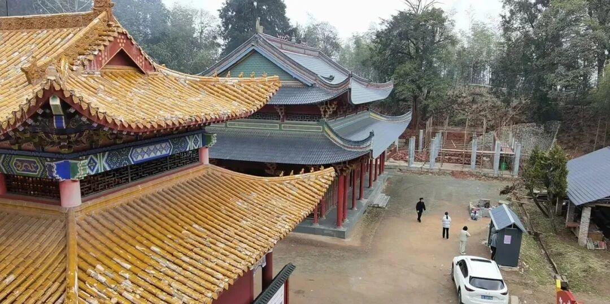

**山居随想——山林佛教何以存在**

两千多年前，印度佛教的寺院按规矩是在聚落、村庄附近，离水源不太远的距离，这样，便于入村乞食，也和人群保持一定距离以方便禅修、诵经——“在世间而不属于它”就是印度佛教寺院的定位了。

佛教传入中国，到了唐代，教理、行持和寺院的形制都充分中国化，以禅宗为标准，寺院的山林化已经完成，到了宋代，五山十刹制度的建立更是明确山林佛教是中国佛教的旗帜。

中国寺院的山林化，有其经济原因和实际可操作性。和外来流民开荒立业不同，外来僧人的开山建寺，一般不会受到地方宗族势力的压制。在（哪怕是个别）信众保证部分基本口粮（山栖的僧人每人每年口粮可以不超过一百斤）的背景下，山栖的僧人开荒成功率比较高，速度也是比较快的。一旦形成了僧人群体，借助宗教的心理势能，开荒的成果和地上建筑就很容易被固定下来，这在一般外来流民身上就很难做到。

温饱问题是最基础的问题。开山种地，把粮食问题解决了；漫山的树林，燃料问题也解决了，那还有一个问题，就是水的问题。亲自建寺以后就关注起这个，发现，今天几乎所有建在山顶的寺院都有水的问题，反过来就可以注意到，山居的寺观，附近都有古井、古泉，因为水源，这是建寺院的先决条件（《野外生存手册》中也明确说，野外生存，必须先找到水源）。考虑到古人不用抽水马桶也不用天天洗澡，所以生活用水消耗极少；古人野外生存能力比我们强，都能挑水，所以基本上只要有个水井、泉水基本就能养活上百号人。

就这样，山林聚居的僧人自给自足有了保障，只要不是自下而上的大乱。山林佛教是可以“独善其身”的。

从“在世间而不属于它”到“入山林而不离世间”，佛教这个印度文明符号嵌入了中国文化；“上山进香”，佛教这个外来宗教嵌入了中国百姓的生活。

