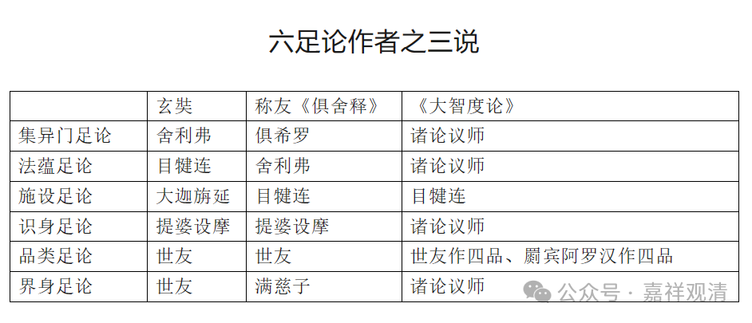

**《宗义略讲》002·039**

《大毗婆沙论》比较好的一点就是，它里面有很丰富的各种记载，假如你想看看经部，经部的阿毗达磨很少，但是你马上就会发现《大毗婆沙论》里面有很多关于经部的说法，说经部、譬喻师在这里的观点是怎么跟有部不一样的……因为《大毗婆沙论》篇幅太广了，所以说这涉及的面太多了。比如说分别说部的观点，现在分别说部具体是哪些还不能完全确定，但是《大毗婆沙论》里面，这里讲了，那里讲了，很多不同的地方都在说，所以你就可以编辑出来……

《大毗婆沙论》很广，广有它的好处，但是实在太广了，简直看不过来……但是我们想想呢，玄奘法师都花了那么多精力把它翻译出来了，我们居然连看都不看一遍，也实在不给人家面子——我们很多人老是说崇拜玄奘法师，含着眼泪唱《蓝莲花》……但是他翻译的书出来了，我们看都不看一遍，人家辛辛苦苦是为了我们啊，我们就是嘴上说它是大译师，其实心里面，真没当他一回事，我们自己注解了什么叫叶公好龙。

那么有部最重要的经典就是这七部。七部的作者，各有传说不同。我们简单看一下下表——

（第二排《俱舍称友释》中《界身足论》的作者应作“富楼那”或者“满”。上表是我做的，后面还有注解，不过一下没找到存档，就在这里注释一下了。这个“满”论师很可能是玄奘《大唐西域记》里提到的望满论师，而不是佛世时的满慈子。）

很有趣啊，南传最重要的经典也是七部：《法集论》《分别论》《界论》《人施设论》《论事》《双论》《发趣论》。

很有趣，大家都说“七部”，我就怀疑这个“七”对他们来说是不是有个专门的，很传统的说法，导致大家都一定要去凑“七”，就像中国人老是要凑三、四；四大名医，四大菜系等等，他们老愿意凑“七”，凑七不知道什么原因。比如说有部凑极微的整合，也是凑七的，最小的极微是一个极微，一个极微凑七个极微，大家都很喜欢“七”。不过凑七个极微也是有原因的，就是一个东西加上前后左右上下，就有七个，但是这个非常危险，因为有部讲极微是无方分的，一旦你说前后左右上下，就是有方，一个极微要和前后左右上下相结合，称为七个极微，慢慢变大，他就变成它有方，太危险了，其实他只要这样一许，自己就把自己逼到墙角里面了，就没退路了……

（有人问：极微也不是最小？）

他认为是最小。“极”就是极端，“微”就是微小，最极微小，就是最小。

