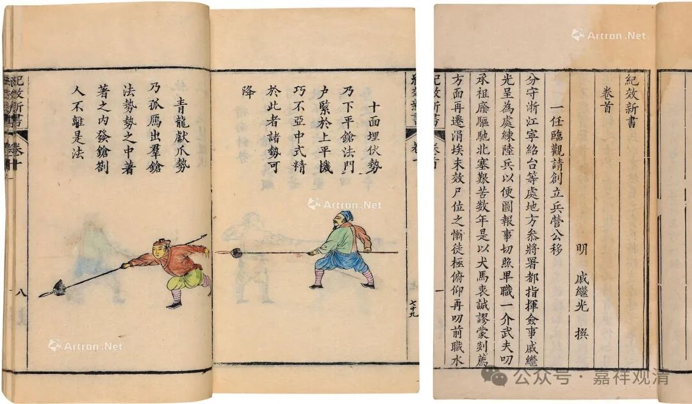
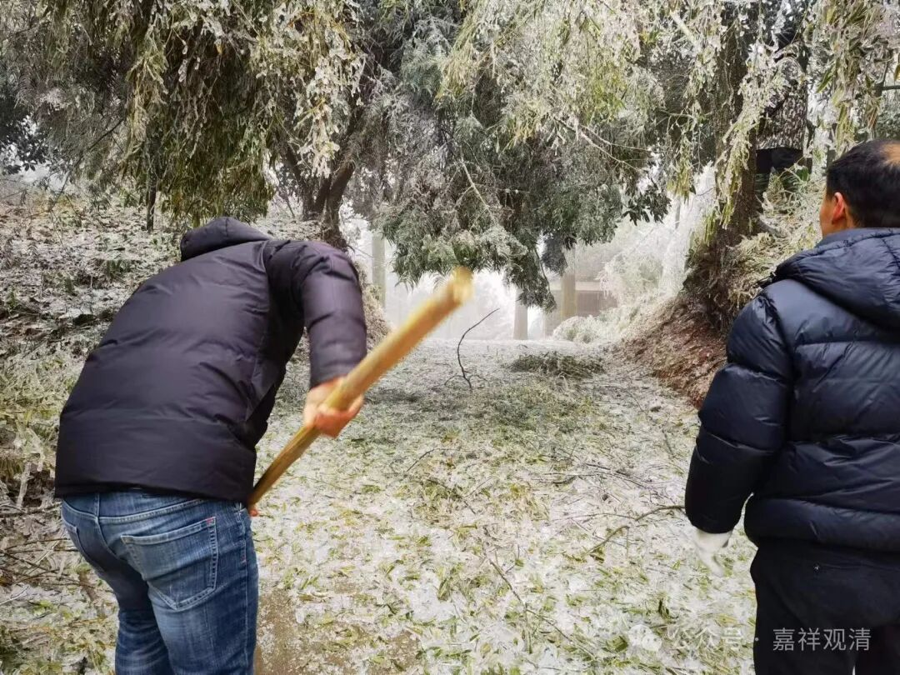

**铲雪、挥斧带来的领悟**

铲了两天雪，其实没干多少活儿，手臂却酸得很，连大腿都酸了，我这还算是经常跑步锻炼的人呐。唉，城市里的人，四肢之不勤若此。

前几年有一次下山“窜访”，看到村里人劈木头，一斧子接一斧子，都砍在同一处，瞬间顿悟现代人练武的症结（问题）了。

以前（古代）练武术的，要么是专业的部队军人，要么是猎户、农民，军人和猎户是以格斗为生存手段的，自不必论，至于农民，平时都干农活儿，本来就有爆发力、耐力和协调性，只要增加相应的格斗技巧性训练，便能迅速用于实战。

至于今天城市里的“楼里白条”们，只是业余地练习一些武术技巧动作，是完全无法谈实战的，这骨脆如渣、气喘如牛、汗出如雨、面白如玉……的，要是穿越到古代实战战场，简直就是个行走的军功啊。遇到剪径的强盗，不等他义愤填膺、义不容辞、见义勇为，早已经一命归西了。

所以我后来就一直强调，武术格斗之谈实战，必须谈力量、速度、耐力，技巧之不可缺，但不是最重要的。

（抬起胳膊拿杯子喝口水，连杯子都快捏不住了……）

