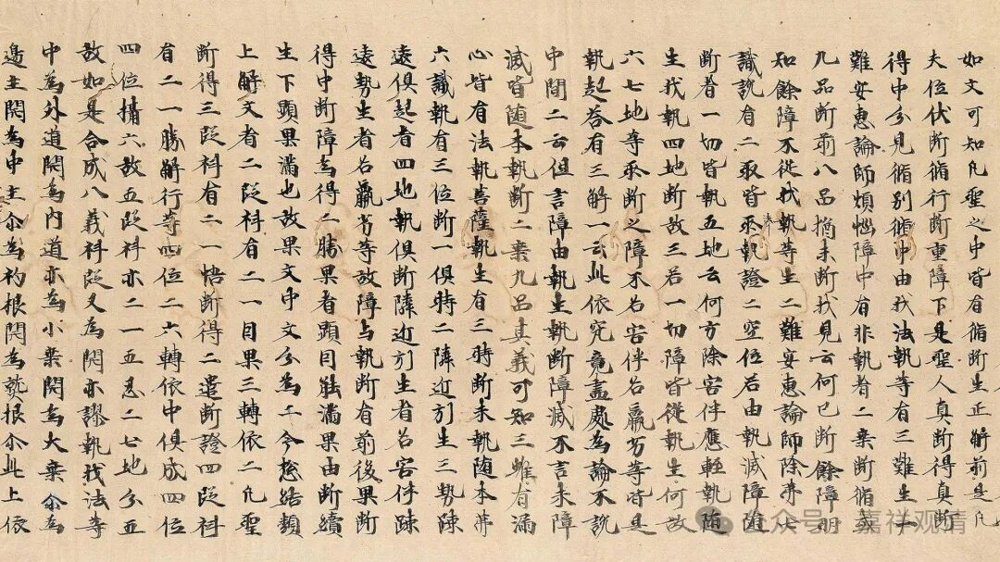

**别境心所之考察（五）俱不俱**

《成唯识论述记》说：

** “此欲等五，若一起時必有餘四，相資之時，方作用轉，五必俱生。若一不起時，餘四皆不起。此安惠義，西方共責。”**

说安慧（即“安慧”，《成唯识论述记》等“安慧”与“安惠”二说通用，而多用“安惠”）即是许“别境五必同时起”者。但明显和安慧《唯识三十颂释》不同。

若据调伏天《唯识三十颂释论疏》（又译作《唯识三十颂复注》，为调伏天释安慧《唯识三十颂释》之作）说，则可能有版本差异的问题——

** “有谓；此语有异，应作‘如是五法，非依更互相异境界而起’。**

** 然此意与所说‘若于是处生起胜解，即于此处余定不生’等言相违。……**

** 由是，云何得说‘非依更互相异境界而起’耶？”**

调伏天说，“如是五法，非依更互相异境界而起”的异文不对，因为和《安慧释》下文相违，其理由如下：

1、如果是对未来境生起希望，那么由于“念”（回忆）心所的境是“曾习境”，未来法不可能是“曾习境”“串习境”，所以此时（未来境起“欲”心所时）不起“念”心所；

2、如果“欲”心所生起的境不是“所观境”，那么这时不能生起“定”心所，因为“定心所”的对境是“所观境”；

3、如果“欲”心所生起的境不是“决定境”，那么这时不能生起“胜解”心所，因为“胜解心所”的对境是“决定境”。

所以，调伏天在这里说：你说的“如是五法，非依更互相异境界而起”的这个异文和安慧《唯识三十颂释》的上下文对不上，有矛盾，所以不应该是《安慧释》的原文。

从上面的这个角度看来，会不会《成唯识论述记》所说的“此安惠义”也是《安慧三十颂释》版本差异造成的呢？

