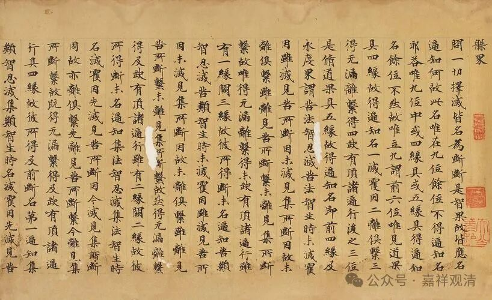

**别境心所之考察（六）都可以！**

关于上述五别境的生起问题，若按《成唯识论》引述护法的意思，则是——此五别境，即非“必同时起”，也非“必不同时”。护法的意思是，这五别境，既可以独立起，也可以两两起，也可以三三共起，也可以四个四个起，也可以五个一起生起，甚至也可以都不起。

《成唯识论》卷五：

** “有义：不定。《瑜伽》说此‘四一切’中无后二故；又说此五缘四境生，所缘能缘非定俱故。”**

这里的“** 有义**”，就是护法——玄奘自宗；

“** 不定**”，就是五别境不一定一起生。不一定一起生，就是可以一起生，也可以不一起生，甚至也可以不生。

“** 《瑜伽》说此‘四一切’中无后二故**”：这是破“五别境必同时生，是说五别境“一定俱生”的说法不对。这里举的理由是《瑜伽师地论》，因为《瑜伽师地论》卷三说“** 几依一切处心生、一切地、非一切时、非一切耶？答：亦五，谓欲等，慧为后边**。”《瑜伽师地论》的意思是，五别境不是和五遍行一样的同时俱生。（最后一个“非一切耶”的意思就是“非一切俱”。）

“** 又说此五缘四境生，所缘能缘非定俱故**”，这一句又是说五别境非必单独生，因为五个心有四个境——至少有一个（所观境）能生起俩（三摩地、慧）。

我们还可以说，既然五遍行可以同时生起，那么，其他的心（如五别境）也可以在对境存在的情况下同时生起。

《成唯识论》最后总结：“** 總別合有三十一句……或有心位五皆不起。**”说，五别境，从单个生起，乃至五个同时生起，一共有三十一种可能，如果再算上五个都不生起的情况，则有三十二种可能。（今天有些法师少算了“五别境全都不生起”的这一种，只算了三十一种，算是一种“漏算”。）

