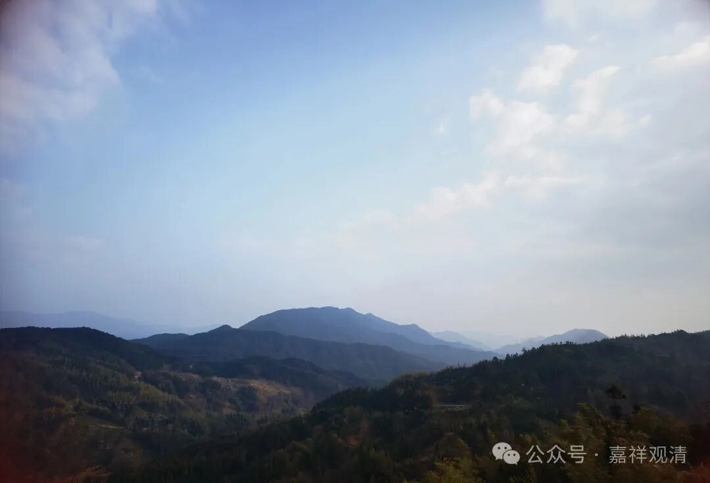

​

**游神的遗产**

最近互联网上福建的游神很火，连兰州的关公也火了……

上次说过，这种“神像出巡”、“佛陀巡境”、“老爷游城”之类的民俗其实各地都有，之前我们发了一篇文章里面也找到了在《大唐西域记》等书里的记载，表明西域龟兹（今新疆库车）等地区唐代时就有这一宗教活动了。今天的甘肃夏河的拉卜楞寺在正月十六也有弥勒巡寺的活动。

库车、夏河的这类明显是宗教法会、宗教活动，福建、潮汕、广东等地的现在叫“非物质文化遗产”，介于民间宗教和民俗活动之间，有一段时间地方对外的口径是：对境外可以加一些传说之类的宣传符号，对内则定位在民俗口、非物质文化遗产。

福建、潮汕一带几乎村村有类似的风俗，也是因为村村都祭拜不同的神灵、老爷，其中最有名的自然是“妈祖”，这是后来被官方化的信仰了。也有宗教背景更重的观音，比如上次我转发的“观音巡境”。福建、潮汕这些祭拜的神灵里面，相当一部分是历史上真实存在的古人，这应该看作是儒家文化“移风易俗”的结果——原先村里乡间的淫祀，经当地文人、士绅改造为符合儒家文化的名臣、烈士的崇拜。

福建、潮汕的这种村村有老爷的情况和云南的“本主信仰”非常接近，云南各地也基本是每个村都有本主庙，“本主”神灵也是既有大黑天、观音，也有历代名臣、龙王，感觉两地在这方面非常相似，这或者因为商路、或者因为宦游，造成两地的文化趋同。

如果从茭贝（全国各地都有）的文化符号上来看，则这种南方各省间的“趋同”也可能不是后来造成的，是原先固有“文化符号”的“复明”？

佛陀说轮回的本质是苦，现实的层面没法完全解决所有的苦，跪在关公面前的病人家属就表明了，现实的人心还是需要这些心灵寄托的，哪怕你管他叫“民俗”或是“遗产”，宗教在目前这个历史阶段是有其存在的社会基础的……

